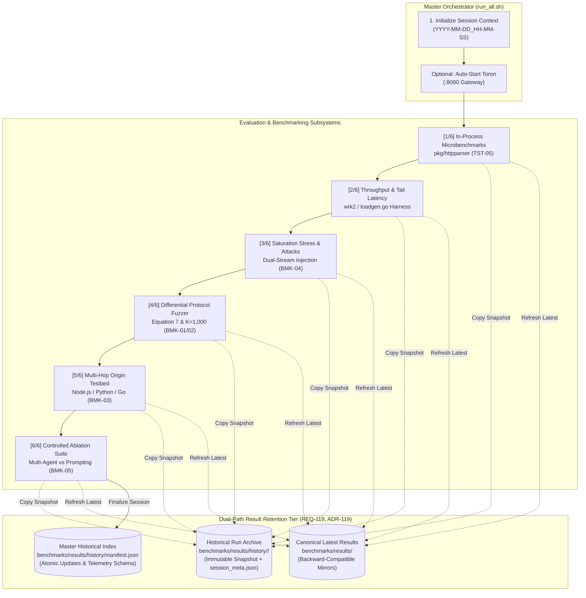
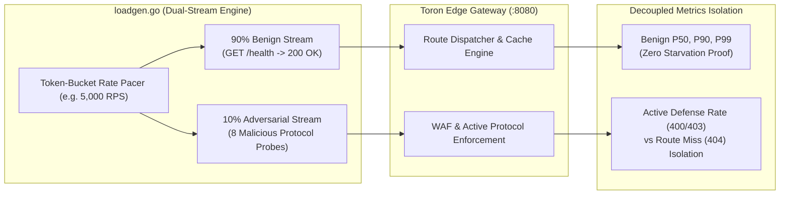

# Toron Automated Empirical Evaluation, Security Verification & Benchmarking Suite

This directory contains the automated performance benchmarking harnesses, saturation stress generators, differential protocol security fuzzers, heterogeneous multi-hop backend testbeds, and controlled ablation experiment suites for the **Toron Research Project**.

The suite is engineered to generate empirical figures, tables, latency distributions, and verifiable evaluation artifacts for academic peer review (*USENIX Security*, *ACM CCS*, *EuroSys*, *IEEE S&P*, *SoCC*, *ICSE*) while guaranteeing complete historical retention and reproducibility across software iterations ([`REQ-119`](file:///Users/sneha/Developer/toron-research/toron/docs/requirements/REQ-119.md), [`ADR-119`](file:///Users/sneha/Developer/toron-research/toron/docs/architecture/ADR-119.md), [`TASK-142`](file:///Users/sneha/Developer/toron-research/toron/docs/tasks/TASK-142.md)).

---

## 📑 Table of Contents

1. [System Architecture & Evaluation Overview](#-system-architecture--evaluation-overview)
2. [Complete Directory Structure](#-complete-directory-structure)
3. [Master Orchestrator (`benchmarks/run_all.sh`)](#-master-orchestrator-benchmarksrun_allsh)
4. [In-Process HTTP Parser Microbenchmarks (`pkg/httpparser/`, TST-05)](#-1-in-process-http-parser-microbenchmarks-pkghttpparser)
5. [Throughput & Tail Latency Benchmark (`benchmarks/wrk2/run_wrk2.sh`)](#-2-throughput--tail-latency-benchmark-benchmarkswrk2run_wrk2sh)
6. [Saturation Stress & Adversarial Injection Benchmark (`benchmarks/wrk2/run_saturation_stress.sh`, BMK-04, HARN-01)](#-3-saturation-stress--adversarial-injection-benchmark-benchmarkswrk2run_saturation_stresssh)
7. [Differential Protocol Security Fuzzer (`benchmarks/fuzzer/run_fuzzer.sh`, BMK-01, BMK-02, HARN-02)](#-4-differential-protocol-security-fuzzer-benchmarksfuzzerrun_fuzzersh)
8. [Heterogeneous Multi-Hop Backend Origin Testbed (`benchmarks/multihop/run_multihop.sh`, BMK-03)](#-5-heterogeneous-multi-hop-backend-origin-testbed-benchmarksmultihoprun_multihopsh)
9. [Controlled Ablation Experiment Suite (`benchmarks/ablation/run_ablation.sh`, BMK-05)](#-6-controlled-ablation-experiment-suite-benchmarksablationrun_ablationsh)
10. [Result Retention & Historical Manifest Architecture (`REQ-119`, `ADR-119`, `TASK-142`)](#-7-result-retention--historical-manifest-architecture-req-119-adr-119)
11. [Troubleshooting & Operational FAQs](#-8-troubleshooting--operational-faqs)

---

## 🔬 System Architecture & Evaluation Overview

Toron evaluates proxy defense capabilities and transport performance across six specialized dimensions:



### Key Scientific & Methodological Properties:
- **Coordinated Omission Elimination**: `wrk2` and the zero-dependency Go fallback (`loadgen.go`) enforce constant-rate Poisson/token-bucket pacing to capture accurate tail latency ($p90, p99, p99.9$) under saturation without omission bias.
- **Strict Active Defense Oracles**: Path traversal and framing smuggling attacks are asserted as active security rejections (`400 Bad Request`, `403 Forbidden`, `501 Not Implemented`) with physical socket closure. Passive route-misses (`404 Not Found`) and connection reuse are categorized as failures or bypasses.
- **Equation 7 Latency Isolation**: Wire-level rejection timing isolates proxy parsing and decision-making from operating system TCP handshake and loopback buffer allocation.
- **Dual-Path Data Retention**: Historical benchmark runs are preserved in immutable timestamped folders while keeping canonical latest paths intact for downstream consumers.

---

## 📁 Complete Directory Structure

```text
benchmarks/
├── README.md                            # Exhaustive evaluation & benchmarking documentation (this file)
├── archive_run.sh                       # POSIX shell helper for session initialization & artifact archival
├── run_all.sh                           # Master orchestrator executing all 6 evaluation stages
├── results/                             # Canonical latest evaluation artifacts (backward-compatible mirror)
│   ├── ablation_study_report.json       # Latest controlled ablation JSON telemetry (BMK-05)
│   ├── ablation_study_report.md         # Latest publication-grade ablation Markdown report
│   ├── benchmark_c100_r5000.csv         # Latency distribution CSV for external plotting
│   ├── benchmark_c100_r5000.json        # High-throughput wrk2 benchmark JSON metrics
│   ├── benchmark_c100_r5000.raw.txt     # Raw stdout capture from wrk2/loadgen
│   ├── concurrency_sweep_summary.csv    # Concurrency scaling summary table (generated during sweeps)
│   ├── differential_fuzz_report.json    # Latest differential fuzzer JSON report (BMK-01, BMK-02)
│   ├── differential_fuzz_report.md      # Latest invariant conformance Markdown report
│   ├── microbenchmarks.raw.txt          # Raw output from Go testing.B parser microbenchmarks
│   ├── multihop_report.json             # Latest heterogeneous multi-hop evaluation JSON (BMK-03)
│   ├── multihop_report.md               # Latest multi-hop cross-runtime Markdown matrix
│   ├── saturation_stress_report.json    # Latest dual-stream saturation stress JSON report (BMK-04)
│   ├── saturation_stress_report.md      # Latest saturation stress Markdown report
│   ├── server.log                       # Background Toron server log from automated runs
│   └── history/                         # Immutable chronological historical runs (REQ-119)
│       ├── manifest.json                # Master machine-readable index tracking all benchmark runs
│       └── 2026-09-12_12-40-53/         # Sample historical run directory (YYYY-MM-DD_HH-MM-SS)
│           ├── session_meta.json        # Self-contained session metadata (git commit, parameters, status)
│           ├── ablation_study_report.json
│           ├── differential_fuzz_report.json
│           ├── multihop_report.json
│           └── ... (full artifact snapshot)
├── wrk2/                                # Throughput, tail latency & saturation stress harnesses
│   ├── run_wrk2.sh                      # Shell runner with wrk2 / wrk / loadgen.go fallback
│   ├── run_saturation_stress.sh         # High-concurrency saturation stress harness (BMK-04)
│   ├── loadgen.go                       # Zero-dependency, pure Go constant-rate dual-stream load generator
│   └── scripts/                         # Lua execution scripts for wrk/wrk2
│       ├── pipeline.lua                 # Pipelined HTTP request evaluation script
│       └── post_payload.lua             # HTTP POST JSON ingestion script
├── fuzzer/                              # Differential protocol security fuzzer (BMK-01, BMK-02)
│   ├── run_fuzzer.sh                    # Fuzzer execution harness with statistical trial flags
│   ├── diff_fuzzer.go                   # Raw TCP socket fuzzer, Equation 7 timing & invariant engine
│   └── diff_fuzzer_test.go              # Unit tests for socket teardown verification & timing isolation
├── multihop/                            # Heterogeneous multi-hop backend testbed (BMK-03)
│   ├── run_multihop.sh                  # Multi-hop execution script (standalone & Docker modes)
│   ├── runner.go                        # Two-stage desynchronization engine (pure Go standard library)
│   ├── multihop_test.go                 # Standalone in-process test suite
│   ├── config.multihop.yaml             # Multi-hop edge gateway configuration
│   ├── routes.multihop.yaml             # Multi-hop gateway routing table
│   ├── docker-compose.multihop.yml      # Multi-container Docker Compose cluster orchestration
│   └── backends/                        # Live origin backends across diverse HTTP parsers
│       ├── node/                        # Node.js 20 LTS (llhttp C-based parser)
│       ├── python/                      # Python 3.11 ASGI (uvicorn / h11 parser)
│       └── go/                          # Go 1.24 (net/http parser)
├── ablation/                            # Controlled ablation experiment suite (BMK-05)
│   ├── run_ablation.sh                  # Ablation execution harness
│   ├── runner.go                        # Quantitative evaluation engine & statistical aggregator
│   ├── schema.go                        # Go data models for conditions, criteria & reports
│   ├── tasks.go                         # Task cohort definition for TASK-061 through TASK-070
│   ├── ablation_test.go                 # Unit and race test suite
│   ├── cmd/
│   │   └── main.go                      # CLI entrypoint for ablation evaluation
│   └── data/                            # Empirical telemetry data for Conditions A & B
│       ├── condition_a/                 # Metadata and logs for ADR Multi-Agent Pipeline
│       └── condition_b/                 # Prompts, diffs, telemetry & logs for Direct Prompting
└── retention/                           # Result retention & historical manifest engine (REQ-119, ADR-119)
    ├── retention.go                     # Core retention logic, atomic manifest writing & Git metadata
    ├── retention_test.go                # Unit test suite for manifest atomicity and directory creation
    ├── integration_test.go              # End-to-end integration tests for retention workflows
    └── cmd/
        └── main.go                      # CLI tool invoked by archive_run.sh
```

---

## 🚀 Master Orchestrator (`benchmarks/run_all.sh`)

### Overview
[`benchmarks/run_all.sh`](file:///Users/sneha/Developer/toron-research/toron/benchmarks/run_all.sh) is the top-level master runner that executes all six benchmark suites in strict sequence, captures comprehensive telemetry, retains full run artifacts under `benchmarks/results/history/<timestamp>/`, updates `manifest.json`, and refreshes canonical files in `benchmarks/results/`.

### Execution Flow:
1. **Retention Session Initialization**: Calls `init_benchmark_session "all"` to create `benchmarks/results/history/YYYY-MM-DD_HH-MM-SS/` and exports `TORON_BENCHMARK_SESSION_DIR`.
2. **[1/6] In-Process Microbenchmarks**: Runs Go microbenchmarks on `pkg/httpparser/` (`testing.B`, TST-05) measuring nanosecond parsing and allocations.
3. **Automated Server Launch (Optional with `--auto-start`)**: Compiles `cmd/toron`, launches it in the background with `config.yaml` and `routes.yaml`, and polls `http://127.0.0.1:8080/health` until healthy.
4. **[2/6] Baseline Throughput & Tail Latency**: Runs `wrk2/run_wrk2.sh` under 100 connections at 5,000 RPS for 5s.
5. **[3/6] High-Concurrency Saturation & Adversarial Stress**: Runs `wrk2/run_saturation_stress.sh` under 50 connections at 5,000 RPS with 10% adversarial injection for 5s (BMK-04).
6. **[4/6] Differential Protocol Security Fuzzer**: Runs `fuzzer/run_fuzzer.sh` with $K=1,000$ repeated statistical trials and $W=50$ discarded warm-up runs (BMK-01, BMK-02).
7. **Server Teardown**: Gracefully terminates background Toron gateway.
8. **[5/6] Heterogeneous Multi-Hop Testbed**: Runs `multihop/run_multihop.sh --standalone` evaluating 30 two-stage desynchronization scenarios across Node.js, Python, and Go backends (BMK-03).
9. **[6/6] Controlled Ablation Experiment Suite**: Runs `ablation/run_ablation.sh` evaluating Condition A vs Condition B across TASK-061 through TASK-070 (BMK-05).
10. **Manifest Finalization**: Atomically updates `benchmarks/results/history/manifest.json` with stage details, status, duration, and artifact paths.

### CLI Options Table

| Option | Argument | Description | Default |
| :--- | :--- | :--- | :--- |
| `--auto-start` | *None* | Automatically compile `cmd/toron` and launch the gateway server in background with readiness polling | `false` (assumes server is already running) |
| `-t` | `<host:port>` | Target proxy endpoint under test | `127.0.0.1:8080` |
| `--no-history` | *None* | Disable historical retention; update only canonical files in `benchmarks/results/` | `false` (retention enabled) |
| `--session-name` | `<name>` | Custom alphanumeric suffix appended to the historical timestamp directory | `""` (format: `YYYY-MM-DD_HH-MM-SS`) |
| `--session-dir` | `<dir>` | Explicit destination session directory (overrides auto-generated path) | Auto-generated under `benchmarks/results/history/` |
| `-h`, `--help` | *None* | Display usage help and command line options | N/A |

### Example Commands

```bash
# 1. Standard one-click automated evaluation (compiles Toron, runs all 6 suites, archives results)
bash benchmarks/run_all.sh --auto-start

# 2. Evaluate an existing, externally running Toron instance on port 8443
bash benchmarks/run_all.sh -t 127.0.0.1:8443

# 3. Label historical run for specific release / PR testing
bash benchmarks/run_all.sh --auto-start --session-name "pre_release_v1.2.0"

# 4. CI execution without writing historical directories (canonical results only)
bash benchmarks/run_all.sh --auto-start --no-history
```

---

## ⚡ 1. In-Process HTTP Parser Microbenchmarks (`pkg/httpparser/`)

### Overview
Operating system TCP loopback network overhead (~250–300 $\mu$s per round-trip) obscures pure parser state machine speed. In-process Go parser microbenchmarks (`testing.B`) located in [`pkg/httpparser/parser_test.go`](file:///Users/sneha/Developer/toron-research/toron/pkg/httpparser/parser_test.go) and [`pkg/httpparser/parser_bench_test.go`](file:///Users/sneha/Developer/toron-research/toron/pkg/httpparser/parser_bench_test.go) isolate raw wire-parsing speed and heap allocation overheads without socket interference.

### Benchmark Suite Breakdown

| Benchmark Symbol | Target RFC / Invariant | Purpose & Behavior | Representative Metrics |
| :--- | :--- | :--- | :--- |
| `BenchmarkParseRequest_WhitespaceRejection` | RFC 7230 §3.2.4 (CWE-436) | Nanosecond fail-fast rejection of whitespace preceding field colon | ~1,158 ns/op, 12 allocs/op |
| `BenchmarkParseRequest_MultipleCL` | RFC 7230 §3.3.2 (CWE-444) | Nanosecond fail-fast rejection of multiple conflicting `Content-Length` headers | ~1,933 ns/op, 26 allocs/op |
| `BenchmarkParseRequest_ValidBaseline` | RFC 7230 Canonical Baseline | Baseline parsing latency and heap allocation profile for valid HTTP/1.1 requests | ~1,791 ns/op, 22 allocs/op |
| `BenchmarkParseRequest_InvalidTokenRejection` | RFC 7230 §3.2 Grammar | Immediate rejection of invalid field name characters (`@`, `(`, `)`) | ~1,558 ns/op, 16 allocs/op |
| `BenchmarkParseRequest_PooledBody` | Memory Recycling | Allocation reduction when utilizing `sync.Pool` payload buffers | ~1,918 ns/op, 25 allocs/op |
| `BenchmarkParseRequest_GET` | Standard Wire Ingestion | End-to-end GET parsing throughput | ~1,965 ns/op, 25 allocs/op |
| `BenchmarkParseRequest_POST` | Ingestion with Body | End-to-end POST parsing with chunked body | ~7,749 ns/op, 30 allocs/op |

### How to Run

```bash
# Execute full microbenchmark suite with allocation tracking
go test -bench=BenchmarkParseRequest -benchmem -run=^$ ./pkg/httpparser/...

# Save raw output to file
go test -bench=BenchmarkParseRequest -benchmem -run=^$ ./pkg/httpparser/... | tee benchmarks/results/microbenchmarks.raw.txt
```

---

## 📊 2. Throughput & Tail Latency Benchmark (`benchmarks/wrk2/run_wrk2.sh`)

### Overview
Measures sustained request throughput (RPS), network data rate (MB/s), and fine-grained tail latency percentiles ($p50, p75, p90, p95, p99, p99.9$).

### Zero-Dependency Engine Selection Hierarchy
The runner [`benchmarks/wrk2/run_wrk2.sh`](file:///Users/sneha/Developer/toron-research/toron/benchmarks/wrk2/run_wrk2.sh) automatically inspects the environment and selects the most accurate engine available:
1. **`wrk2` (Preferred)**: C-based high-performance HTTP benchmarking tool featuring coordinated omission correction via constant-rate Poisson pacing.
2. **`wrk` (Secondary)**: Standard C-based load generator (when `wrk2` is unavailable).
3. **`loadgen.go` (Zero-Dependency Fallback)**: Pure Go implementation in [`benchmarks/wrk2/loadgen.go`](file:///Users/sneha/Developer/toron-research/toron/benchmarks/wrk2/loadgen.go) using standard library `net/http` with token-bucket rate pacing and monotonic microsecond clocking. Evaluators can run full benchmarks without installing any C compilers or external tools.

### CLI Options Table

| Option | Argument | Description | Default |
| :--- | :--- | :--- | :--- |
| `-u` | `<url>` | Target HTTP URL to probe | `http://127.0.0.1:8080/health` |
| `-d` | `<duration>` | Test duration (e.g. `10s`, `30s`, `1m`) | `10s` |
| `-c` | `<conns>` | Number of concurrent TCP connections | `100` |
| `-t` | `<threads>` | Worker threads (for `wrk` and `wrk2`) | `4` |
| `-r` | `<rate>` | Target requests/second limit (for `wrk2` / `loadgen.go`) | `10000` |
| `-s` | `<lua_script>` | Optional wrk Lua script (e.g. `scripts/pipeline.lua`, `scripts/post_payload.lua`) | `""` (plain GET) |
| `--sweep` | *None* | Execute automated concurrency scaling sweep across 50, 100, 250, 500, 1,000 connections | `false` |
| `--no-history` | *None* | Disable historical retention; write only to `benchmarks/results/` | `false` |
| `--session-name` | `<name>` | Custom suffix for historical run directory | `""` |
| `--session-dir` | `<dir>` | Explicit destination session directory | Auto-generated |
| `-h`, `--help` | *None* | Display usage help message | N/A |

### Example Commands

```bash
# 1. Standard benchmark (100 connections, 10,000 req/sec, 10s duration)
bash benchmarks/wrk2/run_wrk2.sh -u http://127.0.0.1:8080/health -c 100 -d 10s -r 10000

# 2. Automated Concurrency Scaling Sweep (50, 100, 250, 500, 1,000 connections)
# Generates benchmarks/results/concurrency_sweep_summary.csv for Matplotlib plotting
bash benchmarks/wrk2/run_wrk2.sh -u http://127.0.0.1:8080/health --sweep

# 3. HTTP POST JSON Payload Ingestion using custom Lua script
bash benchmarks/wrk2/run_wrk2.sh -u http://127.0.0.1:8080/api/v1/echo -s benchmarks/wrk2/scripts/post_payload.lua -c 50 -r 5000

# 4. HTTP Pipelining throughput evaluation
bash benchmarks/wrk2/run_wrk2.sh -u http://127.0.0.1:8080/health -s benchmarks/wrk2/scripts/pipeline.lua -c 50 -r 15000
```

### Generated Artifacts:
- `benchmark_c<conn>_r<rate>.json`: Complete latency percentiles and throughput figures.
- `benchmark_c<conn>_r<rate>.csv`: Raw CSV formatted for Gnuplot / Python graphing.
- `benchmark_c<conn>_r<rate>.raw.txt`: Full console output.
- `concurrency_sweep_summary.csv`: Aggregated sweep curves across all concurrency steps.

---

## 🛡️ 3. Saturation Stress & Adversarial Injection Benchmark (`benchmarks/wrk2/run_saturation_stress.sh`)

### Overview (`BMK-04`, `HARN-01`)
High-performance gateways frequently encounter adverse conditions where high-volume benign traffic coincides with deliberate protocol attacks. [`benchmarks/wrk2/run_saturation_stress.sh`](file:///Users/sneha/Developer/toron-research/toron/benchmarks/wrk2/run_saturation_stress.sh) utilizes [`benchmarks/wrk2/loadgen.go`](file:///Users/sneha/Developer/toron-research/toron/benchmarks/wrk2/loadgen.go) to generate a decoupled dual-stream load:
1. **Benign Background Stream**: Valid HTTP/1.1 traffic (`200 OK`) measuring baseline throughput and tail latency under load.
2. **Adversarial Injection Stream**: A configurable ratio ($a \in [0.0, 1.0]$, default 10%) of raw, malformed protocol wire probes injected concurrently over separate TCP channels.



### Status Code Classification & Active Defense Separation
The harness rigorously enforces status code categorization to prevent false-positive masking:
- **Active Security Defense (`400`, `403`, `413`, `431`, `501`)**: Counted as a **PASS** for the active defense oracle. Verifies that the gateway actively intercepted the violation.
- **Route Miss (`404 Not Found`)**: Strictly isolated and counted as a **ROUTE MISS**. If an attack is deflected to 404 because path normalization stripped the probe before security evaluation, it is NOT credited as an active defense.
- **Bypassed (`200 OK`)**: Counted as a critical security bypass failure.
- **Unhandled / Error (`500 Internal Server Error`, etc.)**: Counted as an anomaly.

### Attack Vector Catalog (8 Vectors)

| Vector ID | Attack Name | Target Vulnerability & Invariant | Expected Status |
| :--- | :--- | :--- | :---: |
| `ADV-01` | CL.TE Conflicting Framing Smuggle | HTTP Request Smuggling (CWE-444 / RFC 7230 §3.3.3) | `400` / `501` |
| `ADV-02` | Obfuscated Header Whitespace | RFC 7230 §3.2.4 Syntax Invariant (Space before colon) | `400` |
| `ADV-03` | Invalid Token Character in Field Name | RFC 7230 §3.2 Grammar Hardening (`@` character in name) | `400` |
| `ADV-04` | CRLF Header Injection | Response Splitting Defense (CWE-113 / Header Folding) | `400` |
| `ADV-05` | Multiple Conflicting Content-Length | RFC 7230 §3.3.2 Parsing Invariant (Divergent lengths) | `400` |
| `ADV-06` | Path Traversal Directory Escape | Path Traversal Defense (CWE-22 / Prefix escape `/../../`) | `400` / `403` |
| `ADV-07` | Oversized Request Header Block | Heap Bounding Defense (CWE-400 / >8KB Header block) | `400` / `431` |
| `ADV-08` | Null Byte Path Injection | Control Character Defense (CWE-117 / `%00` in URI) | `400` |

### CLI Options Table

| Option | Argument | Description | Default |
| :--- | :--- | :--- | :--- |
| `-u` | `<url>` | Target gateway endpoint URL | `http://127.0.0.1:8080/health` |
| `-c` | `<conns>` | Number of concurrent worker connections | `50` |
| `-d` | `<duration>` | Evaluation duration | `10s` |
| `-r` | `<rate>` | Target requests/second aggregate rate | `5000` |
| `-a` | `<ratio>` | Adversarial attack injection fraction ($0.0$ to $1.0$) | `0.10` (10% attacks) |
| `-j` | `<file>` | Output JSON report destination path | `benchmarks/results/saturation_stress_report.json` |
| `-m` | `<file>` | Output Markdown report destination path | `benchmarks/results/saturation_stress_report.md` |
| `--auto-start` | *None* | Automatically build and launch background Toron server | `false` |
| `--no-history` | *None* | Disable historical retention | `false` |
| `--session-name` | `<name>` | Custom suffix for historical run directory | `""` |
| `--session-dir` | `<dir>` | Explicit destination session directory | Auto-generated |
| `-h`, `--help` | *None* | Display usage help message | N/A |

### Example Commands

```bash
# 1. Standard saturation run (5,000 RPS, 50 conns, 10% attack injection, auto-starting server)
bash benchmarks/wrk2/run_saturation_stress.sh --auto-start -r 5000 -c 50 -d 10s -a 0.10

# 2. Extreme stress saturation (12,000 RPS, 100 conns, 20% attack injection)
bash benchmarks/wrk2/run_saturation_stress.sh -u http://127.0.0.1:8080/health -r 12000 -c 100 -d 30s -a 0.20
```

---

## 🛡️ 4. Differential Protocol Security Fuzzer (`benchmarks/fuzzer/run_fuzzer.sh`)

### Overview (`BMK-01`, `BMK-02`, `HARN-02`)
The differential security fuzzer ([`benchmarks/fuzzer/run_fuzzer.sh`](file:///Users/sneha/Developer/toron-research/toron/benchmarks/fuzzer/run_fuzzer.sh), [`benchmarks/fuzzer/diff_fuzzer.go`](file:///Users/sneha/Developer/toron-research/toron/benchmarks/fuzzer/diff_fuzzer.go)) transmits raw, handcrafted TCP byte sequences violating RFC specifications directly to the listening socket. It evaluates two essential defense invariants:
1. **Status Code Rejection**: Proves that protocol violations receive `400 Bad Request`, `403 Forbidden`, or `501 Not Implemented`.
2. **Physical Socket Teardown (`conn:closed`)**: Verifies that the gateway closes the underlying TCP socket (`Connection: close`) upon rejection to prevent desynchronization attacks on pooled keep-alive connections.

### Statistical Methodology & Equation 7 Alignment
- **Equation 7 Latency Isolation**:
  $$T_{\text{rejection}} = t_{\text{status\_line\_read}} - t_{\text{socket\_write\_start}}$$
  Loopback connection establishment (`net.DialTimeout`) and multi-stage cache setup executions (`sendAndDrain`) occur strictly *outside* the timing window. The timer starts immediately before the probe bytes are flushed to the wire and stops once the HTTP response status line is parsed, capturing pure proxy rejection decision latency.
- **Warm-Up Runs ($W=50$)**: Configured via `-w <runs>`, executes preliminary discarded cycles to warm JIT paths, CPU caches, and OS socket tables.
- **Repeated Statistical Trials ($K \ge 1,000$)**: Configured via `-k <trials>`, runs each test vector $K$ times to compute sample mean ($\bar{x}$), sample standard deviation ($s$), median ($p50$), tail percentiles ($p90, p99, p99.9$), and 95% Confidence Intervals.
- **Disaggregated Evaluation Cohorts**:
  - **Fail-Fast Defense Cohort ($N=18$)**: All 18 adversarial attack and invariant rejection vectors. Evaluates how quickly attacks are actively terminated ($< 300\ \mu\text{s}$ mean).
  - **Comprehensive Cohort ($N=19$)**: All 18 rejection vectors plus `BASELINE-001` (valid `200 OK` request).

### Comprehensive Test Vector Catalog (19 Tests)

| Vector ID | Category | CWE | Target Invariant & Attack Vector | Expected Status | Socket Teardown |
| :--- | :--- | :---: | :--- | :---: | :---: |
| `SMUGGLE-001` | Request Smuggling | CWE-444 | Multiple divergent `Content-Length` headers | `400` | `conn:closed` |
| `SMUGGLE-002` | Request Smuggling | CWE-444 | Obfuscated `Transfer-Encoding: chunked` with tabs (`\t`) | `400` / `501` | `conn:closed` |
| `SMUGGLE-003` | Request Smuggling | CWE-444 | Invalid non-hex chunk size extensions | `400` | `conn:closed` |
| `SMUGGLE-004` | Request Smuggling | CWE-444 | Conflicting `Content-Length` and `Transfer-Encoding` | `400` / `501` | `conn:closed` |
| `WHITESPACE-001` | Header Syntax | CWE-436 | Space immediately preceding colon (`Host : example.com`) | `400` | `conn:closed` |
| `WHITESPACE-002` | Header Syntax | CWE-436 | Tab immediately preceding colon (`Host\t: example.com`) | `400` | `conn:closed` |
| `WHITESPACE-003` | Header Syntax | CWE-436 | Obsolete line folding (`obs-fold` with leading space) | `400` | `conn:closed` |
| `CONTROL-001` | Control Characters | CWE-117 | Null byte (`%00` / `0x00`) in URI path | `400` | `conn:closed` |
| `CONTROL-002` | Control Characters | CWE-117 | Bell control character (`0x07`) in header value | `400` | `conn:closed` |
| `CONTROL-003` | Control Characters | CWE-117 | ANSI escape sequence (`0x1B[31m`) in query string | `400` | `conn:closed` |
| `TRAVERSAL-001` | Path Traversal | CWE-22 | Raw dot-dot (`/../../canary_traversal.txt`) prefix escape | `400` / `403` | `conn:closed` |
| `TRAVERSAL-002` | Path Traversal | CWE-22 | Uppercase percent-encoded (`/%2E%2E/%2E%2E/`) escape | `400` / `403` | `conn:closed` |
| `TRAVERSAL-003` | Path Traversal | CWE-22 | Double percent-encoded (`/%252e%252e/`) fixpoint escape | `400` / `403` | `conn:closed` |
| `RESOURCE-001` | Resource Bounding | CWE-400 | Oversized request header block (>8KB) | `400` / `431` | `conn:closed` |
| `RESOURCE-002` | Resource Bounding | CWE-400 | Oversized single query parameter (>2KB) | `400` / `414` | `conn:closed` |
| `BASELINE-001` | RFC Baseline | N/A | Canonical RFC 7230 valid HTTP/1.1 request | `200` | `conn:open` |
| `CACHE-001` | Cache Boundary | CWE-524 | Web Cache Deception (unauthenticated probe misses private cache) | `200` (`MISS`) | `conn:open` |
| `CACHE-002` | Cache Boundary | CWE-384 | Shared cache `Set-Cookie` header stripping verification | `200` (`HIT`) | `conn:open` |
| `CACHE-003` | Cache Boundary | CWE-524 | Authorization refusal in shared cache without public directive | `200` (`MISS`) | `conn:open` |

### CLI Options Table

| Option | Argument | Description | Default |
| :--- | :--- | :--- | :--- |
| `-t` | `<host:port>` | Target proxy server under test | `127.0.0.1:8080` |
| `-b` | `<host:port>` | Optional baseline reference server for differential comparison (e.g. NGINX on `:8081`) | `""` |
| `-k` | `<trials>` | Number of repeated trials per test case ($K=1$ for CI, $K=1000$ for stats) | `1` |
| `-w` | `<warmup>` | Number of preliminary discarded warm-up runs ($W=50$) | `0` |
| `-j` | `<file>` | Output JSON report destination path | `benchmarks/results/differential_fuzz_report.json` |
| `-m` | `<file>` | Output Markdown report destination path | `benchmarks/results/differential_fuzz_report.md` |
| `--no-history` | *None* | Disable historical retention | `false` |
| `--session-name` | `<name>` | Custom suffix for historical run directory | `""` |
| `--session-dir` | `<dir>` | Explicit destination session directory | Auto-generated |
| `-h`, `--help` | *None* | Display usage help message | N/A |

### Example Commands

```bash
# 1. Rapid CI verification (K=1 single shot across all 19 vectors)
bash benchmarks/fuzzer/run_fuzzer.sh -t 127.0.0.1:8080

# 2. Publication-grade empirical evaluation (K=1,000 trials, W=50 warm-up)
bash benchmarks/fuzzer/run_fuzzer.sh -t 127.0.0.1:8080 -k 1000 -w 50

# 3. Differential comparison against baseline server (e.g., NGINX on port 8081)
bash benchmarks/fuzzer/run_fuzzer.sh -t 127.0.0.1:8080 -b 127.0.0.1:8081 -k 1000 -w 50
```

---

## 🌐 5. Heterogeneous Multi-Hop Backend Origin Testbed (`benchmarks/multihop/run_multihop.sh`)

### Overview (`BMK-03`)
Directly resolving the "multi-hop blindspot" critique (`AER-002` Issue 6, `AR-002` Alternative Explanation 3), this testbed evaluates Toron fronting three live, distinct backend HTTP runtime parsing engines:
1. **Node.js 20 LTS**: C-based `llhttp` parser engine (`/node`).
2. **Python 3.11**: ASGI `uvicorn` / `h11` parser engine (`/python`).
3. **Go 1.24**: Standard library `net/http` parser engine (`/go`).

### Two-Stage Desynchronization Protocol ($r_{\text{poison}} \,\|\, r_{\text{benign}}$)
For each vector across all three runtimes ($10 \times 3 = 30$ scenarios):
- **Stage 1 ($r_{\text{poison}}$)**: Transmits crafted smuggling vectors (H2.TE, H2.CL duplicate/mismatch, H1-CL.TE, H1-TE.CL whitespace obfuscation, pipelining buffer eviction, CRLF header injection, pseudo-header isolation, and benign baselines).
- **Stage 2 ($r_{\text{benign}}$)**: Immediately issues a benign canary request (`GET /canary`) over the connection session to prove that:
  - Edge security rejections physically tear down transport sockets without leaking residual bytes into backend pools.
  - Forwarded traffic maintains 100% connection pool integrity without response poisoning or desynchronization.

### CLI Options Table

| Option | Argument | Description | Default |
| :--- | :--- | :--- | :--- |
| `--standalone` | *None* | Run in-process zero-dependency standalone testbed (pure Go standard library) | `true` (default mode) |
| `--docker` | *None* | Automatically build and launch multi-container Docker Compose cluster and evaluate | `false` |
| `-e` | `<host:port>` | Target live Edge Gateway address | `127.0.0.1:8080` |
| `-j` | `<file>` | Output JSON report destination path | `benchmarks/results/multihop_report.json` |
| `-m` | `<file>` | Output Markdown report destination path | `benchmarks/results/multihop_report.md` |
| `--no-history` | *None* | Disable historical retention | `false` |
| `--session-name` | `<name>` | Custom suffix for historical run directory | `""` |
| `--session-dir` | `<dir>` | Explicit destination session directory | Auto-generated |
| `-h`, `--help` | *None* | Display usage help message | N/A |

### Example Commands

```bash
# 1. Zero-dependency standalone in-process execution (ideal for local development & fast CI)
bash benchmarks/multihop/run_multihop.sh --standalone

# 2. Live multi-container Docker Compose cluster execution
bash benchmarks/multihop/run_multihop.sh --docker

# 3. Direct Go test runner execution with race detection
go test -v -race -count=1 ./benchmarks/multihop/...
```

---

## 🔬 6. Controlled Ablation Experiment Suite (`benchmarks/ablation/run_ablation.sh`)

### Overview (`BMK-05`)
Quantifies the software engineering and security efficacy of the **Artifact-Anchored Multi-Agent Pipeline with ADR Governance** by executing a counterfactual controlled ablation study across 10 representative systems engineering tasks (`TASK-061` through `TASK-070`).

### Conditions Evaluated:
- **Condition A (Artifact-Anchored Multi-Agent Pipeline with ADRs)**:
  Architectural specification gating via formal Architecture Decision Records (ADRs), contract compliance validation, and parallel pre-merge adversarial reviews by Code Reviewer (`CR`) and Security Reviewer (`SR`).
- **Condition B (Direct Single-Agent Prompting Baseline)**:
  Direct prompt-driven implementation given identical task descriptions and codebases without intermediate ADR governance or adversarial review gates.

### 10-Task Cohort & Evaluated Vulnerabilities

| Task ID | Component Subsystem | Target Vulnerability / Invariant |
| :--- | :--- | :--- |
| `TASK-061` | `pkg/httpparser`, `pkg/server` | CWE-444: HTTP Desynchronization & Socket Teardown upon 501 |
| `TASK-062` | `pkg/server` | CWE-306: Missing Authentication & CIDR Validation on Admin Endpoints |
| `TASK-063` | `pkg/router` | CWE-525: Web Cache Deception & `Set-Cookie` Stripping |
| `TASK-064` | `pkg/router` | CWE-770: Rate Limiter Resource Bounding & Map TTL Pruning |
| `TASK-065` | `pkg/proxy` | CWE-295: WebSocket Dialing Certificate Validation Enforcement |
| `TASK-066` | `pkg/logging` | CWE-117: Terminal Log Injection & Control Code Sanitization |
| `TASK-067` | `pkg/proxy` | CWE-22: Proxy Path Traversal & Iterative Percent-Unescaping Fixpoint |
| `TASK-068` | `pkg/transcoder` | CWE-400: gRPC Large Frame Buffer Allocation Bounding |
| `TASK-069` | `pkg/router` | CWE-942: Permissive CORS Cross-Domain Policy Validation |
| `TASK-070` | `pkg/server` | CWE-601: Open Redirect Phishing via Host Spoofing |

### Empirical Ablation Findings Summary:
- **Specification Drift**: Condition A achieved **0.00%** drift vs. **63.34%** in Condition B (-100% elimination).
- **Defect Injection**: Condition A achieved **0.00** defects/task vs. **1.90** defects/task in Condition B (zero defect survival).
- **Test Pass Rate**: Condition A achieved **100.00%** pass rate vs. **53.60%** in Condition B (+46.40% improvement).
- **Pre-Merge Defect Arrest**: Reviewer roles in Condition A successfully arrested all 15 latent defects prior to merge.
- **Governance Overhead**: Condition A required a **3.29x token expansion ratio**, empirically proving that governance overhead directly buys defect-free protocol correctness.

### CLI Options Table

| Option | Argument | Description | Default |
| :--- | :--- | :--- | :--- |
| `-j` | `<file>` | Output JSON report destination path | `benchmarks/results/ablation_study_report.json` |
| `-m` | `<file>` | Output Markdown report destination path | `benchmarks/results/ablation_study_report.md` |
| `--no-history` | *None* | Disable historical retention | `false` |
| `--session-name` | `<name>` | Custom suffix for historical run directory | `""` |
| `--session-dir` | `<dir>` | Explicit destination session directory | Auto-generated |
| `-h`, `--help` | *None* | Display usage help message | N/A |

### Example Commands

```bash
# 1. Execute complete ablation evaluation harness
bash benchmarks/ablation/run_ablation.sh

# 2. Run ablation harness unit and race tests
go test -v -race -count=1 ./benchmarks/ablation/...
```

---

## 🗄️ 7. Result Retention & Historical Manifest Architecture (`REQ-119`, `ADR-119`)

### Dual-Path Model
To resolve the empirical loss and destructive overwrite of earlier benchmark executions while preserving zero-breaking-change compatibility for papers and CI scripts, Toron implements a **Dual-Path Retention Architecture**:
1. **Immutable Historical Snapshot**:
   Every run generates an isolated directory:
   `benchmarks/results/history/<timestamp>/` (formatted as `YYYY-MM-DD_HH-MM-SS`, e.g. `2026-09-12_12-40-53`).
   In the event of a collision, a monotonic counter suffix (`_1`, `_2`) is appended.
2. **Canonical Latest Root**:
   Generated artifacts are simultaneously mirrored directly into `benchmarks/results/`. External scripts expecting `benchmarks/results/differential_fuzz_report.json` continue to function without modification.

### Master Manifest Schema (`benchmarks/results/history/manifest.json`)
The central index tracks every benchmark execution. Updates use temporary file creation and atomic POSIX replacement (`mv` / `os.Rename`) to prevent JSON corruption during concurrent runs.

```json
{
  "schema_version": "1.0",
  "updated_at": "2026-09-12T12:41:43+05:30",
  "total_runs": 2,
  "runs": [
    {
      "run_id": "run_2026-09-12_12-41-19",
      "timestamp": "2026-09-12T12:41:21+05:30",
      "directory": "benchmarks/results/history/2026-09-12_12-41-19",
      "suite": "ablation",
      "command": "/path/to/benchmarks/ablation/run_ablation.sh",
      "git_commit": "1637ed28b5eac04591644a152dbce784ef07d78a",
      "git_branch": "master",
      "go_version": "go1.26.6",
      "status": "success",
      "duration_seconds": 2,
      "artifacts": [
        "ablation_study_report.json",
        "ablation_study_report.md"
      ],
      "stages": []
    }
  ]
}
```

### Run Session Metadata (`session_meta.json`)
Each historical run folder contains a self-contained metadata file recording its environment:

```json
{
  "run_id": "run_2026-09-12_12-41-19",
  "timestamp": "2026-09-12T12:41:21+05:30",
  "suite": "ablation",
  "command": "benchmarks/ablation/run_ablation.sh",
  "git_commit": "1637ed28b5eac04591644a152dbce784ef07d78a",
  "git_branch": "master",
  "go_version": "go1.26.6",
  "status": "success",
  "duration_seconds": 2.0,
  "artifacts": [
    "ablation_study_report.json",
    "ablation_study_report.md"
  ]
}
```

### Querying the Historical Manifest

```bash
# 1. View total historical benchmark runs recorded
cat benchmarks/results/history/manifest.json | grep '"total_runs"'

# 2. List all runs by timestamp, suite, and status using jq
jq '.runs[] | {timestamp: .timestamp, suite: .suite, status: .status, commit: .git_commit[0:7]}' benchmarks/results/history/manifest.json

# 3. Find the most recent run for a specific suite (e.g. differential_fuzzer)
jq '[.runs[] | select(.suite=="differential_fuzzer")] | last' benchmarks/results/history/manifest.json

# 4. View artifacts generated by the last run
jq '.runs[-1].artifacts' benchmarks/results/history/manifest.json
```

### Direct Archival Helper Usage (`benchmarks/archive_run.sh`)
The shell helper [`benchmarks/archive_run.sh`](file:///Users/sneha/Developer/toron-research/toron/benchmarks/archive_run.sh) can also be invoked directly from custom user workflows:

```bash
# Initialize a new session directory
bash benchmarks/archive_run.sh init -suite custom -session-name "experiment1"

# Manually archive an artifact to history and manifest
bash benchmarks/archive_run.sh archive \
    -session-dir "benchmarks/results/history/2026-09-12_12-00-00_experiment1" \
    -suite custom \
    -status success \
    -duration 10.5 \
    -artifacts "benchmarks/results/my_output.json"
```

---

## 🔧 8. Troubleshooting & Operational FAQs

### 1. Port Collision (`address already in use` on `127.0.0.1:8080`)
- **Symptom**: Toron server fails to launch with `bind: address already in use`.
- **Cause**: An earlier Toron server, Docker container, or background process is still bound to port 8080.
- **Solution**:
  ```bash
  # Locate the process holding port 8080
  lsof -i :8080
  # Terminate the lingering process
  kill -15 $(lsof -t -i :8080)
  ```

### 2. Socket Exhaustion / `TIME_WAIT` / `too many open files`
- **Symptom**: Load generators abort with `dial tcp: socket: too many open files` or high connection error rates during saturation stress runs.
- **Cause**: The operating system default open file descriptor limit (`ulimit -n`) is too low for high concurrency (e.g., 1,000 connections with rapid teardown).
- **Solution**:
  ```bash
  # Check current file descriptor limit
  ulimit -n
  # Increase file descriptor limit for the current shell session
  ulimit -n 65536
  ```

### 3. Docker Compose Multi-Hop Prerequisites
- **Symptom**: `run_multihop.sh --docker` fails with `docker: command not found` or Docker daemon connection errors.
- **Cause**: Docker Desktop / Docker Engine is not running or accessible.
- **Solution**:
  - Start the Docker daemon.
  - Alternatively, use the standalone in-process mode (`bash benchmarks/multihop/run_multihop.sh --standalone`), which requires zero Docker dependencies and evaluates all three backend parser engines using pure Go standard library runners.

### 4. Permission Denied when Executing Scripts
- **Symptom**: `bash: benchmarks/run_all.sh: Permission denied`.
- **Cause**: POSIX execute bit missing on checkout.
- **Solution**:
  ```bash
  chmod +x benchmarks/*.sh benchmarks/**/*.sh
  ```

### 5. Missing `wrk2` Toolchain
- **Symptom**: Notice: `Engine: go-loadgen (Zero-dependency fallback)`.
- **Explanation**: This is normal behavior. Toron automatically detects if `wrk2` is installed on your system. If not present, it seamlessly executes `loadgen.go`, reproducing constant-rate token-bucket pacing without requiring manual compilation of `wrk2`.

### 6. Background Server Clean Teardown
- **Symptom**: Toron remains running in the background if a shell script is abruptly interrupted (`Ctrl+C`).
- **Explanation**: All scripts (`run_all.sh`, `run_saturation_stress.sh`, `run_multihop.sh`) register POSIX signal traps (`trap cleanup EXIT INT TERM`). However, if forcibly killed (`kill -9`), run:
  ```bash
  killall toron toron_eval toron_stress 2>/dev/null || true
  ```
