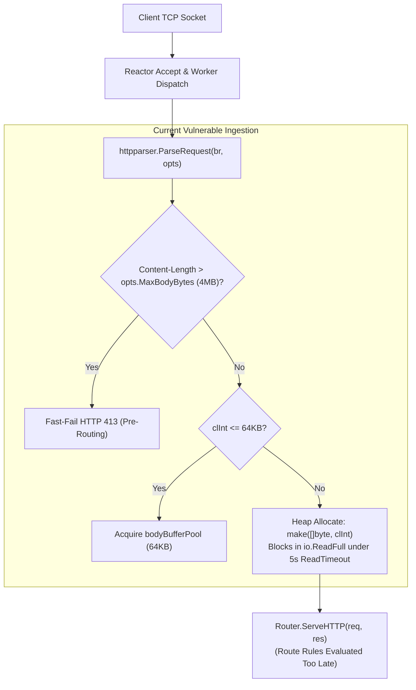
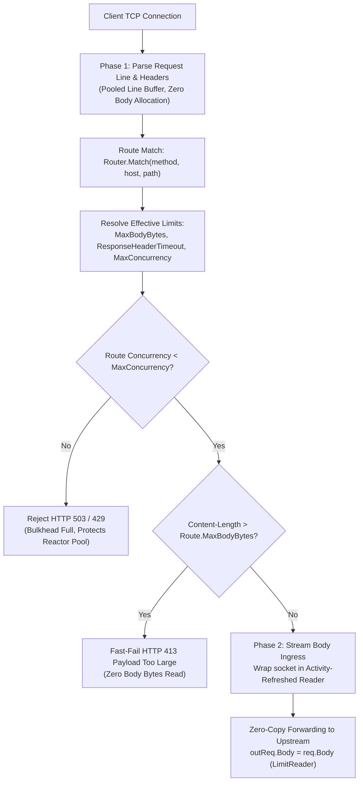
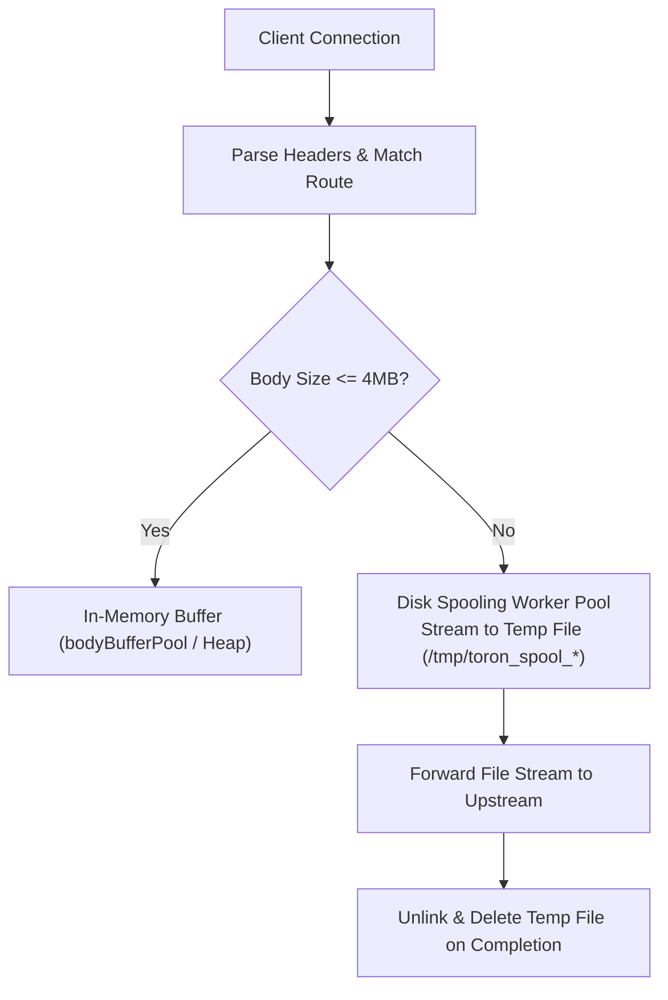

# AN-006 - Supporting Legacy Applications (Large Payloads, Slow Backends, Streaming) under Hardened Security Mandates

## 1. Executive Summary

Toron is engineered as a cloud-native, high-throughput Layer 4/Layer 7 reverse proxy, web server, and API gateway optimized for low memory overhead and rapid request multiplexing. To prevent Denial-of-Service attacks, Toron enforces strict global security defaults:
- Maximum request body ceiling: `4 MB` (`max_body_bytes: 4194304`).
- Static connection timeouts: `read_timeout: 5s`, `write_timeout: 5s`, `idle_timeout: 30s`.
- Reverse proxy upstream response header timeout: `10s` (`ResponseHeaderTimeout`).
- Fixed reactor worker pool: `128` workers (`worker_pool_size: 128`).
- Eager in-memory body allocation: Incoming payloads $> 64\,\text{KB}$ are eagerly read into heap slices (`make([]byte, clInt)`) before route matching or authorization occurs.

While these controls successfully remediate [CWE-400](https://cwe.mitre.org/data/definitions/400.html) (Slowloris, Slow Read) and [CWE-770](https://cwe.mitre.org/data/definitions/770.html) (Out-Of-Memory exhaustion, [`SEC-28`](../architecture/ADR-084.md)), they fundamentally break compatibility with real-world enterprise legacy workloads characterized by:
1. **Large File Uploads**: Multipart/form-data, database dumps, CAD/CAM binaries, and media files exceeding `200 MB`.
2. **Slow Processing Times**: Legacy transactional monolithic backends, report generators, complex SQL aggregations, and batch ETL endpoints requiring `15s` to `60s+` to produce response headers.
3. **Large Downloads & Continuous Streaming**: File distribution services, large artifact pulls, and unbounded streaming downloads.
4. **Degraded/Slow Client Links**: Clients communicating over mobile networks, satellite links, or constrained branch WANs where a `200 MB` upload legitimately takes `20s` to `60s+`.

Simply relaxing global server configurations (e.g., setting global `max_body_bytes: 500MB` and `read_timeout: 300s`) introduces catastrophic security vulnerabilities:
- An attacker sending $10$ concurrent requests with `Content-Length: 500MB` triggers $5\,\text{GB}$ of instant heap allocation in [`pkg/httpparser/parser.go`](../../pkg/httpparser/parser.go), causing process termination via Linux OOM killer (`SIGKILL 9`, re-opening `SEC-28`).
- An attacker opening $128$ Slowloris connections transmitting $1$ byte per minute exhausts all $128$ reactor workers in [`pkg/reactor/reactor.go`](../../pkg/reactor/reactor.go), completely starving health checks (`/health`), metrics (`/metrics`), and all microservice routes (violating [`REQ-005`](../requirements/REQ-005.md) and [`REQ-126`](../requirements/REQ-126.md)).

This analysis formulates an architectural blueprint that **supports real-world legacy workloads without relaxing global defensive postures**. The solution couples:
1. **Two-Phase Route-Aware Ingestion**: Resolving route rules immediately after parsing HTTP headers, enabling route-scoped payload ceilings (`route.MaxBodyBytes`) while preserving the global $4\,\text{MB}$ default.
2. **Activity-Refreshed Read/Write Deadlines**: Progress-based socket deadline tracking that allows sustained high-volume data transfers as long as bytes are actively flowing, while killing dead/stalled connections within the timeout window.
3. **Zero-Copy Streaming Proxy Ingress**: Streaming request bodies directly to upstream HTTP connections without intermediary memory buffering.
4. **Route-Level Bulkhead Concurrency Gates**: Limiting concurrent legacy connections per route (`max_concurrency: 16`), preventing slow requests from starving the reactor worker pool.

---

## 2. Problem Statement & Legacy Application Profile

Enterprise environments frequently require reverse proxies to terminate traffic for legacy backend systems. These systems exhibit distinct operational patterns that clash with modern microservice assumptions:

| Legacy Operational Characteristic | Real-World Operational Metric | Current Toron Global Default | Resulting System Behavior / Failure Mode |
|---|---|---|---|
| **Large File Ingestion** | $200\,\text{MB} - 2\,\text{GB}$ uploads (firmware, media, batch files) | `max_body_bytes: 4194304` ($4\,\text{MB}$) | Immediate `HTTP 413 Payload Too Large` rejection by parser before routing. |
| **High Latency Backend Execution** | $15\,\text{s} - 90\,\text{s}$ database queries, report generation | `ResponseHeaderTimeout: 10s` (proxy), `write_timeout: 5s` (server) | Upstream context cancellation returning `HTTP 502 Bad Gateway` after $10\,\text{s}$; socket closed after $5\,\text{s}$. |
| **Sustained Upload Durations** | $30\,\text{s} - 120\,\text{s}$ transfer time on standard broadband | `read_timeout: 5s` (server) | Socket read deadline expires mid-transfer; client terminated with `i/o timeout` (400 Bad Request / connection reset). |
| **Sustained Download Streams** | $50\,\text{MB} - 500\,\text{MB}$ streaming downloads | `write_timeout: 5s` (server) | Socket write deadline terminates transfer if upstream pauses $> 5\,\text{s}$ between chunks. |
| **Worker Pool Saturation** | Multiple concurrent slow requests | `worker_pool_size: 128`, queue: $512$ | $128$ slow requests consume all workers; queue fills; `ln.Accept()` blocks; gateway drops all new traffic. |

---

## 3. Detailed Architectural Bottleneck & Conflict Analysis

### 3.1 Bottleneck 1: Eager Heap Allocation & Pre-Route Parsing in [`pkg/httpparser/parser.go`](../../pkg/httpparser/parser.go)

In Toron's core request processing pipeline ([`pkg/server/server.go:241`](../../pkg/server/server.go#L241)), `httpparser.ParseRequest(br, opts)` is executed immediately when bytes arrive on an accepted connection:



#### Deficiencies Identified:
1. **Pre-Routing Rejection**: The global `opts.MaxBodyBytes` ($4\,\text{MB}$) is enforced at lines 302–304:
   ```go
   if clInt > opts.MaxBodyBytes {
       return nil, ErrBodyTooLarge
   }
   ```
   Because routing occurs *after* `ParseRequest` returns, a route configured with `max_body_bytes: 500MB` in [`ProxyRouteConfig`](../../pkg/config/config.go#L416) is never evaluated. The request is rejected at the protocol layer.
2. **Eager Heap Slice Allocation**: For any payload $> 64\,\text{KB}$, line 318 executes:
   ```go
   bodyBuf := make([]byte, clInt)
   if _, err := io.ReadFull(bufr, bodyBuf); err != nil { ... }
   ```
   If `opts.MaxBodyBytes` is globally raised to $500\,\text{MB}$, any client sending a valid or malicious header `Content-Length: 524288000` immediately forces a half-gigabyte memory allocation before body bytes even arrive.
3. **Synchronous Blocking Read**: `io.ReadFull(bufr, bodyBuf)` blocks the worker goroutine until the entire body is ingested from the network.

---

### 3.2 Bottleneck 2: Static Connection Timeouts in [`pkg/server/server.go`](../../pkg/server/server.go)

Toron configures connection deadlines using `newConnDeadlineTracker(conn)`:
```go
timeout := s.config.ReadTimeout
...
_ = tracker.SetAmortizedReadDeadline(timeout)
req, err := httpparser.ParseRequest(br, opts)
```

#### Deficiencies Identified:
1. **Absolute Deadline vs. Activity Progress**: `SetAmortizedReadDeadline(5s)` establishes an absolute future timestamp (`time.Now().Add(5s)`). It is designed to mitigate Slowloris attacks. However, a legitimate $200\,\text{MB}$ file upload transmitted over a $20\,\text{MB/s}$ link requires $10\,\text{seconds}$. At second $5$, the kernel socket timer fires, cancelling `io.ReadFull` and returning an unrecoverable `i/o timeout`.
2. **Static Write Deadline During Upstream Processing**: In [`pkg/server/server.go:387`](../../pkg/server/server.go#L387), `SetAmortizedWriteDeadline(s.config.WriteTimeout)` (5s) is applied. While Toron waits for an upstream legacy backend to execute a query (which may take $30\,\text{s}$), the client socket write deadline is expired by the OS.
3. **Intermittent Upstream Streaming Stalls**: In `s.relayStreamBody` ([`pkg/server/server.go:443`](../../pkg/server/server.go#L443)), the write deadline is refreshed on every chunk read from `res.StreamBody.Read(buf)`. If a legacy backend pauses for $> 5\,\text{s}$ between data frames while computing an intermediate calculation, the client socket write deadline expires in the kernel, and Toron severs the connection at line 450.

---

### 3.3 Bottleneck 3: Worker Pool Exhaustion in [`pkg/reactor/reactor.go`](../../pkg/reactor/reactor.go)

Toron's event-driven reactor maintains a static worker pool:
- `WorkerPoolSize = 128` (default).
- Task buffer: `MaxQueueSize = WorkerPoolSize * 4 = 512`.

```mermaid
flowchart LR
    subgraph Reactor
        LN["TCP Listener ln.Accept()"] --> Queue["Task Queue chan net.Conn (Cap: 512)"]
        Queue --> W1["Worker 1 (Slow Upload: 60s)"]
        Queue --> W2["Worker 2 (Slow Upstream: 45s)"]
        Queue --> WN["Worker 128 (Slow Download: 90s)"]
    end
    
    FastClient["Health Check / API Client"] -.->|Queue Full! ln.Accept() Blocks| Blocked["Connection Dropped / Timed Out"]
```

#### Deficiencies Identified:
1. **Persistent Worker Binding**: When an accepted connection is assigned to a worker, that worker executes `r.processConn(conn)`, which invokes `s.handleConn(ctx, conn)`. The worker remains bound to that single TCP socket for the entire duration of all HTTP transactions on that connection.
2. **Head-of-Line Starvation**: If $128$ slow clients initiate uploads or wait on slow backends, all $128$ worker goroutines are suspended in blocking syscalls (`Read` or `p.Client.Do`).
3. **Gateway Denial of Service (CWE-400)**: As incoming connections fill the $512$-capacity queue, line 202 (`r.tasks <- conn`) blocks `ln.Accept()`. Toron stops accepting TCP handshakes. High-speed APIs, `/health`, and `/metrics` freeze, triggering container restarts in Kubernetes environments.

---

### 3.4 Bottleneck 4: Upstream Reverse Proxy Transport in [`pkg/proxy/proxy.go`](../../pkg/proxy/proxy.go)

#### Deficiencies Identified:
1. **Hardcoded Fallback for `ResponseHeaderTimeout`**: Lines 726–728 state:
   ```go
   if tc.ResponseHeaderTimeout <= 0 {
       tc.ResponseHeaderTimeout = 10 * time.Second
   }
   ```
   Even if a route does not explicitly define a transport timeout, or sets zero expecting unlimited wait, the transport unconditionally aborts requests if upstream response headers are not received within $10\,\text{seconds}$.
2. **Duplicate In-Memory Body Buffering**: In line 1164:
   ```go
   bodyBytes, err := io.ReadAll(req.Body)
   if err == nil && len(bodyBytes) > 0 {
       bodyReader = bytes.NewReader(bodyBytes)
   }
   ```
   Even when `req.Body` is already an in-memory `bytes.Reader` from `httpparser`, the proxy reads it entirely into a new `[]byte` slice, doubling memory consumption for large payloads.
3. **Chunked Body Normalization Buffering**: Under the default `"normalize"` mode ([`REQ-133`](../requirements/REQ-133.md)), line 1132 performs `decodedBytes, err := io.ReadAll(req.Body)`, accumulating the entire chunked upload into memory.

---

## 4. Security & Architectural Invariants to Preserve

Any proposed solution must strictly adhere to the following established security and architectural mandates:

```
+----------------------------------------------------------------------------------------------------+
|                                    NON-NEGOTIABLE SECURITY MANDATES                                |
+----------------------------------------------------------------------------------------------------+
| 1. REQ-005 & REQ-126 (Slowloris & Slow-Read Protection - CWE-400):                                 |
|    - Timeouts must never be disabled globally.                                                     |
|    - Stalled connections (0 bytes transferred) must be terminated within the configured timeout.   |
|    - Deadline updates must be amortized to prevent syscall degradation under high RPS.             |
|                                                                                                    |
| 2. SEC-28 & ADR-084 (OOM & Unbounded Allocation Protection - CWE-400 / CWE-770):                   |
|    - Global server default must remain secure (4 MB ceiling).                                      |
|    - Monolithic heap allocations (make([]byte, largeSize)) must be prevented.                      |
|    - Pre-read fast-fail checks must reject oversized payloads before buffering.                    |
|                                                                                                    |
| 3. ADR-082 & REQ-087 (Hierarchical Priority Resolution):                                           |
|    - Route-level configurations override global server defaults.                                   |
|    - Relaxed limits apply strictly to designated routes; global microservices remain hardened.     |
+----------------------------------------------------------------------------------------------------+
```

---

## 5. Architectural Options Formulation

### Option 1: Route-Aware Streaming Fast-Path with Activity-Refreshed Deadlines & Route-Scoped Bulkheading (Recommended)

This option restructures request ingestion into a two-phase pipeline:
1. **Phase 1 (Header Parsing)**: Parse only the HTTP request line and headers using existing pooled line buffers.
2. **Interim Route Resolution**: Match the HTTP method, host, and path to obtain the target route's configuration *before* ingesting the payload body.
3. **Phase 2 (Governed Body Ingestion)**:
   - Apply `route.MaxBodyBytes` (falling back to global `server.MaxBodyBytes` if unspecified).
   - Fast-fail with `HTTP 413` if `req.ContentLength > maxBodyBytes`.
   - Wrap the socket body in a streaming, rate-aware reader (`io.LimitReader(br, maxBodyBytes)`) rather than reading into a monolithic heap slice.
4. **Activity-Refreshed Read Deadlines**: Refresh socket deadlines on byte progress (e.g., every $32\,\text{KB}$ transferred).
5. **Route-Level Bulkhead Concurrency Semaphore**: Bound concurrent slow requests per route (`max_concurrency: 16`), preserving reactor workers for the rest of the application.



#### Architectural Trade-offs & Deep Engineering Analysis:

1. **Unseekable Request Streams & Loss of Transparent Upstream Retries**:
   - *Trade-off*: In zero-copy streaming, incoming payload bytes are piped directly from `req.Body` to the upstream `net/http` connection. Because `io.Reader` streams cannot be seeked or rewound, once the first byte is transmitted to upstream node A, the payload cannot be replayed to upstream node B if node A fails mid-stream.
   - *Impact*: In a multi-target load-balanced cluster, if upstream A crashes at byte 150MB of a 200MB upload, Toron cannot transparently failover to upstream B.
   - *Mitigation*: Fail-fast semantics. Toron returns `HTTP 502 Bad Gateway` / `HTTP 504 Gateway Timeout` immediately upon upstream transport abort. For idempotent operations, client-side retry handles recovery. For non-idempotent operations (e.g. database inserts/uploads), transparent reverse-proxy replay of partially processed uploads is dangerous and an anti-pattern.

2. **WAF Deep Body Inspection Boundary**:
   - *Trade-off*: Streaming ingestion bounds deep packet inspection to the initial header/multipart prologue (`max_inspect_body_size: 64KB`).
   - *Impact*: Payloads malicious only beyond byte offset 64KB (e.g. polyglot exploits hidden deep within a 200MB binary) bypass inline synchronous WAF regex inspection.
   - *Mitigation*: This aligns with industry standards across enterprise edge gateways (Cloudflare, AWS WAF, Envoy). Edge reverse proxies cannot synchronously scan hundreds of megabytes of raw binaries without severe latency degradation and OOM risks. File security must be tiered: the edge gateway validates metadata, multipart formatting, and content headers, while deep file scanning (e.g., ClamAV, sandboxing) is delegated to asynchronous backend ingestion workers.

3. **Reactor Worker Thread Holding Duration**:
   - *Trade-off*: While memory remains bounded at $O(1)$ ($\le 64\,\text{KB}$), a goroutine worker in Toron's fixed pool (`worker_pool_size: 128`) remains occupied for the entire transfer duration ($20\text{s}-60\text{s}+$).
   - *Impact*: If unconstrained, 128 concurrent slow client uploads would monopolize the entire reactor worker pool.
   - *Mitigation*: Enforce route bulkhead concurrency limits (`max_concurrency: 16`), strictly capping the maximum number of simultaneous slow-stream workers to 16, permanently reserving at least 112 workers for fast microservice APIs and `/health`.

4. **Low-Rate "Drip Feeding" (Slow-Rate Denial of Service)**:
   - *Trade-off*: If read deadlines reset unconditionally on any incoming byte, an attacker transmitting 1 byte every $4.9\,\text{seconds}$ could theoretically hold a connection open for days while staying within a $5\,\text{second}$ read deadline.
   - *Impact*: Low-rate DoS against the route's bulkhead quota.
   - *Mitigation*: Enforce an amortized minimum throughput rate threshold (e.g., minimum 10 KB/s or requiring a minimum chunk transfer progress of 32 KB per deadline renewal window). If cumulative progress across the window falls below the threshold, the connection is terminated.

5. **Client Abort & Half-Close Semantics**:
   - *Trade-off*: If a client disconnects midway through a 200MB upload, the upstream proxy connection must be notified immediately.
   - *Mitigation*: Use context propagation (`req.Context()`). When client read encounters an error, the context is canceled immediately, causing Go's `net/http` transport to close the upstream socket and prevent zombie backend processing.

---

### Option 2: Hybrid Ingress Spooling (Disk Spill) with Dedicated Slow Worker Pool

In this model, request bodies exceeding a memory threshold ($4\,\text{MB}$) are spooled to temporary files on disk (`/tmp/toron_spool_*` with `0600` permissions) before dispatching to upstream. A dedicated secondary worker pool processes spooling routes.



#### Evaluation:
- **Pros**: Enables upstream request retries (full body replay); allows full-body inspection if required.
- **Cons**: Severe disk I/O latency; NVMe/SSD write wear under high upload volumes; risk of disk space exhaustion ([CWE-400](https://cwe.mitre.org/data/definitions/400.html) disk starvation); requires complex background file cleanup daemons for orphaned files if Toron crashes.

---

### Option 3: Global Limit & Timeout Relaxation (Anti-Pattern / Explicitly Rejected)

Configuring global defaults in `config.yaml` to accommodate worst-case legacy parameters:
```yaml
server:
  max_body_bytes: 524288000   # 500 MB
  read_timeout: 300s          # 5 minutes
  write_timeout: 300s         # 5 minutes
  worker_pool_size: 2048
```

#### Security & Stability Rejection Justification:
1. **Critical Vulnerability (SEC-28 / CWE-770)**: An attacker issuing $10$ requests with `Content-Length: 500000000` consumes $5\,\text{GB}$ of memory in `httpparser.ParseRequest` before WAF or routing checks occur, triggering an instantaneous OOM crash.
2. **Critical Vulnerability (REQ-005 / CWE-400)**: Relaxing `read_timeout` to $300\,\text{s}$ allows Slowloris attackers to hold $2048$ connections open for $5\,\text{minutes}$ transmitting $1$ byte every $299\,\text{seconds}$, totally exhausting server file descriptors and worker pools.
3. **Conclusion**: **Option 3 is firmly rejected.**

## 6. Industry Comparative Architecture (NGINX, Caddy, Traefik, Envoy, HAProxy)

How industry-standard web servers and edge proxies address slow legacy applications, large uploads, and Slowloris protections:

### 6.1 NGINX
- **Request Body Buffering (`proxy_request_buffering`)**:
  - *Default (`proxy_request_buffering on`)*: NGINX buffers the complete request body from the client before opening an upstream connection to the backend. It uses an in-memory buffer (`client_body_buffer_size`, default 8KB/16KB); if exceeded, it automatically spools the overflow to disk files (`client_body_temp_path`). This was historically designed to shield slow backend workers (e.g. PHP-FPM / Unicorn) from slow clients.
  - *Streaming Mode (`proxy_request_buffering off`)*: Added in NGINX 1.7.11 to support large uploads and real-time APIs. When turned off, NGINX immediately establishes the upstream connection and streams bytes directly from client to backend. Once streaming begins, `proxy_next_upstream` retries are disabled because the stream cannot be rewound.
- **Route-Level Body Limits**:
  - `client_max_body_size` can be declared hierarchically at `http`, `server`, or `location` (route) level, allowing 200MB on `/upload` while keeping 1MB globally.
- **Timeout Management & Slowloris Defense**:
  - `client_body_timeout 60s`: Crucially, in NGINX this is **not** a timeout for the entire body transfer; it is an inter-read timer between two successive read operations. If a client sends data continuously, a 200MB upload can take 10 minutes without failing. If the client pauses for > 60s, NGINX returns `408 Request Timeout`.
  - `proxy_read_timeout 60s`: Timeout between two successive read operations from the proxied server.

### 6.2 Caddy (Go-Native)
- **Streaming Architecture**:
  - Like Toron, Caddy is written in Go. Caddy’s `reverse_proxy` streams request bodies to upstream backends by default (`buffer_requests` is `false`).
- **Route-Scoped Body Limits**:
  - `request_body` directive allows configuring `max_size 200MB` scoped to named matchers (e.g., `@uploads path /upload/*`).
- **Timeout Decoupling (Go 1.8+ Insight)**:
  - In standard Go `http.Server`, setting `ReadTimeout` enforces a hard deadline from TCP accept to full body read, which broke large file uploads. Go 1.8 introduced `ReadHeaderTimeout` specifically to fix this: `ReadHeaderTimeout` defends against Slowloris (header attacks), while `ReadTimeout` is set to 0 or relaxed for body streaming.
  - Upstream backend execution uses `transport http { response_header_timeout 300s }`.

### 6.3 Traefik (Go-Native)
- **Streaming & Buffering Middleware**:
  - By default, Traefik uses Go's `httputil.ReverseProxy`, streaming the request body directly.
  - For backends that require full payloads or retries, Traefik provides a dedicated `Buffering` middleware:
    - `maxRequestBodyBytes`: Hard payload limit.
    - `memRequestBodyBytes`: In-memory limit before spilling over to temporary disk files.
- **Bulkhead Concurrency Limiting**:
  - Traefik provides an explicit `InFlightReq` middleware: limits simultaneous concurrent requests to a specific service, immediately rejecting excess connections with `429 Too Many Requests`.

### 6.4 Envoy Proxy
- **Zero-Copy Streaming by Default**:
  - Envoy does not buffer request or response bodies by default; data flows through streaming filters in small buffer chunks.
  - Buffer limit per route: `per_stream_buffer_limit_bytes` (default 1MB) limits memory accumulation if a filter pauses streaming.
- **Timeout Granularity**:
  - `stream_idle_timeout` (default 5m): Resets whenever data is transmitted on the stream, allowing sustained transfers while killing dead sessions.
  - `request_headers_timeout`: Distinguishes header arrival from payload transmission.
- **Circuit Breaking & Bulkheading**:
  - Cluster `circuit_breakers` limit `max_connections` and `max_pending_requests` per upstream cluster, isolating slow legacy backends from the rest of Envoy's event loop.

### 6.5 HAProxy
- **Chunked Ring Buffer Streaming**:
  - HAProxy uses fixed-size memory ring buffers (`tune.bufsize`, default 16KB). Payloads of any size stream through these buffers without ever allocating the full payload size into RAM or disk.
- **Activity-Based Deadlines**:
  - `timeout http-request`: Enforces strict deadline (e.g. 5s) for the client to send HTTP headers (Slowloris defense).
  - `timeout client`: Timer resets every time the client transmits a data chunk, keeping healthy slow links alive.
  - `timeout server`: Timer resets every time the backend transmits data.

---

### 6.6 Industry Synthesis & Toron Alignment

| Mechanism | NGINX | Caddy | Traefik | Envoy | HAProxy | Toron (Proposed Option 1) |
|---|---|---|---|---|---|---|
| **Default Body Flow** | Buffering (disk spill) | Streaming | Streaming | Streaming | Streaming (16KB buf) | Streaming ($O(1)$ constant) |
| **Route Body Limits** | `client_max_body_size` | `request_body max_size` | `Buffering maxReqBytes` | `per_stream_buffer_limit` | Filter/ACL limit | Route `max_body_bytes` |
| **Slowloris Defense** | `client_body_timeout` (inter-read) | `ReadHeaderTimeout` | `respondingTimeouts` | `stream_idle_timeout` | `timeout http-request` | `activityReader` (inter-read deadline) |
| **Slow Backend Timeout** | `proxy_read_timeout` | `response_header_timeout` | `responseHeaderTimeout` | `request_timeout` | `timeout server` | Route `response_header_timeout` |
| **Worker Protection** | Epoll non-blocking | Goroutine scheduling | `InFlightReq` middleware | Cluster circuit breaker | Non-blocking reactor | Route Bulkhead (`MaxConcurrency`) |

Toron's **Option 1** adopts the proven pattern utilized by NGINX (`proxy_request_buffering off` + inter-read `client_body_timeout`), Caddy/Go (`ReadHeaderTimeout` + streaming `io.LimitReader`), and Traefik (`InFlightReq` bulkhead), guaranteeing that memory remains strictly $O(1)$ without risking disk I/O bottlenecks or OOM crashes.

---

## 7. Comparative Options Matrix

| Architectural Dimension | Option 1: Route-Aware Streaming Fast-Path (Recommended) | Option 2: Hybrid Disk Spooling & Dual Worker Pool | Option 3: Global Relaxation (Rejected) |
|---|---|---|---|
| **Memory Footprint** | $O(1)$ constant ($\le 64\,\text{KB}$ per active upload) | $O(1)$ RAM, $O(N)$ Disk ($200\,\text{MB}+$ disk writes) | $O(N)$ Unbounded Heap (High OOM crash risk) |
| **Max Upload Capacity** | $2\,\text{GB}+$ (bounded only by route limit) | Limited by available host disk space | Technically large, practically causes OOM |
| **Slowloris Defense** | Preserved via Activity-Refreshed Deadlines | Preserved via Activity-Refreshed Deadlines | Severely compromised ($300\,\text{s}$ idle exposure) |
| **Reactor Worker Protection**| Guaranteed via Route Bulkheads (`MaxConcurrency`) | Guaranteed via Isolated Secondary Pool | None (Pool saturation cascades to all routes) |
| **I/O Overhead** | Minimum (direct socket-to-socket streaming) | High (Disk write + Disk read + Unlink) | Low (In-memory, but crashes under load) |
| **Upstream Retry Replay** | Not supported (Stream cannot be rewound) | Supported (Disk file can be rewound) | Supported (if process survives memory pressure) |
| **Implementation Complexity**| Moderate (Two-phase parse + deadline tracker) | High (File lifecycle, cleaners, disk quotas) | Trivial (Config changes only) |

---

## 8. Recommended Architectural Blueprint

### 7.1 Component Architecture Overview

```
┌──────────────────────────────────────────────────────────────────────────────────────────────────┐
│                               TORON ROUTE-AWARE RESILIENT INGRESS                                │
├──────────────────────────────────────────────────────────────────────────────────────────────────┤
│                                                                                                  │
│   1. CLIENT CONNECTION & HEADER INGESTION                                                        │
│      net.Conn ──► httpparser.ParseHeader(br, maxHeaderBytes: 8KB)                                │
│                   • Validates Method, URI, Protocol, Headers                                     │
│                   • ZERO body bytes read into heap                                               │
│                                                                                                  │
│   2. ROUTE MATCHING & BULKHEAD ISOLATION (pkg/router)                                            │
│      Router.Match(req.Method, req.Host, req.Path) ──► TargetRoute                                │
│      • Route Concurrency Gate: atomic.AddInt32(&route.Active, 1) <= MaxConcurrency               │
│        (If exceeded ──► Return HTTP 503 / 429 immediately, Worker yields)                        │
│                                                                                                  │
│   3. GOVERNED BODY INGESTION & TIMEOUT CONFIGURATION (pkg/server)                                │
│      • EffectiveMaxBody = route.MaxBodyBytes ?? server.MaxBodyBytes (4MB)                        │
│      • Check Content-Length > EffectiveMaxBody ──► Fast-Fail HTTP 413                            │
│      • Activity-Refreshed Reader:                                                                │
│        req.Body = NewActivityReader(br, conn, route.ReadTimeout, EffectiveMaxBody)               │
│                                                                                                  │
│   4. ZERO-COPY STREAMING REVERSE PROXY (pkg/proxy)                                               │
│      • outReq.Body = req.Body (LimitReader directly to upstream net/http transport)              │
│      • Transport ResponseHeaderTimeout = route.ResponseHeaderTimeout ?? 10s                      │
│      • Downstream Write: relayStreamBody with Activity-Refreshed Write Deadlines                 │
│                                                                                                  │
└──────────────────────────────────────────────────────────────────────────────────────────────────┘
```

### 7.2 Detailed Mechanism Specifications

#### 1. Two-Phase Request Parsing (`pkg/httpparser`)
Refactor request parsing into:
- `ParseHeader(r io.Reader, maxHeaderBytes int) (*Request, error)`: Parses only the request line and headers. Retains zero body allocations.
- `AttachStreamingBody(req *Request, r io.Reader, limit int64, progressFn func())`: Attaches a streaming `io.ReadCloser` that updates the socket deadline after every successful buffer read.

#### 2. Activity-Refreshed Deadline Reader (`pkg/server`)
Introduce an `activityReader` wrapping the connection:
```go
type activityReader struct {
    r         io.Reader
    conn      net.Conn
    timeout   time.Duration
    remaining int64
}

func (a *activityReader) Read(p []byte) (int, error) {
    if a.remaining <= 0 {
        return 0, io.EOF
    }
    if int64(len(p)) > a.remaining {
        p = p[:a.remaining]
    }
    // Refresh socket read deadline before blocking read
    if a.timeout > 0 {
        _ = a.conn.SetReadDeadline(time.Now().Add(a.timeout))
    }
    n, err := a.r.Read(p)
    a.remaining -= int64(n)
    return n, err
}
```
*Security Guarantee*: If a client transmits $200\,\text{MB}$ at $10\,\text{MB/s}$, `SetReadDeadline` is refreshed every $32\,\text{KB}$, allowing the transfer to complete over $20\,\text{seconds}$. If the client stalls for $> 5\,\text{s}$ at any point, the socket deadline expires and the connection drops.

#### 3. Route Configuration Extensions (`pkg/config/config.go`)
Extend `ProxyRouteConfig` with explicit legacy support attributes:
```go
type ProxyRouteConfig struct {
    // ... existing fields ...
    MaxBodyBytes           int64         `yaml:"max_body_bytes,omitempty" json:"max_body_bytes,omitempty"`
    MaxConcurrency         int           `yaml:"max_concurrency,omitempty" json:"max_concurrency,omitempty"`
    ReadTimeout            time.Duration `yaml:"read_timeout,omitempty" json:"read_timeout,omitempty"`
    WriteTimeout           time.Duration `yaml:"write_timeout,omitempty" json:"write_timeout,omitempty"`
    StreamRequestBody      *bool         `yaml:"stream_request_body,omitempty" json:"stream_request_body,omitempty"`
    ResponseHeaderTimeout  time.Duration `yaml:"response_header_timeout,omitempty" json:"response_header_timeout,omitempty"`
}
```

#### 4. Route Bulkheading Semaphore (`pkg/router`)
Each compiled prefix route maintains an active request counter:
- If `route.MaxConcurrency > 0` and `atomic.LoadInt32(&route.activeConns) >= int32(route.MaxConcurrency)`:
  - Respond with `HTTP 503 Service Unavailable` (or `429 Too Many Requests`).
  - Header: `Retry-After: 5`.
  - Body: `{"error":"503 Service Unavailable: Route concurrency limit reached"}`.
  - Abort without reading request body or proxying upstream.

---

## 9. Phased, Actionable Execution Roadmap

To implement this architecture safely across Toron's agent ecosystem, follow this phased execution plan:

```
┌──────────────────────────────────────────────────────────────────────────────────────────────────┐
│                                   PHASED IMPLEMENTATION ROADMAP                                  │
├──────────────────────────────────────────────────────────────────────────────────────────────────┤
│ Phase 1: Requirements Engineering (AGENT-002)                                                    │
│ └── Produce REQ-145: Route-Scoped Payloads, Activity Deadlines & Ingress Bulkheads               │
│                                                                                                  │
│ Phase 2: Architecture Decision Record (AGENT-004)                                                │
│ └── Produce ADR-145: Two-Phase Ingestion, Activity Deadlines & Bulkhead Isolation Architecture   │
│                                                                                                  │
│ Phase 3: Task Decomposition (AGENT-003)                                                          │
│ └── Decompose into TASK-170, TASK-171, TASK-172, TASK-173, TASK-174                              │
│                                                                                                  │
│ Phase 4: Implementation (AGENT-006)                                                              │
│ ├── TASK-170: Config Schema & Loader Extensions (ProxyRouteConfig fields)                        │
│ ├── TASK-171: Two-Phase Parser Refactoring (httpparser.ParseHeader)                             │
│ ├── TASK-172: Activity-Refreshed Socket Deadline Tracker (pkg/server)                            │
│ ├── TASK-173: Zero-Copy Request Body Proxy Streaming (pkg/proxy)                                 │
│ └── TASK-174: Route Bulkhead Concurrency Limiter (pkg/router)                                     │
│                                                                                                  │
│ Phase 5: Test Strategy & Verification (AGENT-005)                                                │
│ └── Produce TC-145: 200MB Streaming, Slowloris Invariant, Bulkhead & Timeout Suites              │
│                                                                                                  │
│ Phase 6: Specialist Reviews (AGENT-007 / AGENT-008)                                              │
│ └── Produce CR-145 & SR-145: CWE-400, CWE-770 & Race Safety Verification                         │
└──────────────────────────────────────────────────────────────────────────────────────────────────┘
```

### Detailed Task Specifications:

1. **`TASK-170` (Config Schema Extensions)**:
   - Add `MaxBodyBytes`, `MaxConcurrency`, `ReadTimeout`, `WriteTimeout`, `StreamRequestBody`, and `ResponseHeaderTimeout` to [`ProxyRouteConfig`](../../pkg/config/config.go).
   - Implement accessor helper methods (`GetMaxBodyBytes(defaultVal int64) int64`, etc.).
   - Add validation in [`pkg/config/loader.go`](../../pkg/config/loader.go).

2. **`TASK-171` (Two-Phase HTTP Request Parsing)**:
   - In [`pkg/httpparser/parser.go`](../../pkg/httpparser/parser.go), decouple request line and header reading into `ParseHeader`.
   - Implement `NewStreamingBodyReader(r io.Reader, limit int64)` returning an unbuffered bounded reader.
   - Maintain backward compatibility for standalone `ParseRequest` callers in existing tests.

3. **`TASK-172` (Activity-Refreshed Deadline Reader & Timeout Decoupling)**:
   - In [`pkg/server/server.go`](../../pkg/server/server.go), integrate `activityReader` into `s.handleConn`.
   - Update client write deadline to dynamically span upstream `ResponseHeaderTimeout` while waiting for upstream execution.

4. **`TASK-173` (Zero-Copy Proxy Body Streaming)**:
   - In [`pkg/proxy/proxy.go`](../../pkg/proxy/proxy.go), bypass `io.ReadAll(req.Body)` when `StreamRequestBody` is enabled or `req.ContentLength > maxPooledBodySize`.
   - Assign `outReq.Body = req.Body` and propagate `outReq.ContentLength` directly to upstream `http.Transport`.

5. **`TASK-174` (Route Bulkhead Concurrency Semaphore)**:
   - In [`pkg/router/router.go`](../../pkg/router/router.go), add atomic active connection tracking to `prefixRoute`.
   - Fast-fail with `HTTP 503` when `MaxConcurrency` is exceeded.

6. **`TC-145` (Automated Test Verification Suite)**:
   - `TestUpload_200MB_Streaming`: Transmit $200\,\text{MB}$ payload; verify heap allocation does not increase by more than $10\,\text{MB}$.
   - `TestUpload_SlowLink_ActivityRefresh`: Transmit $10\,\text{MB}$ over $15\,\text{s}$ with `read_timeout: 5s`; verify transfer completes without timeout.
   - `TestUpload_Slowloris_Terminated`: Transmit $1\,\text{byte}$ and pause for $6\,\text{s}$; verify connection is severed within $5\,\text{s}$ (`REQ-005` invariant).
   - `TestBackend_LongProcessing_Succeeds`: Upstream takes $25\,\text{s}$ with route `response_header_timeout: 30s`; verify clean `HTTP 200`.
   - `TestRoute_Bulkhead_Isolation`: Max out legacy route concurrency ($16$ requests); issue request $17$ and verify instant `HTTP 503`; verify `/health` responds in $< 1\,\text{ms}$.

---

## 10. Risk Analysis & Mitigation Strategies

| Risk Identifier | Failure Scenario | Architectural Mitigation |
|---|---|---|
| **RISK-01: WAF Body Inspection Blindspot** | Attackers hide malicious SQLi/XSS past the first $64\,\text{KB}$ in large file uploads ($200\,\text{MB}$). | WAF maintains `max_inspect_body_size: 65536` ($64\,\text{KB}$) for streaming payloads. For file upload endpoints (multipart/form-data), WAF inspects multipart metadata/filename headers. Deep binary scanning is delegated to dedicated antivirus/antimalware upstream workers. |
| **RISK-02: Upstream Connection Desynchronization** | Upstream server rejects chunked or streaming transfer, terminating midway. | Direct proxy stream implements fail-closed semantics: on mid-stream network error, the downstream client connection is abruptly reset without sending a clean termination chunk (`0\r\n\r\n`), signaling transfer truncation to the client. |
| **RISK-03: Route Concurrency Leak** | Goroutine panics inside reverse proxy or handler without releasing the bulkhead semaphore. | Semaphore decrement is strictly deferred (`defer atomic.AddInt32(&route.activeConns, -1)`) at the outermost entry boundary in `router.ServeHTTP`. |
| **RISK-04: Sybil Slowloris via Multiple Routes** | Attacker distributes slow connections across multiple routes to exhaust worker pool. | Server maintains a global max streaming connection ceiling (`server.max_streaming_conns: 64`) ensuring that at least half the worker pool ($64$ workers) remains permanently reserved for fast non-streaming routes. |

---

## 11. Open Questions

1. **Default for `stream_request_body`**: Should request bodies $> 4\,\text{MB}$ automatically stream by default on all upstream routes, or require explicit opt-in (`stream_request_body: true`) per route?
   - *Recommendation*: Automatically stream for all upstream proxy routes where payload exceeds $4\,\text{MB}$, unless route specifically configures in-memory body caching or transformation.
2. **Bulkhead Capacity Defaults**: If a route specifies `max_body_bytes: 200MB` but omits `max_concurrency`, what should the default bulkhead limit be?
   - *Recommendation*: Default to $\min(32, \text{WorkerPoolSize} / 4)$ (e.g., $32$ on standard $128$-worker installations) to prevent accidental pool exhaustion by unconstrained configuration.
