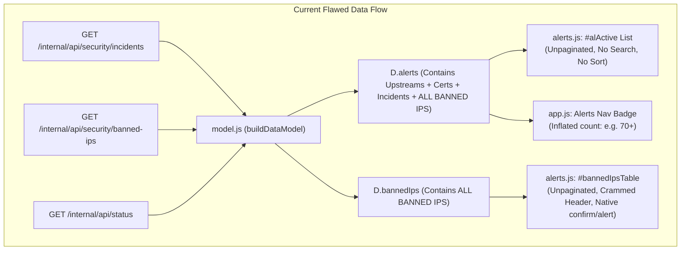
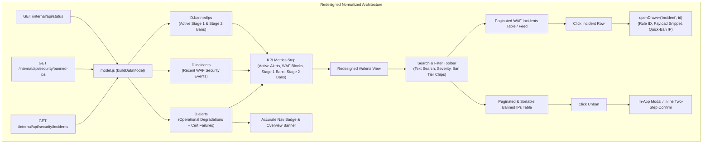

# AN-007 - Alerts and Threat Defense Control Center Redesign

## 1. Problem Statement

Operators monitoring production edge traffic via the Toron Control Center (`https://sayantansaha.in/internal/dashboard/#/alerts`) have reported severe operational friction and visual degradation:
> *"The alerts list and blocked ips list are getting very long. We need to redesign this page."*

The current Alerts & Threat Defense view suffers from structural architectural defects:
1. **Data Duplication & Cardinality Distortion**: Active IP bans are injected into both the `alerts` array and the `bannedIps` table within the client data model, causing every banned IP to render twice on the same screen and artificially inflating the primary navigation badge count.
2. **Unbounded Vertical Scrolling & Missing Data Controls**: Both the active alerts list and the banned IPs table lack pagination, search querying, category/severity filtering, and interactive column sorting, forcing operators to scroll through hundreds of unorganized DOM elements.
3. **Responsive Header Layout Collisions**: The manual IP ban form (consisting of text input, select dropdown, and action button) is crammed directly into the card header flex row, causing layout breaking and truncation on standard and constrained viewports.
4. **Synchronous Thread-Blocking Primitives**: Unban actions trigger browser-native `confirm()` and `alert()` dialogs that block JavaScript execution, break automated headless testing, and clash with the Toron dark/light design system.
5. **Inaccessible Forensic Telemetry**: When WAF security anomalies occur, rich backend security event metadata (rule ID, payload snippet, parameter location, anomaly score) is discarded by the UI because the details drawer only supports routes and HTTP request logs.
6. **Absence of High-Level Operational Signals**: The view lacks a top-level Key Performance Indicator (KPI) metrics strip to provide security operators with instant situational awareness regarding active threats, WAF block counts, and ban tier distributions.

---

## 2. Observed Behavior

### 2.1 UI Rendering & Navigation
- When navigating to `#/alerts`, the browser renders two vertically stacked cards:
  1. `Active Alerts & WAF Incidents` (`#alActive`), containing an unpaginated `<ul>` list.
  2. `Dynamic 2-Stage Auto-Ban & Blocked IPs` (`#bannedIpsTable`), containing an unpaginated `<table>`.
- If 20 IPs are banned and 50 WAF incidents have occurred, the top list outputs 70+ `<li>` items, followed immediately by 20 `<tr>` items in the table below.
- Every banned IP appears first as an alert card item (`Banned Threat Actor: <IP> (<type>)`) and second as a row in the table below (`<IP> | Stage X | <Date> | ...`).
- The left rail navigation badge for Alerts (`#nav button[data-nav="alerts"] .badge`) displays the combined length of all operational alerts, WAF incidents, and duplicate banned IPs, leading operators to believe dozens of active unmitigated incidents exist.
- The Overview status banner (`#/overview`) reports `X Active Alerts` based on `D.alerts.length`, even when the gateway is healthy and all banned actors have been blocked.

### 2.2 Search, Filtering, and Sorting Behavior
- Operators attempting to locate a specific IP address (e.g., checking if a reported client IP `198.51.100.42` is blocked) have no search input or filter controls.
- The Banned IPs table columns (`Client IP`, `Ban Tier`, `Created At`, `Temp Bans`, `Reason / Category`, `TTL / Expiry`, `Action`) have static non-clickable table headers (`<th>`). Users cannot sort by IP, ban tier, creation date, strike count, or remaining TTL.
- No severity toggles exist: Critical, Warning, and Info alerts are combined into a single unsiftable list.

### 2.3 Form Layout and Interaction
- The manual ban controls reside inside `<div class="card-h" style="display:flex;justify-content:space-between;align-items:center">`. On displays under 1200px wide or zoomed viewports, the title text and the form inputs collide and wrap, pushing buttons out of alignment.
- The form lacks an input field for `reason` and `duration`, even though the underlying backend endpoint `/internal/api/security/ban` supports both fields.
- Clicking the "Unban" button in any table row immediately invokes `window.confirm("Are you sure you want to unban IP <IP>?")`, freezing all DOM rendering and background timers until dismissed. If unbanning fails, `window.alert(...)` is triggered.

### 2.4 Incident Investigation
- Clicking an incident item in `#alActive` executes `<li data-go="alerts">`, which simply re-routes to `#/alerts` (a no-op).
- The inspection drawer (`#drawer`), which successfully renders route metrics and live request trace waterfalls on `#/routes` and `#/logs`, cannot be opened for security incidents. Operators cannot inspect the triggering OWASP rule ID, attack vector, parameter location, or matched payload snippet.

---

## 3. Expected Behavior

1. **Clean Separation of Concerns & Normalized Data Model**:
   - The primary alerts list shall only display active operational system alerts (upstream pool degradations, high 5xx error rates, failing certificate renewals) and unmitigated security anomalies.
   - Banned IPs shall exist solely within the dedicated Threat Defense Ban Table and not duplicate into the general alerts list or falsely inflate the global navigation badge.
2. **Unified Data Navigation (Search, Filter, Sort, Pagination)**:
   - Both the Security Incidents feed and the Banned IPs table shall implement client-side pagination (configurable page sizes: 10, 25, 50), matching the UX pattern in `public/js/views/logs.js`.
   - Real-time text search filtering across IP addresses, rule IDs, paths, and ban reasons.
   - Segmented facet filters for Severity (`Critical`, `Warning`), Ban Tier (`Stage 1 Temporary`, `Stage 2 Permanent`), and Category.
   - Interactive sortable column headers with visual ascending/descending indicators (`▲`/`▼`) and deterministic tie-breaking.
3. **Ergonomic & Responsive Management Controls**:
   - The manual ban form shall be decoupled from the section header into a responsive toolbar or focused modal/drawer action with input validation (IPv4/IPv6 syntax verification, tier selection, optional custom duration, and reason description).
4. **Non-Blocking In-App Confirmations**:
   - Unban actions shall utilize non-blocking in-app confirmation (such as a modal confirmation card or an inline two-step button state) with standard callout/toast feedback upon completion or failure.
5. **Security Incident Investigation Drawer**:
   - Clicking any WAF security incident shall open the slide-out drawer (`#drawer`) with `kind: 'incident'`, rendering the complete forensic breakdown: Category, Rule ID, Anomaly Score, Action (Blocked vs Logged), Parameter Location, Request Path, HTTP Method, Client IP, and Attack Payload Snippet, accompanied by a quick-action button to ban the client IP.
6. **Executive Telemetry Strip**:
   - A 4-panel KPI signal strip at the top of the view rendering:
     - **Active Incidents**: Total unresolved operational alerts and recent security incidents.
     - **Recent WAF Blocks**: Total threats intercepted and dropped by WAF rules.
     - **Stage 1 Temp Bans**: Count of IP addresses undergoing 1-hour quarantine.
     - **Stage 2 Permanent Bans**: Count of repeat offenders permanently blocked in the firewall.

---

## 4. Evidence

### 4.1 Data Model Duplication in [`public/js/model.js`](../../public/js/model.js)

Lines 309–315 of `public/js/model.js`:
```javascript
  (rawApiIncidents || []).forEach((inc, i) => {
    alerts.push({ id: `inc_${i}`, sev: 'warning', title: `WAF Security Anomaly: ${inc.category || inc.rule_id || 'Threat'} on ${inc.path}`, timestamp: inc.timestamp ? new Date(inc.timestamp).getTime() : now, ip: inc.client_ip || '', go: 'alerts', detail: () => `Blocked malicious threat from client IP ${inc.client_ip || 'unknown'}` });
  });
  (rawApiBannedIps || []).forEach((ban, i) => {
    alerts.push({ id: `ban_${i}`, sev: ban.type === 'permanent' ? 'critical' : 'warning', title: `Banned Threat Actor: ${ban.ip} (${ban.type})`, timestamp: ban.created_at ? new Date(ban.created_at).getTime() : now, ip: ban.ip || '', go: 'alerts', detail: () => ban.reason || 'IP address has been banned due to repeated security violations' });
  });
```
Then lines 332–333:
```javascript
  const computed = {
    ...
    alerts,
    bannedIps: rawApiBannedIps
  };
```
Every element of `rawApiBannedIps` is pushed as a generic alert object into `alerts`, and the original array is simultaneously passed through as `bannedIps`.

### 4.2 Unpaginated Rendering in [`public/js/views/alerts.js`](../../public/js/views/alerts.js)

Lines 50–85 of `public/js/views/alerts.js`:
```javascript
export function alUpdate(D) {
  const alEl = $('#alActive');
  if (alEl) {
    alEl.innerHTML = D.alerts.map(a => `<li data-go="${a.go}" tabindex="0" role="link">...</li>`).join('') || ...;
  }

  const tb = $('#bannedIpsTable');
  if (tb) {
    const bans = (D.bannedIps || []).slice().sort(...);
    ...
    tb.innerHTML = bans.map(b => `<tr>...</tr>`).join('');
  }
  ...
}
```
There is no pagination slicing, no limit clause, and no search predicate filtering the arrays before DOM string concatenation.

### 4.3 Crammed Header Layout in [`public/js/views/alerts.js`](../../public/js/views/alerts.js)

Lines 12–19 of `public/js/views/alerts.js`:
```html
<div class="card-h" style="display:flex;justify-content:space-between;align-items:center">
  <div><h2>Dynamic 2-Stage Auto-Ban & Blocked IPs</h2><p class="sub">Automated threat defense reactor and persistent IP firewall entries</p></div>
  <div style="display:flex;gap:8px;align-items:center">
    <input type="text" id="manualBanIP" class="field ban-fld" placeholder="IP to ban (e.g. 1.2.3.4)">
    <select id="manualBanType" class="field ban-sel"><option value="temporary">Stage 1 (1h Temp)</option><option value="permanent">Stage 2 (Permanent)</option></select>
    <button class="btn primary ban-btn" id="manualBanBtn">Ban IP</button>
  </div>
</div>
```
In `public/style.css` lines 371–373:
```css
.ban-fld{width:160px;font-size:12px;padding:4px 8px}
.ban-sel{font-size:12px;padding:4px 8px}
.ban-btn{font-size:12px;padding:4px 10px}
```
The fixed width of the controls plus flex layout creates immediate collision on viewports below 1024px.

### 4.4 Thread-Blocking Dialogs in [`public/js/views/alerts.js`](../../public/js/views/alerts.js)

Lines 30–46 of `public/js/views/alerts.js`:
```javascript
export async function unbanIpAddress(ip) {
  if (typeof confirm === 'function' && !confirm(`Are you sure you want to unban IP ${ip}?`)) return;
  try {
    const res = await authenticatedFetch('/internal/api/security/unban', { ... });
    if (res.ok) await fetchBackendData();
    else {
      const err = await res.json();
      if (typeof alert === 'function') alert('Failed to unban IP: ' + (err.message || 'Unknown error'));
    }
  } catch (e) {
    if (typeof alert === 'function') alert('Unban request error: ' + e.message);
  }
}
```

### 4.5 Drawer Limited to Route and Log in [`public/js/components/drawer.js`](../../public/js/components/drawer.js)

Lines 17–31 of `public/js/components/drawer.js`:
```javascript
  if (kind === 'route') {
    ...
  } else {
    const logs = (rawApiLogs && rawApiLogs.length > 0) ? rawApiLogs : [...];
    const e = logs.find(x => x.id === id) || logs[0];
    ...
  }
```
`openDrawer` provides no branching for `kind === 'incident'`. Passing any other kind falls back into searching `rawApiLogs`.

### 4.6 Backend Telemetry Richness in [`pkg/waf/audit.go`](../../pkg/waf/audit.go) & [`pkg/server/internal_api.go`](../../pkg/server/internal_api.go)

Lines 28–40 of `pkg/waf/audit.go`:
```go
type SecurityEvent struct {
	Timestamp      string `json:"timestamp"`
	Event          string `json:"event"`
	ClientIP       string `json:"client_ip"`
	Method         string `json:"method"`
	Path           string `json:"path"`
	Category       string `json:"category"`
	RuleID         string `json:"rule_id,omitempty"`
	AnomalyScore   int    `json:"anomaly_score"`
	Action         string `json:"action"` // "blocked" or "logged"
	Location       string `json:"location,omitempty"`
	PayloadSnippet string `json:"payload_snippet,omitempty"`
}
```
Lines 921–937 of `pkg/server/internal_api.go`:
```go
	r.GET("/internal/api/security/incidents", wrapHandler(func(req *httpparser.Request, res *httpparser.Response) {
		res.Header.Set("Content-Type", "application/json")
		events := []waf.SecurityEvent{}
		if cfg.AuditLogger != nil {
			events = cfg.AuditLogger.GetRecentEvents(50)
		}
		...
		payload := map[string]interface{}{
			"timestamp": time.Now().UTC().Format(time.RFC3339),
			"total":     len(events),
			"incidents": events,
		}
		data, _ := json.Marshal(payload)
		_, _ = res.Write(data)
	}))
```
The backend already provides all necessary forensic fields (`category`, `rule_id`, `anomaly_score`, `action`, `location`, `payload_snippet`), which are currently ignored by the frontend.

---

## 5. Scope and Impact

### 5.1 Scope of Changes
- **Frontend Presentation Layer**:
  - `public/js/views/alerts.js`: Complete architectural redesign incorporating KPI summary cards, search filter bar, tabbed/segmented categories, paginated lists, interactive sortable table headers, and decoupled manual ban workflow.
  - `public/js/components/drawer.js`: Addition of incident detail drawer rendering (`kind === 'incident'`) displaying deep forensic telemetry and one-click ban triggers.
  - `public/js/model.js`: Normalization of the alerts data pipeline to decouple active firewall bans from operational alerts.
  - `public/js/state.js`: Addition of alerts view state (search query, severity filters, ban tier filters, sort keys, page indices, page sizes).
  - `public/style.css`: Responsive styles for alerts KPI metrics grid, search toolbars, sort headers, and incident detail badges.
- **Backend API Layer**:
  - `pkg/server/internal_api.go`: Current endpoints `/internal/api/security/incidents`, `/internal/api/security/banned-ips`, `/internal/api/security/ban`, and `/internal/api/security/unban` are fully capable of supporting the redesigned view without breaking API changes.

### 5.2 Functional & Operational Impact
- **Operator Fatigue**: Eliminates duplicate alerts and false high alert counts in the top-level navigation.
- **Incident Response Time**: Reduces time-to-mitigation by allowing instant search of suspect IPs and 1-click drill-down into payload snippets and attack signatures.
- **Responsive Ergonomics**: Restores proper layout integrity on smaller tablets, split-screen desktop windows, and laptop viewports.

---

## 6. Affected Components

| Component | File Path | Nature of Change |
|---|---|---|
| **Alerts View** | [`public/js/views/alerts.js`](../../public/js/views/alerts.js) | Full UI overhaul: KPI strip, search toolbar, pagination, sortable headers, in-app modal confirmation |
| **Data Model Builder** | [`public/js/model.js`](../../public/js/model.js) | Deduplication: remove banned IPs from `alerts` array; structure distinct `alerts`, `incidents`, and `bannedIps` |
| **Drawer Component** | [`public/js/components/drawer.js`](../../public/js/components/drawer.js) | Add `kind === 'incident'` drawer template for detailed security anomaly investigation |
| **Application State** | [`public/js/state.js`](../../public/js/state.js) | Add state variables for alert search, paging, tier filter, and sort order |
| **Design System / CSS** | [`public/style.css`](../../public/style.css) | Add styling for alerts toolbar, KPI grid, pagination bar, and threat tier badges |
| **Navigation & Overview** | [`public/js/app.js`](../../public/js/app.js), [`public/js/views/overview.js`](../../public/js/views/overview.js) | Align alert badge count and overview banner to count true unresolved issues |

---

## 7. Analysis





### 7.1 Detailed Evaluation of Key Findings

#### 1. Data Duplication in `model.js`
In the current implementation, `(rawApiBannedIps || []).forEach` pushes each banned IP into `alerts` with `id: ban_${i}` and severity based on whether it is permanent or temporary.
- **Finding**: A banned IP is not an active incident requiring attention; it is a resolved mitigation executed by the automated threat defense reactor. Displaying it as both an alert item and a table row confuses operators and causes alert blindness.
- **Resolution**:
  - Remove `ban_*` injection from `alerts` in `model.js`.
  - Maintain `bannedIps` as an independent collection.
  - Structure `alerts` to only contain actionable operational anomalies (upstream down, route error rate exceeded, certificate renewal failing) and active security incidents.

#### 2. Lack of Pagination, Search, Filtering, and Sortability
- **Finding**: In production, Toron handles thousands of requests per second. Attack bursts can produce dozens of WAF alerts and ban dozens of scanning bots within minutes. The current alerts view renders all records simultaneously.
- **Pattern Match with `public/js/views/logs.js`**:
  - `logs.js` implements a high-performance, non-blocking client-side pagination pipeline:
    - Slices arrays via `(state.lpage - 1) * state.lpageSize` to `start + state.lpageSize`.
    - Updates footer indicators: `Showing start+1–end of total`.
    - Handles page changes via `lgFirst`, `lgPrev`, `lgNext`, `lgLast`, and page size dropdown `[10, 25, 50, 100]`.
    - Provides real-time query filtering via input listener.
  - Adopting this exact pagination and search structure in `alerts.js` brings uniform ergonomics and prevents browser rendering freezes.
- **Multi-Level Deterministic Sorting ([`REQ-138`](../requirements/REQ-138.md), [`ADR-138`](../architecture/ADR-138.md))**:
  - Sort headers on the Banned IPs table shall support interactive column sorting (`Client IP`, `Ban Tier`, `Created At`, `Temp Bans`, `Reason`, `TTL / Expiry`) with fallback tie-breaking on IP address.

#### 3. Manual Ban Form Crammed into Table Header
- **Finding**: Placing `<input>`, `<select>`, and `<button>` inside `<div class="card-h">` breaks on narrow screens and limits available inputs.
- **Resolution**:
  - Move manual banning into a dedicated, clean action toolbar or collapsible card below the KPI metrics strip or above the table.
  - Expose fields for IP address, Ban Tier (`Stage 1 Temporary` vs `Stage 2 Permanent`), custom Duration (for temp bans, e.g. `1h`, `24h`), and Reason description.
  - Implement client-side IP validation before dispatching `POST /internal/api/security/ban`.

#### 4. Native `confirm()` / `alert()` Blocking UI for Unban Actions
- **Finding**: `confirm()` blocks the browser UI loop. If an operator is tailing logs or monitoring live metrics in another tab or view, the execution of timers is paused.
- **Resolution**:
  - Replace `confirm()` with a custom in-app confirmation modal (leveraging the existing `#scrim` and modal patterns established in `authModal.js`) or an inline confirmation button state (e.g. initial click changes button to "Confirm Unban?", second click executes API call; reverts after 3 seconds if not clicked).
  - Replace `alert()` with an in-app error banner or toast notification.

#### 5. Missing Incident Drill-Down Drawer Integration
- **Finding**: The backend `AuditLogger` records rich telemetry: `Category`, `RuleID`, `AnomalyScore`, `Action`, `Location`, `PayloadSnippet`. None of this is exposed to the user.
- **Resolution**:
  - Extend `openDrawer(kind, id)` in `public/js/components/drawer.js` with a dedicated handler for `kind === 'incident'`.
  - When an incident item or row is clicked, open the drawer to display:
    - Rule ID and Anomaly Category with color-coded severity badges.
    - Full client IP with geographic/provenance metadata.
    - Attack vector location (`query`, `header`, `uri`, `body`).
    - Raw attack payload snippet in a formatted code block (`<pre class="cs-pre">`).
    - Exact timestamp (`YYYY-MM-DD HH:MM:SS`) and relative duration.
    - Direct action buttons: **"Ban Client IP"** (opens pre-filled ban dialog) and **"Filter Logs for IP"** (navigates to `#/logs` with IP pre-filtered).

#### 6. Missing Top-Level KPI Metrics Strip
- **Finding**: Operators need an instant dashboard summary of edge security health.
- **Resolution**:
  - Add a 4-card KPI strip at the top of `alerts.js`:
    1. **Total Active Alerts**: Unresolved operational events and recent security anomalies.
    2. **WAF Blocks (Recent)**: Total requests blocked by OWASP/custom WAF rules.
    3. **Stage 1 Temp Bans**: Currently active temporary bans (1-hour auto-defense).
    4. **Stage 2 Permanent Bans**: Escalated repeat offender permanent bans.

---

## 8. Root Cause

### Confirmed
1. **Model Redundancy**: In `public/js/model.js` lines 312–314, `rawApiBannedIps` entries are explicitly converted into `alerts` items and pushed into the same array alongside `rawApiIncidents`, causing 100% duplication on `#/alerts` and inflating the navigation badge.
2. **Missing UI Pagination & Search**: Neither `public/js/views/alerts.js` nor `public/js/state.js` implements pagination counters, filter predicates, or search query listeners for alerts or banned IPs.
3. **Hardcoded Blocking Primitives**: `public/js/views/alerts.js` explicitly invokes `confirm(...)` and `alert(...)` in `unbanIpAddress()` instead of using an in-app dialog or non-blocking notification.
4. **Drawer Dispatch Limitation**: In `public/js/components/drawer.js`, `openDrawer()` strictly checks `if (kind === 'route')` and defaults everything else to `rawApiLogs`, with no case for `incident`.

### Probable
1. **Prototype Evolution Artifact**: The Alerts view was originally designed in early prototypes (`PROTOTYPE-15` / `PROTOTYPE-25`) when only 2 or 3 test bans and sample alerts existed. As Toron matured to v1.0.0 with full OWASP WAF inspection and automated 2-stage auto-banning, traffic volume scaled up, but the Alerts view was never refactored to handle realistic dataset cardinality.

### Unknown
- None. All observed limitations are directly attributable to concrete code structures identified in `alerts.js`, `model.js`, and `drawer.js`.

---

## 9. Options

### Option 1: Full Frontend View Redesign & Model Normalization (Recommended)
Refactor `public/js/views/alerts.js`, `public/js/model.js`, `public/js/components/drawer.js`, `public/js/state.js`, and `public/style.css`:
- Normalizes `model.js` to eliminate banned IP duplication in `D.alerts`.
- Introduces top-level KPI metrics strip (Active Incidents, WAF Blocks, Stage 1 Bans, Stage 2 Bans).
- Introduces search input, severity chips, tier chips, and full pagination (10/25/50 items per page) for both the incidents feed and banned IPs table.
- Interactive sortable table headers on the Banned IPs table.
- Decouples manual IP ban form into a clean, responsive toolbar with validation.
- Replaces native `confirm()`/`alert()` with non-blocking in-app confirmation and feedback.
- Implements `kind === 'incident'` in `drawer.js` with full payload snippet and quick-ban trigger.
- **Pros**:
  - Solves all 6 identified user issues completely.
  - Zero backend breaking changes; leverages existing endpoints.
  - 100% consistent with the established design pattern in `logs.js` and `routes.js`.
  - Sub-millisecond performance on typical datasets (dozens to hundreds of bans/events).
- **Cons**:
  - Requires coordinated updates across 5 frontend files (`alerts.js`, `model.js`, `drawer.js`, `state.js`, `style.css`).

### Option 2: Server-Side Pagination and Filtering via Backend API Expansion
Modify `pkg/server/internal_api.go` and `pkg/waf/auto_ban.go` to support query parameters:
- Add `?page=1&limit=25&q=...&tier=...&sort=...` to `/internal/api/security/banned-ips` and `/internal/api/security/incidents`.
- Implement server-side filtering, locking, and pagination in Go.
- Update frontend `api.js` and `alerts.js` to dispatch paginated requests on every keystroke or page change.
- **Pros**:
  - Scales gracefully if an enterprise maintains $> 50,000$ active IP bans simultaneously.
- **Cons**:
  - Substantially higher backend implementation complexity and lock contention on `AutoBanManager` during fast search typing.
  - Unnecessary for current and near-term deployment scales (in-memory ban manager typically tracks $50 - 2,000$ active bans).
  - Breaches Version 1.0.0 API feature freeze without operational necessity.

### Option 3: Minimal Quick Fix (CSS Clamping & Table Max-Height Only)
Keep existing logic, but add CSS scroll containers (`max-height: 400px; overflow-y: auto`) and fix header flex wrapping:
- **Pros**:
  - Very low effort.
- **Cons**:
  - Leaves data duplication intact.
  - Does not provide search, filtering, or column sorting.
  - Leaves thread-blocking `confirm()`/`alert()` intact.
  - Leaves incident forensic data inaccessible in the drawer.
  - Fails to meet user and enterprise observability requirements.

---

## 10. Recommendation

Adopt **Option 1 (Full Frontend View Redesign & Model Normalization)**.

The existing backend endpoints in `pkg/server/internal_api.go` already deliver complete telemetry for both incidents and bans. The bottleneck is entirely in the presentation layer and data model assembly. Implementing Option 1 addresses all 6 findings directly, aligns `alerts.js` with the architectural patterns established in `logs.js`, preserves zero external dependencies, and adheres to Toron's strict performance and design guidelines.

---

## 11. Required Follow-up

1. **Requirements Engineering**:
   - Create `REQ-145: Alerts and Threat Defense Control Center Redesign` specifying acceptance criteria for deduplication, search/filter controls, pagination, non-blocking unban, incident drawer, and KPI metrics.
2. **Architecture Decision Record**:
   - Create `ADR-145: High-Density Observability & Incident Investigation Architecture for Threat Defense View` documenting the normalized data flow, drawer extension contract, and state schema.
3. **Task Definition**:
   - Create development tasks for frontend implementation (`alerts.js`, `model.js`, `drawer.js`, `state.js`, `style.css`).
4. **Test Design**:
   - Create `TC-145` test cases covering:
     - Deduplication verification: ensure banned IPs are not present in `alerts`.
     - Pagination and search filtering on both alerts and bans.
     - Interactive column sorting on the Banned IPs table.
     - Non-blocking confirmation on unban actions.
     - Incident drawer rendering with payload snippets.
     - Accurate KPI metrics calculation.

---

## 12. Risks

1. **Overview Widget & Nav Badge Regression**:
   - Existing code in `overview.js` and `app.js` relies on `D.alerts.length`. Removing banned IPs from `alerts` will reduce this count. This is desirable (as it removes false duplicates), but tests expecting banned IPs in `D.alerts` must be reviewed to prevent test suite failures.
2. **State Management Synchronization**:
   - Adding alerts view filter and pagination state to `state.js` must ensure clean resets when switching between dashboard views or when data is refreshed.
3. **Drawer Dom Conflict**:
   - Extending `drawer.js` must ensure proper focus trapping, scrim behavior, and cleanup when toggling between route details, request log traces, and security incidents.

---

## 13. Open Questions

1. **Incident Retention Window**:
   - Backend `AuditLogger` currently keeps the last 50 events in its in-memory circular ring buffer (`maxEvents: 50`). Should this buffer capacity be made configurable via `InternalAPIConfig` if operators require a deeper in-memory history? *(Analysis: 50 is sufficient for live UI inspection; long-term audit logging is written to stdout/file sink).*
2. **Auto-Ban Duration Customization**:
   - When manually banning an IP via the redesigned form or the incident drawer, should operators be allowed to enter a custom duration (e.g., 30m, 6h, 7d) or select from predefined presets? *(Analysis: The backend `AutoBanManager.Ban` method accepts an arbitrary `time.Duration`; offering presets with a custom duration option provides optimal ergonomics).*
