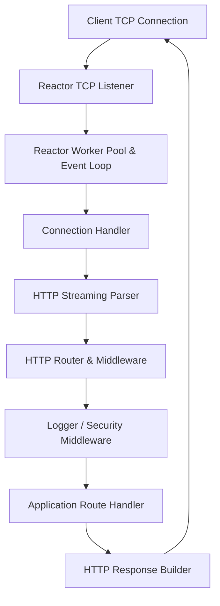
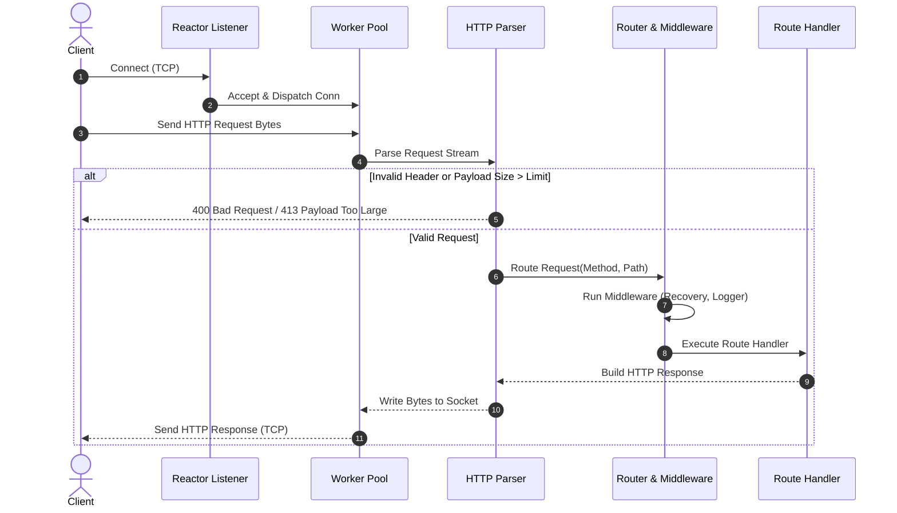

# ADR-001 - Event-Driven Reactor and HTTP Server Architecture

## Description

This document defines the high-level system architecture, package boundaries, data flows, and component responsibilities for Toron, an event-driven Go HTTP web server focused on performance and security.

## Decision

Toron will employ a multi-layered, modular event reactor architecture:

1. **Reactor Engine (`pkg/reactor`)**:
   - Manages non-blocking TCP socket listeners and connection acceptance.
   - Dispatches socket read/write events to worker goroutines using a bounded worker pool and channel-based event loops.
   - Uses `sync.Pool` for zero-allocation connection buffer recycling.

2. **HTTP Protocol Engine (`pkg/httpparser`)**:
   - Implements a streaming HTTP/1.1 request parser and response writer.
   - Enforces configurable read/write deadlines, header size limits (8KB), and request body limits (4MB).

3. **Routing & Middleware Engine (`pkg/router`)**:
   - Provides HTTP route registration and HTTP method matching.
   - Executes middleware stacks (Logger, Recovery, Security Guards) prior to final endpoint handler invocation.

4. **Server Orchestrator (`pkg/server`)**:
   - Binds component lifecycles, configuration defaults, and signal handling (`SIGINT`, `SIGTERM`) for graceful server shutdown.

## Mermaid Diagram

### Component Architecture

### Request Lifecycle Sequence

## Alternatives Considered

1. **Stdlib `net/http` Wrappers**:
   - *Pros*: Fast initial setup.
   - *Cons*: Tightly couples reactor and protocol layers, making custom event loop optimisations and protocol extensions difficult.
2. **Pure OS Epoll Syscalls (`golang.org/x/sys/unix`)**:
   - *Pros*: Maximum performance on Linux.
   - *Cons*: Loses cross-platform Windows compatibility for initial prototype development.
3. **Hybrid Go Netpoller Reactor (Selected)**:
   - *Pros*: Leverages Go runtime's OS-native netpoller (epoll/kqueue/IOCP) with explicit goroutine worker pool and custom buffer pooling, yielding cross-platform compatibility, modularity, and high throughput.

## Rationale

The Hybrid Go Netpoller Reactor strikes the ideal balance between extreme cross-platform portabilty, clean package modularity, and low allocation footprint.

## Constraints

- Codebase MUST maintain strict package isolation between `reactor`, `httpparser`, `router`, and `server`.
- Public functions MUST follow idiomatic Go naming conventions and error wrapping patterns (`fmt.Errorf("...: %w", err)`).

## Consequences

- Components can be independently unit tested using table-driven Go tests.
- Swapping the transport layer or adding HTTP/2 in future iterations will not require refactoring application handlers.

## Open Questions

- None.
