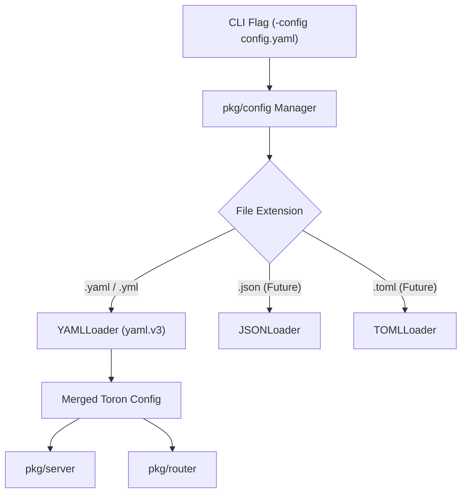

# ADR-002 - Extensible File Configuration Architecture

## Description

This document defines the architectural design for file-based configuration loading in Toron, supporting YAML initially while facilitating future extensions to JSON, TOML, or environment variable overrides.

## Decision

1. **`pkg/config` Abstraction**:
   - `Loader` interface: `Load(filePath string) (*Config, error)`.
   - `Decoder` registry maps file extensions (`.yaml`, `.yml`, `.json`, `.toml`) to appropriate decoders.
   - `YAMLLoader`: Implements `Loader` for `.yaml` / `.yml` files using `gopkg.in/yaml.v3`.

2. **Configuration Hierarchy**:
   - `ServerConfig`: `host`, `port`, `worker_pool_size`, `read_timeout`, `write_timeout`, `idle_timeout`, `max_header_bytes`, `max_body_bytes`.
   - `StaticConfig`: `enabled`, `prefix`, `dir`.
   - `LoggingConfig`: `level`, `format`.

3. **Fallback Strategy**:
   - Hardcoded `DefaultConfig()` is populated first.
   - Unmarshaled file configuration overwrites default fields if present.

## Mermaid Diagram

## Rationale

Decouples format-specific decoding logic from application domain structs. Adding support for JSON or TOML in the future will only require registering a new `Decoder` without altering application startup code.

## Constraints

- Default fallback ensures zero-configuration start remains functional.

## Open Questions

- None.
