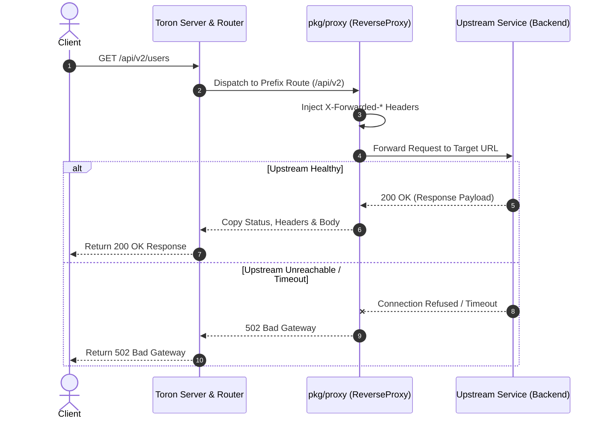

# ADR-004 - Reverse Proxy and Gateway Routing Architecture

## Description

This document defines the architecture, data flow, and package boundaries for Toron's reverse proxy module.

## Decision

1. **`pkg/proxy` Module**:
   - `ReverseProxy`: Decoupled proxy handler wrapping an upstream target URL and an `http.Client` with configurable connection timeouts.
   - `ServeHTTP(req *httpparser.Request, res *httpparser.Response)` translates Toron HTTP `Request` into outbound HTTP request, dispatches to upstream, and copies response status, headers, and body back to `Response`.

2. **Header Rewriting & Injections**:
   - Injects `X-Forwarded-For` (client remote IP).
   - Injects `X-Forwarded-Host` (original Host header).
   - Injects `X-Forwarded-Proto` (`http` / `https`).
   - Injects `X-Real-IP`.

3. **Error Handling**:
   - If upstream connection fails or times out, returns `502 Bad Gateway` with JSON payload `{"error":"502 Bad Gateway: Upstream Unreachable"}`.

## Mermaid Sequence Diagram

## Rationale

Decoupled `pkg/proxy` design allows Toron to act as a standalone HTTP reverse proxy or API gateway.

## Constraints

- Timeouts MUST prevent hung upstream connections from exhausting Toron worker pools.

## Open Questions

- None.
