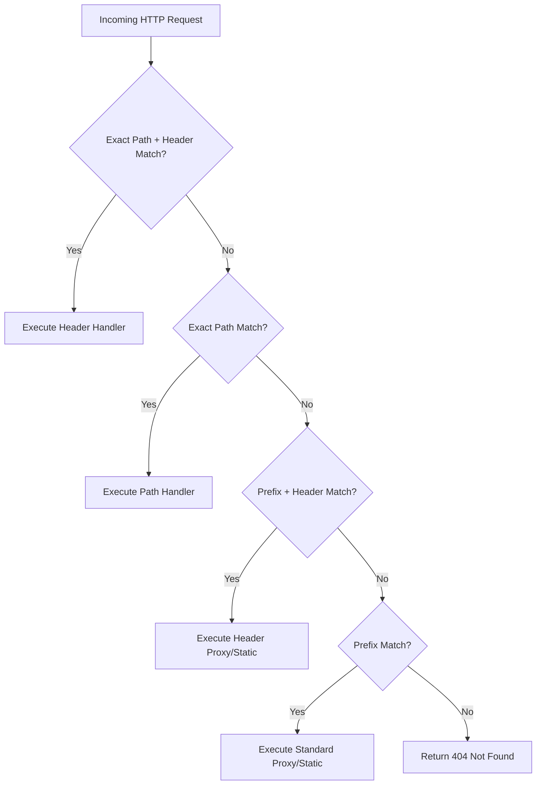

# ADR-005 - Header-Based Routing & Traffic Matching Architecture

## Description

This document defines the resolution order, data structures, and matching algorithm for header-based HTTP routing in Toron.

## Decision

1. **Header Matching Rule Data Structure**:
   ```go
   type HeaderRule struct {
       Key   string
       Value string
   }
   ```

2. **Route Resolution Priority Order**:
   - Priority 1: Exact path + HTTP method + Header rules match.
   - Priority 2: Exact path + HTTP method match.
   - Priority 3: Prefix route (static/proxy) + Header rules match.
   - Priority 4: Prefix route (static/proxy) match.
   - Priority 5: 404 Not Found / 405 Method Not Allowed.

3. **YAML Schema Integration**:
   ```yaml
   proxy:
     enabled: true
     routes:
       - prefix: "/api"
         headers:
           X-Version: "v2"
         target: "http://localhost:9092"
   ```

## Mermaid Resolution Flowchart



## Rationale

Prioritizing header rules ahead of generic path rules enables non-disruptive A/B testing and canary deployment routing without modifying existing fallback routes.

## Constraints

- Header name comparisons must be normalized using `httpparser.Header.Get(key)`.

## Open Questions

- None.
