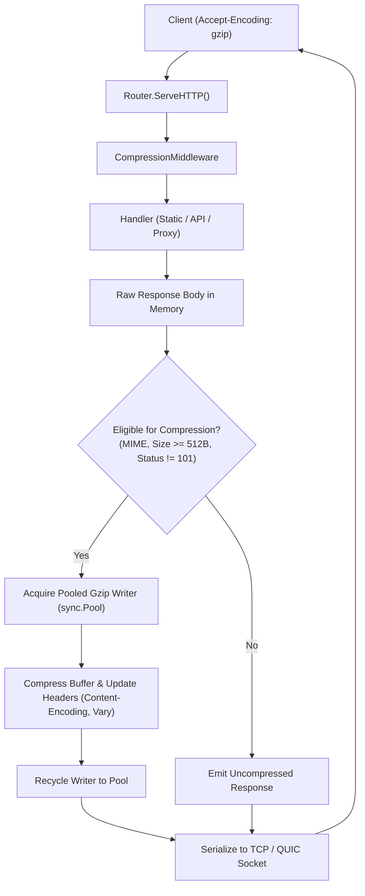

# ADR-029 - Transparent Response Compression Architecture (Gzip & Deflate)

## Context

Static assets (HTML, CSS, JS, JSON) and API payloads served by Toron benefit greatly from streaming compression over WAN connections. Compression should occur transparently without requiring modifications to upstream microservices or static file handlers.

## Decision

1. **Zero External Dependencies**:
   - Utilize standard library packages `compress/gzip` and `compress/flate` exclusively, adhering to Toron's core principle of minimizing 3rd-party dependencies.

2. **Writer Object Pooling (`sync.Pool`)**:
   - Gzip and Flate writer allocations create GC overhead under high QPS. Implement `sync.Pool` for gzip writers and flate writers with `Reset(buf)` to achieve zero-allocation buffer reuse during active request pipelines.

3. **Negotiation and Precedence**:
   - Inspect incoming `Accept-Encoding` header:
     - `gzip` (preferred if present)
     - `deflate` (fallback if gzip not requested)
     - `identity` / unsupported: passthrough uncompressed.

4. **Selective Compression Filter**:
   - Compression is applied only if ALL the following hold:
     - Response status code is not 101, 204, or 304.
     - `UpgradedConn` is nil (WebSocket/tunneling safe).
     - Response body size $\ge$ `min_length` (default 512 bytes).
     - `Content-Encoding` header is not already set.
     - `Content-Type` is a compressible text/data format (`text/*`, `application/json`, `application/javascript`, `application/xml`, `image/svg+xml`, etc.).

5. **Header Management**:
   - Sets `Content-Encoding: gzip` / `Content-Encoding: deflate`.
   - Adds/appends `Vary: Accept-Encoding` to preserve downstream HTTP proxy cache correctness.
   - Recalculates `Content-Length` matching compressed byte buffer length.

## Architecture Flow

## Consequences

- **Bandwidth Reduction**: Up to 70-85% payload reduction for text/JSON responses.
- **High Concurrency Performance**: Memory footprint is bounded by `sync.Pool` recycler.
- **Compatibility**: Fully compliant with RFC 9110 HTTP Semantics for content codings.
