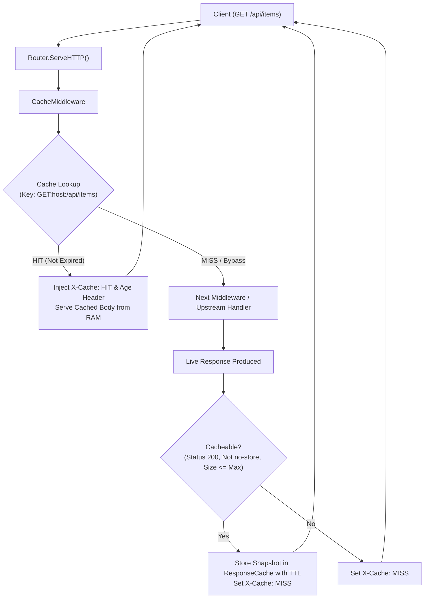

# ADR-030 - In-Memory HTTP Response Caching & Cache-Control Architecture

## Context

High-concurrency API gateways benefit substantially from serving repeated read requests from RAM. A built-in response cache reduces CPU load on upstream microservices and static asset file I/O while ensuring strict adherence to RFC 7234 HTTP caching specifications.

## Decision

1. **In-Memory Thread-Safe Store (`ResponseCache`)**:
   - Store responses as immutable serialized snapshots (`statusCode`, cloned `headers`, `[]byte` body snapshot, `cachedAt` timestamp, `expiresAt` timestamp).
   - Guard entry map with `sync.RWMutex` to support high-throughput concurrent reads.

2. **Cache Key Generation**:
   - Cache key format: `method + ":" + host + ":" + requestURI`.
   - Normalizes host and paths to lower case where appropriate.

3. **Cache Eligibility & RFC 7234 Directives**:
   - **Request Check**:
     - Method must be `GET` or `HEAD`.
     - Bypasses cache if request header contains `Cache-Control: no-cache` or `Pragma: no-cache`.
   - **Response Check**:
     - Status code must be cacheable (200, 301, 404).
     - Response must not be WebSocket (`101 Switching Protocols` / `UpgradedConn != nil`).
     - Response `Cache-Control` must not contain `no-store` or `private`.
     - Response body length must not exceed `max_payload_size` (default 1 MB).
     - TTL is computed from `max-age=N` in `Cache-Control`, or falls back to `default_ttl` (default 60s).

4. **Diagnostics & Age Headers**:
   - Cache hits receive:
     - `X-Cache: HIT`
     - `Age: <seconds>` (calculated as `time.Since(cachedAt).Seconds()`).
   - Cache misses / fresh fetches receive:
     - `X-Cache: MISS`.

5. **Memory Boundaries & Eviction**:
   - Expired entries are discarded passively on access or through periodic garbage collection when entry count approaches `max_entries`.

## Architecture Flow

## Consequences

- **Sub-millisecond Response Latency**: Repeated cache hits return directly from RAM without hitting disk or upstream sockets.
- **RFC 7234 Compliant**: Honors `no-store`, `no-cache`, `max-age`, and `Age` calculations.
- **Bounded Resource Footprint**: Memory growth is strictly constrained by `max_entries` and `max_payload_size`.
