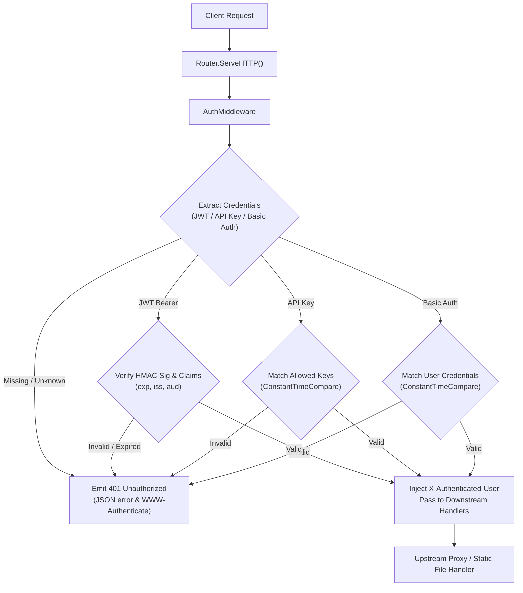

# ADR-031 - Multi-Scheme Authentication & Access Control Architecture

## Context

Edge gateways and reverse proxies act as the primary security perimeter for downstream microservices. They must authenticate incoming requests, validate tokens, and pass verified identity claims upstream while preventing unauthorized traffic from reaching backend applications.

## Decision

1. **Zero External Dependencies**:
   - Build JWT parsing, base64url decoding, and HMAC cryptographic signature verification (`HS256`, `HS384`, `HS512`) using standard library `crypto/hmac`, `crypto/sha256`, `crypto/sha512`, `encoding/base64`, and `encoding/json`.

2. **Timing Attack Protection**:
   - Use `crypto/subtle.ConstantTimeCompare` for API key matching, basic auth password comparisons, and HMAC signature validations to prevent side-channel timing attacks.

3. **Authentication Schemes**:
   - **Scheme 1: JWT Bearer (RFC 7519)**:
     - Header: `Authorization: Bearer <header>.<payload>.<signature>`
     - Validates algorithm header (`alg: "HS256"`, `"HS384"`, or `"HS512"`), signature match, `exp` timestamp $> now$, `nbf` timestamp $\le now$, and optional `iss` / `aud` claims.
   - **Scheme 2: API Key**:
     - Extracted from `X-API-Key`, `Authorization: ApiKey <key>`, or `?api_key=<key>`.
     - Validated against configured key list.
   - **Scheme 3: HTTP Basic Auth (RFC 7617)**:
     - Header: `Authorization: Basic <base64>`
     - Validated against user:password table.

4. **Upstream Identity Injection**:
   - On successful authentication, injects `X-Authenticated-User` (e.g. JWT `sub`, Basic Auth username, or API Key identifier) into the request headers forwarded to upstream microservices.

## Architecture Flow

## Consequences

- **Secure Edge Perimeter**: Unauthorized requests are stopped before reaching internal application clusters.
- **Zero-Dependency Simplicity**: Completely self-contained within the Go standard library.
- **Microservice Ergonomics**: Downstream services can trust `X-Authenticated-User` headers without having to re-validate JWT signatures.
