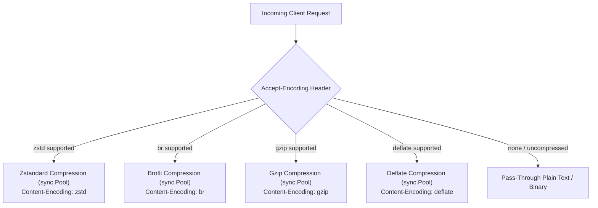

# ADR-032 - Brotli (`br`) and Zstandard (`zstd`) Streaming Response Compression Architecture

## Context

While Gzip and Deflate provide baseline compression compatibility across older HTTP clients, modern browsers and cloud microservices overwhelmingly prefer Brotli (`br`) for higher compression density and Zstandard (`zstd`) for near real-time compression/decompression speeds at high throughput.

## Decision

1. **Algorithm Selection & Precedence**:
   - Parse `Accept-Encoding` with quality factors (`q=`).
   - For equal quality factors, apply the modern precedence order: `zstd` > `br` > `gzip` > `deflate`.

2. **Zero-Allocation Encoder Pools**:
   - `brotliPool`: Wraps `brotli.NewWriterLevel(buf, brotli.DefaultCompression)` and `writer.Reset(buf)`.
   - `zstdPool`: Wraps `zstd.NewWriter(buf)` and `writer.Reset(buf)`.
   - Both recycled into `sync.Pool` after writing payload bytes.

3. **Streaming Safe Boundaries**:
   - WebSocket handshakes (`101 Switching Protocols`) and content with `min_length < 512` bypass compression.

## Consequences

- **Bandwidth Reduction**: Brotli achieves 15–25% smaller sizes on JSON/JS/CSS compared to Gzip.
- **Ultra-Fast Throughput**: Zstandard achieves 3–5x faster compression speeds than Gzip at comparable ratios.
- **Backward Compatibility**: Fully backward compatible with legacy HTTP/1.1 and HTTP/2 clients.
