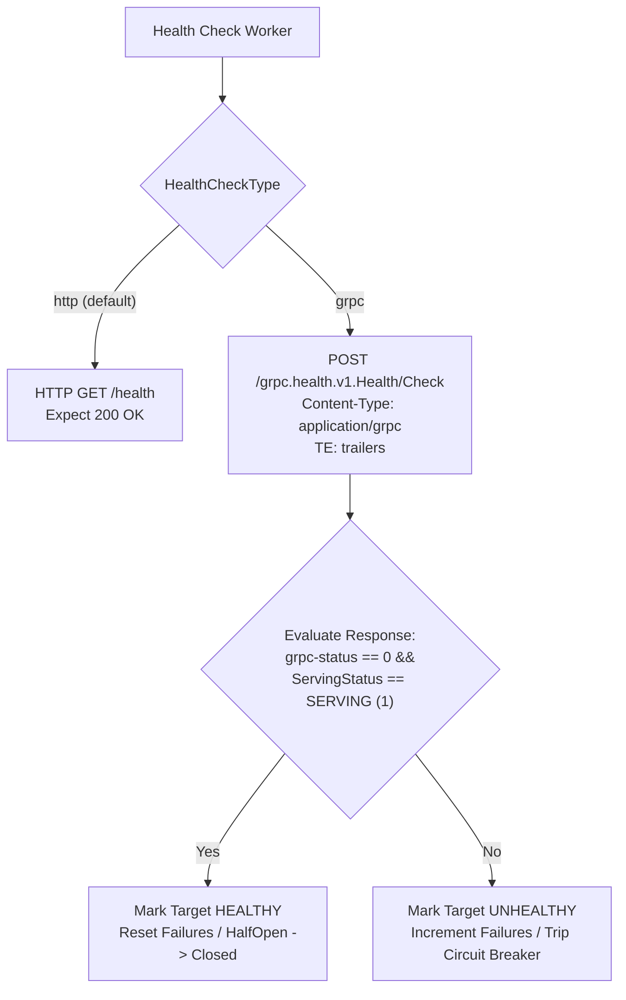

# ADR-033 - Native gRPC Health Probing Protocol and HTTP/2 Trailers Gateway Architecture

## Context

gRPC microservices operate purely over HTTP/2 using binary Protobuf frames and deliver status outcomes inside HTTP/2 trailing headers (`grpc-status`). Standard REST health probes (`GET /health`) fail when aimed at gRPC server ports, and standard HTTP proxies often drop or mishandle trailers.

## Decision

1. **Lightweight Pure Go `grpc.health.v1.Health` Prober**:
   - Instead of importing heavy external C-based gRPC libraries, construct the standard protobuf binary request for `HealthCheckRequest`:
     - Wire format: `tag=0x0a` (`field 1, wire type 2`), `length(service)`, `service string bytes`.
   - Wrap with the standard 5-byte gRPC frame prefix: `[0x00, len[0], len[1], len[2], len[3]]`.
   - Dispatch over HTTP/2 with `Content-Type: application/grpc` and `TE: trailers`.
   - Inspect response HTTP status `:status 200`, `grpc-status: 0`, and parse `ServingStatus == 1 (SERVING)`.

2. **HTTP/2 Trailers Preservation**:
   - Clones upstream response trailers into `httpparser.Response.Header` and preserves `grpc-status`, `grpc-message`, and `grpc-status-details-bin`.

## Consequences

- **Enterprise gRPC Gateway Capability**: Toron natively monitors and load balances gRPC clusters without requiring sidecar translators or external probe helpers.
- **Zero Heavy Dependencies**: Completely implemented within Go standard networking packages and protobuf binary encoding.
