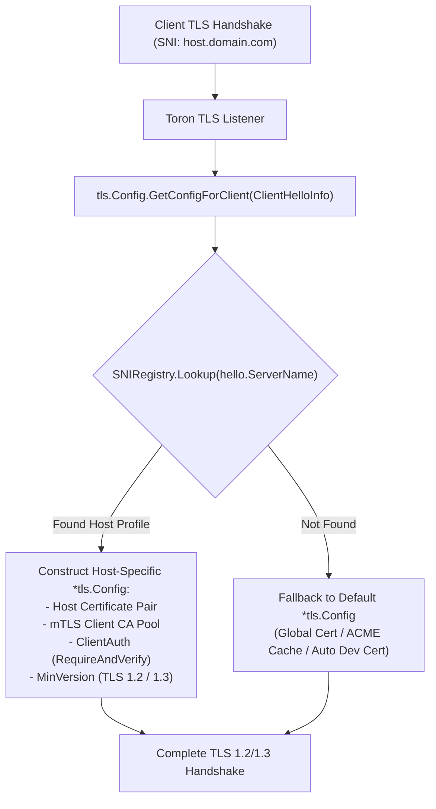

# ADR-034 - Per-Host Dynamic SNI Certificate Mapping and Mutual TLS (mTLS) Architecture

## Context

In multi-tenant cloud edge environments, a single gateway instance often hosts dozens of virtual host domains with distinct requirements: public domains require standard TLS certificates, while internal corporate API hosts require strict Mutual TLS (mTLS) with dedicated Certificate Authority (CA) validation and TLS 1.3 enforcement.

## Decision

1. **Decoupled Route-Level TLS Definition in `routes.yaml`**:
   - Associate per-host TLS settings directly with route definitions:
     ```yaml
     routes:
       - type: "upstream"
         host: "api.internal.local"
         prefix: "/"
         target: "http://localhost:9001"
         tls:
           cert_file: "./certs/api_internal.crt"
           key_file: "./certs/api_internal.key"
           ca_file: "./certs/internal_ca.crt"
           client_auth: "require_and_verify" # mTLS
           min_version: "tls1.3"
     ```

2. **Thread-Safe `SNIRegistry` & `GetConfigForClient`**:
   - Build `SNIRegistry` mapping lowercased hostnames to `HostTLSProfile` (`tls.Certificate`, `*x509.CertPool`, `tls.ClientAuthType`, `MinVersion`).
   - Hook into Go's standard library `tls.Config.GetConfigForClient(hello *tls.ClientHelloInfo) (*tls.Config, error)`.



3. **Hot-Reload Safety**:
   - `SNIRegistry` protects its profile table with `sync.RWMutex`, allowing route reload workers (`RouteWatcher`) to atomically update certificates in memory without restarting listeners or dropping active connections.

## Consequences

- **True Multi-Tenancy**: Single Toron instance can serve public websites and secure mTLS internal APIs concurrently.
- **Zero Extra Dependencies**: Utilizes native Go `crypto/tls` and `crypto/x509` capabilities.
