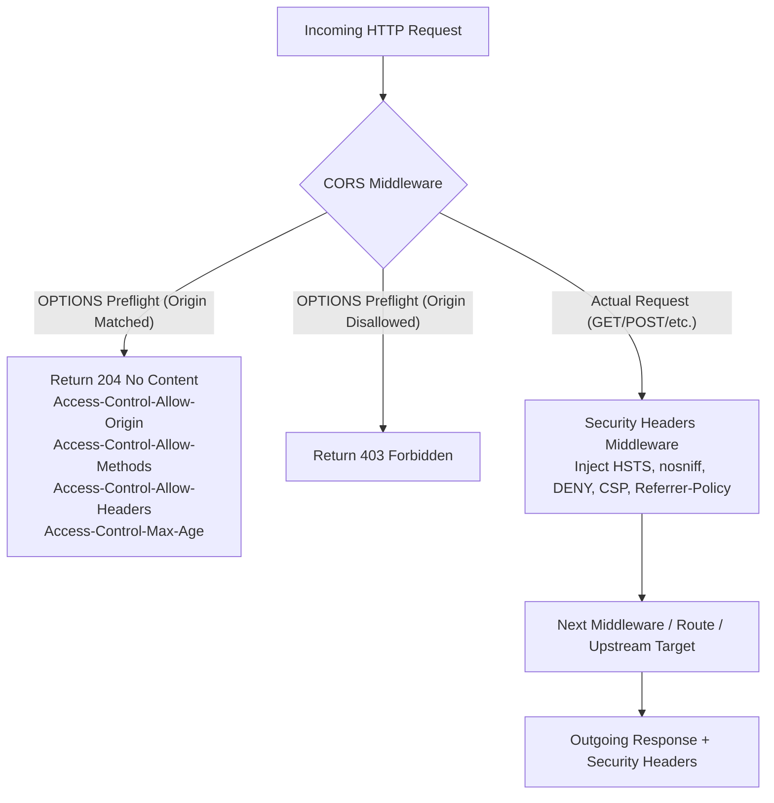

# ADR-035 - Configurable CORS Policies and Enterprise Security Headers Architecture

## Context

Web applications exposed through edge proxies require strict browser security policies (mitigating Clickjacking, MIME-confusion attacks, and insecure transport downgrades) and controlled Cross-Origin Resource Sharing (CORS) for decoupled SPA frontend architectures (React, Vue, Angular).

## Decision

1. **Dedicated Pipeline Middleware**:
   - `CORSMiddleware`: Positioned near the start of the router pipeline to intercept preflight `OPTIONS` requests before they hit expensive authentication, caching, or upstream network proxy handlers.
   - `SecurityHeadersMiddleware`: Applied to outgoing responses, appending compliant security headers.

2. **Zero-Allocation Origin Resolution**:
   - `matchOrigin(origin string, allowed []string) bool`:
     - Checks wildcard `*`.
     - Checks exact string equality (`origin == allowed`).
     - Checks wildcard subdomain patterns (e.g. `https://*.example.com`).

## Consequences

- **Browser Security Hardening**: Immediate compliance with OWASP Top 10 web security hygiene recommendations.
- **Microservice Offloading**: Backend microservices do not need to implement custom CORS preflight logic or repetitive header injection.
