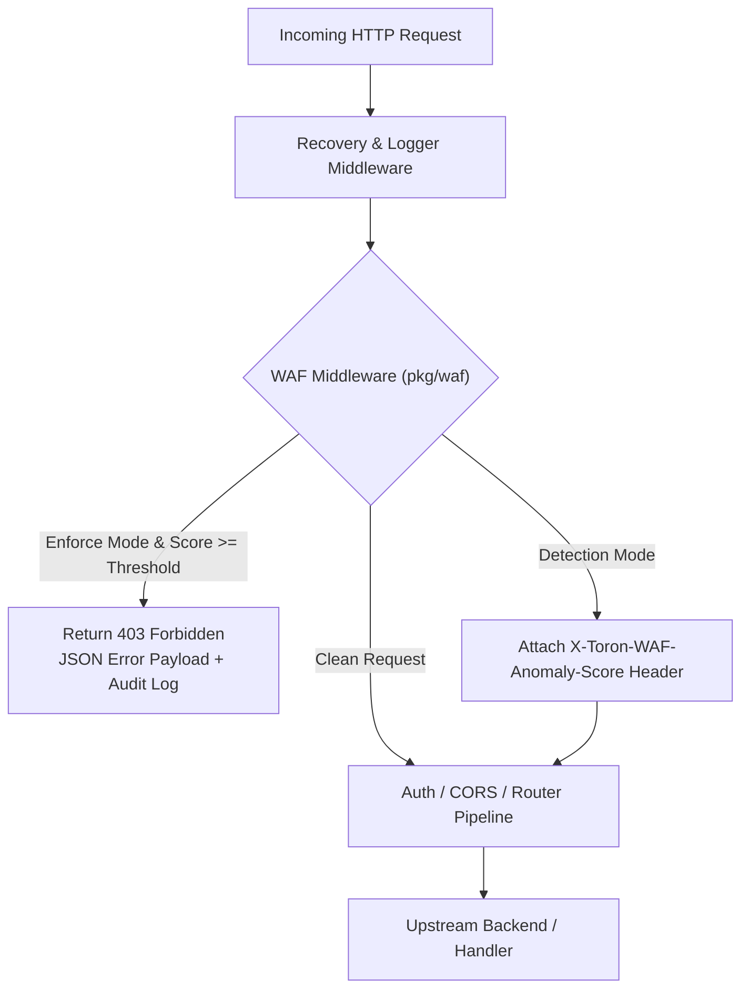

# ADR-036 - Core Web Application Firewall Architecture & Rule Inspection Pipeline

## Context

Toron acts as an edge proxy and web server handling direct internet traffic. To mitigate Layer 7 application attacks (SQL Injection, XSS, Path Traversal, Command Injection) without relying on external WAF appliances or heavy sidecars, Toron requires a native, high-throughput WAF middleware engine (`pkg/waf`).

## Decision

1. **Dedicated `pkg/waf` Package**:
   - Decouple WAF inspection logic into `pkg/waf` separate from HTTP routing (`pkg/router`), allowing standalone reuse or router middleware wrapping.

2. **Inspection Pipeline Order**:
   - WAF middleware is positioned **immediately after Recovery / Logging** and **before Authentication / Route Dispatching**. This ensures malicious requests are intercepted before wasting CPU cycles on JWT/API-key parsing or upstream connection acquisition.

3. **Pre-Compiled Regex & Multi-Location Scanning**:
   - All default OWASP rules (SQLi, XSS, Path Traversal, RCE) are pre-compiled during `NewEngine()` initialization into `*regexp.Regexp`.
   - Inspection covers:
     - `URL.Path` & `URL.RawQuery`
     - Request Headers (`User-Agent`, `Referer`, `Cookie`, `X-Forwarded-For`)
     - Request Body (read up to `MaxInspectBodySize` bytes and restored to `req.Body` using `io.NopCloser`).

## Consequences

- **Sub-millisecond Overhead**: Pre-compiled regex and early short-circuit evaluation ensure < 0.5ms inspection overhead per request.
- **Zero-Dependency Core**: Implemented using pure Go stdlib (`regexp`, `net/http`, `sync`, `bytes`).
