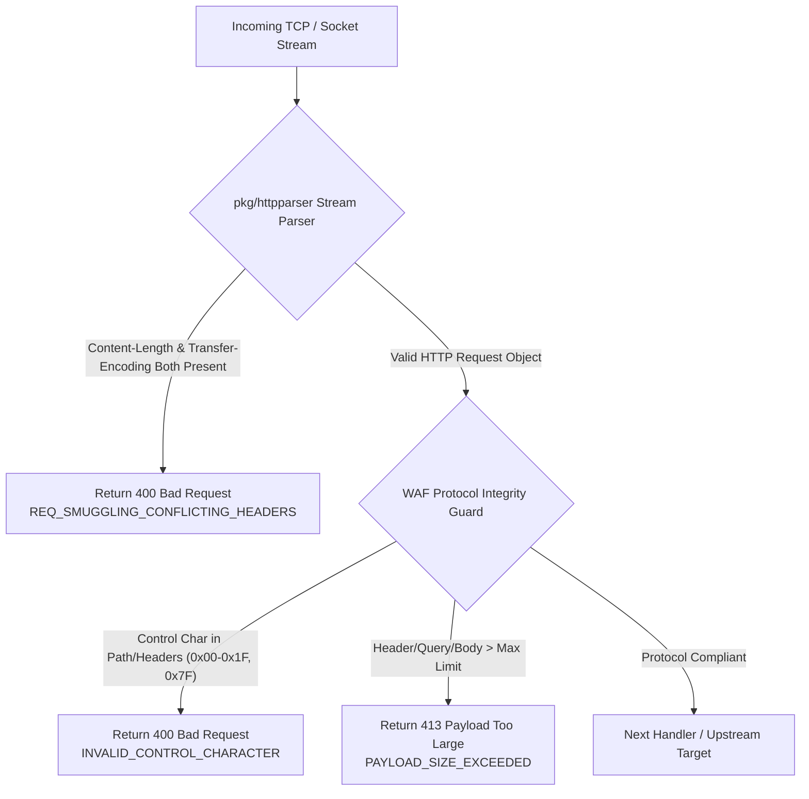

# ADR-037 - Protocol Integrity and Request Smuggling Guard Architecture

## Context

HTTP Request Smuggling occurs when an edge proxy and an upstream server parse HTTP request boundaries differently (e.g. one uses `Content-Length` while the other uses `Transfer-Encoding: chunked`). Additionally, non-printable control characters in URIs or header names can cause parser confusion or CRLF injection.

## Decision

1. **Dual-Layer Defense Architecture**:
   - **Layer 1 (HTTP Parser Level - `pkg/httpparser`)**: Reject conflicting `Content-Length` + `Transfer-Encoding` during raw TCP stream deserialization before object allocation.
   - **Layer 2 (WAF Engine Level - `pkg/waf`)**: Deep inspection of request paths, query strings, headers, and body sizes against protocol limits.

2. **Strict RFC Compliance Enforcement**:
   - Reject any request where `Header.Get("Content-Length") != ""` AND `Header.Get("Transfer-Encoding") != ""`.
   - Scan byte values for non-printable control characters (`b < 0x20 && b != '\t'` or `b == 0x7F`).
   - Validate single header size against `max_header_value_bytes` (4 KB) and query param size against `max_param_bytes` (2 KB).

## Consequences

- **Complete Immunity to CL.TE / TE.CL Attacks**: Prevents backend desynchronization vulnerabilities.
- **Header Injection & CRLF Prevention**: Control character filtering neutralizes HTTP header splitting and response splitting.
