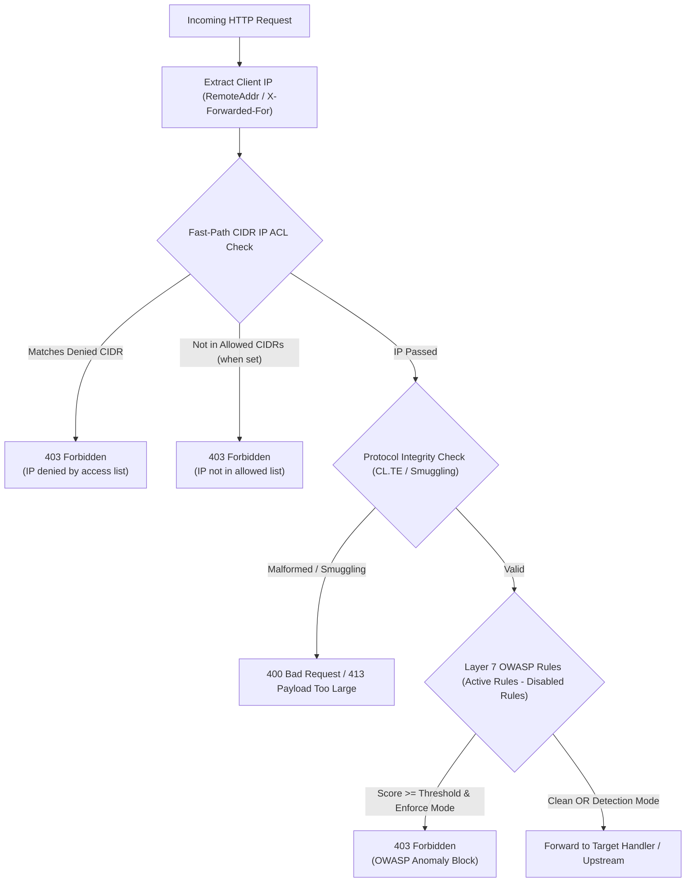

# ADR-038 - Route-Level WAF Overrides and CIDR IP Access Lists Architecture

## Context

Toron web server operates as a multi-tenant edge gateway where different APIs and microservices require distinct security postures:
1. Some internal microservices need strict IP allowlists (e.g. only corporate VPN CIDRs `10.0.0.0/8`).
2. Public APIs may need to block known malicious scanning subnets (`198.51.100.0/24`).
3. Legacy endpoints or specific webhook ingestion routes may produce payload patterns triggering false positives on specific OWASP rules (e.g. `SQLI-001`), requiring selective rule disabling on that route without sacrificing gateway-wide protection.
4. Fast-path IP filtering must happen before deep regex packet inspection to save CPU cycles during volumetric denial-of-service attempts.

## Decision

1. **Pre-Compiled IP Access List (`pkg/waf/ip_acl.go`)**:
   - Parse CIDR notations (`net.ParseCIDR`) and single IP strings (`net.ParseIP`) at startup/route registration into compiled `[]*net.IPNet` structures.
   - Fast-path verification:
     - Check `DeniedIPs` first. If client IP matches any denylist subnet, reject immediately with `403 Forbidden`.
     - Check `AllowedIPs`. If non-empty and client IP does not match any allowlist subnet, reject immediately with `403 Forbidden`.

2. **Per-Route WAF Middleware Encapsulation**:
   - In `routes.yaml`, each route can specify a `waf:` block.
   - When present, the router initializes a route-scoped `WAFEngine` configured with route-specific `AnomalyThreshold`, `Mode`, `DisabledRules`, `AllowedIPs`, and `DeniedIPs`.
   - The route handler is wrapped with this dedicated route WAF middleware, executing before the upstream proxy handler.

3. **Performance & Memory Efficiency**:
   - Zero heap allocation during IP CIDR matching (`IPNet.Contains(ip)` operates on stack-allocated values).
   - Early exit on IP rejection avoids body buffering and regex matching entirely.

## Consequences

- **Positive**: High resilience against untrusted networks, fine-grained control for API teams, zero CPU overhead on blocked IP ranges.
- **Traceability**: All decisions are fully aligned with `REQ-043`, `TASK-043`, and tested via `TC-043`.
