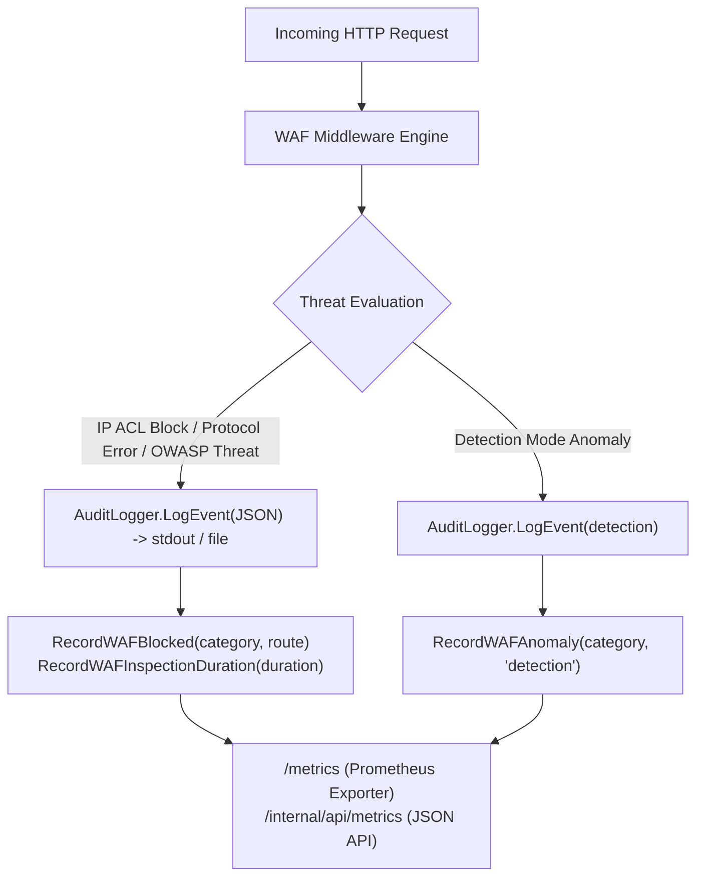

# ADR-039 - WAF Telemetry, Prometheus Metrics, and Structured Security Audit Logging Architecture

## Context

Security operations (SecOps) and site reliability engineering (SRE) teams require real-time telemetry into attacks targeting edge infrastructure. Without standardized metrics and structured audit logs, security operators cannot configure automated alerting (e.g. Grafana alerts on SQLi spikes) or ingest security audit trails into SIEM platforms (Splunk, Elastic, Datadog).

## Decision

1. **Prometheus WAF Metrics Ingestion (`pkg/metrics`)**:
   - Add specialized WAF metric structures within `MetricsRegistry` without adding external dependencies:
     - `toron_waf_blocked_requests_total{category="...",route="..."}`
     - `toron_waf_anomalies_detected_total{category="...",mode="detection"}`
     - `toron_waf_inspection_duration_seconds` (latency histogram with fine-grained sub-millisecond buckets).
   - Prometheus format is emitted automatically via the existing `/metrics` scraping endpoint.

2. **Decoupled Security Audit Logger (`pkg/waf/audit.go`)**:
   - Provide `AuditLogger` with structured JSON serialization (`encoding/json`) writing to `os.Stdout`, `os.Stderr`, or an append-only file sink (`os.OpenFile(..., O_CREATE|O_WRONLY|O_APPEND)`).
   - Sanitize and truncate payload snippets to a maximum of 128 characters to prevent unbounded memory allocation and log flooding.

3. **Concurrency & Thread Safety**:
   - Use `sync.Mutex` on `AuditLogger` to serialize file writes safely across concurrent reactor worker goroutines.
   - Use `sync.RWMutex` on `MetricsRegistry` for low-contention updates.

## Consequences

- **Positive**: Real-time visibility into edge security threats, Prometheus alerting integration, SIEM compliance.
- **Traceability**: Aligns directly with `REQ-044` and `TASK-044`.
