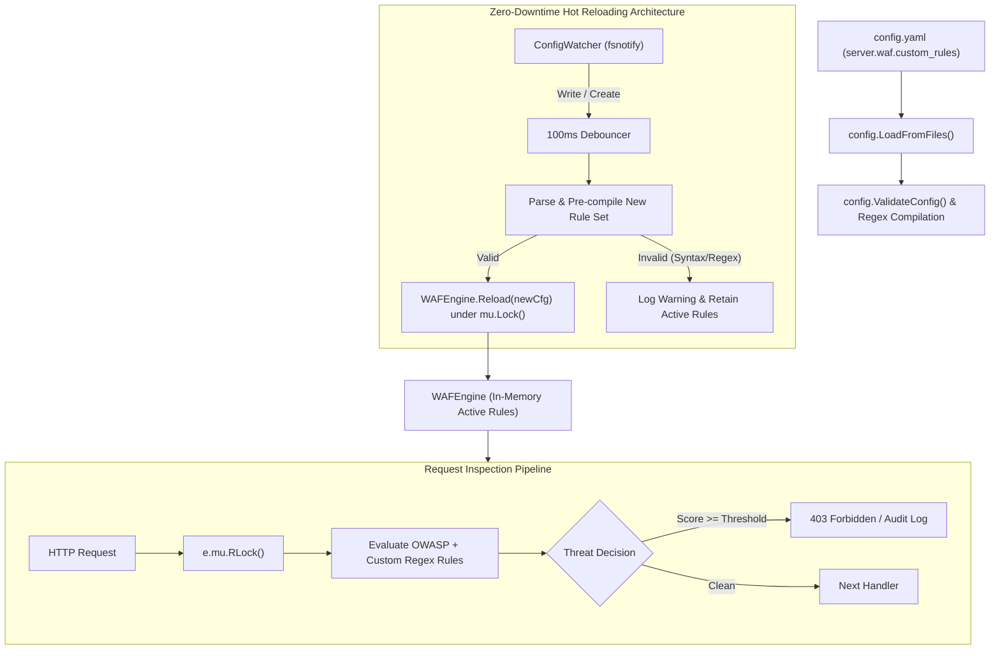

# ADR-040 - Custom WAF Regex Rules Engine & Zero-Downtime Hot Reloading Architecture

## Context

Enterprise security operations require rapid response to emerging threats, zero-day vulnerabilities, and application-specific attack patterns. Rebuilding binary artifacts or restarting edge proxy gateways to deploy new security filtering rules causes operational latency and risks dropping in-flight client connections.

Toron requires a declarative, user-defined custom rules engine integrated directly into its YAML configuration model, coupled with zero-downtime hot reloading powered by `fsnotify` and thread-safe atomic memory swapping.

## Decision

1. **User-Defined Regex Rules Declarative Model (`pkg/waf`)**:
   - Introduce `CustomRuleConfig` in `WAFConfig` with declarative fields: `id`, `category`, `description`, `pattern`, `score`, `locations`.
   - Compile raw string patterns to `*regexp.Regexp` at configuration load time with fail-fast validation.
   - Support granular target location bitmasks: `InspectURL` (`"url"`, `"path"`), `InspectQuery` (`"query"`), `InspectHeaders` (`"headers"`), `InspectBody` (`"body"`).

2. **Atomic Rule Swapping via `sync.RWMutex` (`pkg/waf/waf.go`)**:
   - Request evaluations take a shared read lock (`e.mu.RLock()`) on the `WAFEngine`.
   - Dynamic reload prepares and validates all `*regexp.Regexp` objects, IP ACL subnets, and disabled rules tables *before* taking the write lock.
   - The write lock (`e.mu.Lock()`) is held only for pointer and slice reassignment ($O(1)$ time complexity), guaranteeing that ongoing client requests and long-lived HTTP/2 streams experience zero perceptible latency overhead.

3. **Background Config Watcher (`pkg/config/watcher.go`)**:
   - `ConfigWatcher` mirrors `RouteWatcher`, watching the server configuration directory for file change events.
   - Uses a 100ms debouncing timer to consolidate multi-step file writes from editors (e.g. temporary file swap on vim/VS Code).
   - If the new configuration file is malformed or contains an invalid regex pattern, the change is rejected safely, and active in-memory rules remain completely intact.

## Consequences

- **Positive**: Operators can deploy zero-day virtual patches instantly via simple YAML edits without downtime.
- **Resilience**: Invalid configuration edits do not disrupt active traffic or crash the server.
- **Performance**: Pre-compiled regexes and $O(1)$ mutex swapping ensure maximum throughput and low latency.
- **Traceability**: Implements `REQ-045` and `TASK-045`.
