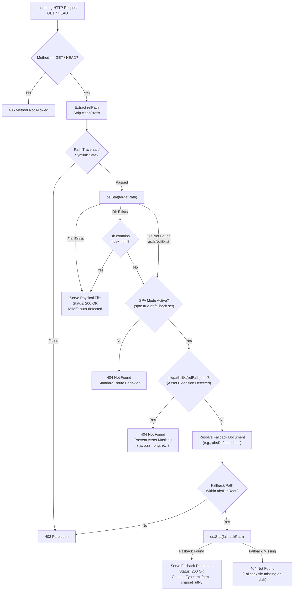

# ADR-051 - Single Page Application (SPA) HTML5 History Fallback in Static Router

## Context & Problem Statement

Modern web frontend applications developed with frameworks such as React, Vue, Angular, and Svelte utilize client-side routing based on the standard HTML5 History API (`window.history.pushState`, `window.history.replaceState`). Virtual route paths such as `/kite/signin`, `/kite/devops`, or `/dashboard/settings/profile` represent application UI states dynamically resolved in browser JavaScript rather than physical files or directories stored on the web server's filesystem.

When a client navigates within the running SPA, the browser intercepts anchor clicks and updates the URL bar without sending an HTTP GET request to the origin server. However, when a user:
1. Performs a hard browser refresh on a deep link,
2. Directly enters or pastes a deep URL into the address bar, or
3. Accesses a saved bookmark or external hyperlink,

the browser sends a direct HTTP request (e.g., `GET /kite/devops`) to Toron. In a traditional static file server, this request maps to a non-existent filesystem path (`$DIR/devops`), causing the server to return an HTTP 404 Not Found error.

In legacy web server architectures such as Nginx, this challenge is traditionally addressed via the `try_files` directive:
```nginx
location /kite/ {
    alias /var/www/kite/;
    try_files $uri $uri/ /kite/index.html;
}
```

Toron is designed as an ultra-lightweight, zero-dependency, event-driven web server and edge gateway in Go. To support production SPA hosting without forcing operators to place an Nginx or Caddy proxy in front of Toron, Toron's static router requires native SPA HTML5 History fallback capabilities.

### The Asset Masking Problem

A simplistic fallback implementation (e.g., rewriting all missing files to `index.html`) introduces a severe failure mode known as **Asset Masking**:
- If a client requests a non-existent asset with a file extension (e.g., `/kite/assets/main-bundle.c3a9f.js`, `/kite/styles/theme.css`, or `/kite/images/logo.png`), returning the HTML fallback document with HTTP 200 OK causes the browser to attempt parsing HTML markup as JavaScript or CSS.
- In JavaScript, this produces fatal runtime syntax errors (e.g., `Uncaught SyntaxError: Unexpected token '<'`), breaking the application bundle loading process.
- In CSS, the browser ignores the stylesheet due to MIME-type mismatch warnings (`Strict-MIME-Type-Checking`), breaking UI rendering.
- For API routes or analytics beacons, it conceals 404/500 errors behind false 200 OK HTML responses, preventing proper monitoring and observability.

Therefore, Toron's architecture must establish a clean, strict separation between:
1. **Client-side navigation routes** (virtual paths without a file extension, or with trailing slashes) $\rightarrow$ transparently served the configured fallback document (`index.html`) with HTTP 200 OK.
2. **Physical static assets** (requests with file extensions such as `.js`, `.css`, `.png`, `.map`, `.json`, `.svg`) $\rightarrow$ immediately returned as HTTP 404 Not Found if absent on disk, preventing asset masking.

---

## Decision

We decide to implement **Native Static Router SPA Fallback** directly within Toron's static route handler (`pkg/router/router.go`), configured declaratively via `spa: true` and optional `fallback: "<file>"` parameters in `routes.yaml` and `config.yaml`.

### 1. Configuration Schema Extensions

In `pkg/config/config.go`, extend `ProxyRouteConfig` with two first-class static routing attributes:

```go
type ProxyRouteConfig struct {
    // ... existing fields ...
    SPA      bool   `yaml:"spa" json:"spa"`
    Fallback string `yaml:"fallback" json:"fallback"`
}
```

- `spa` (`bool`): When `true`, enables HTML5 History fallback for the route.
- `fallback` (`string`): Specifies the relative fallback document path within the route's `dir` (defaults to `"index.html"` if unspecified or if `spa: true`).
- Implicit enablement: If `fallback` is configured with a non-empty string, SPA mode is automatically treated as active even if `spa: true` was not explicitly declared.

Example configuration in `routes.yaml`:

```yaml
routes:
  - path: /kite
    type: static
    dir: /var/www/kite
    spa: true
    fallback: index.html

  - path: /admin
    type: static
    dir: /var/www/admin-portal
    spa: true
    # defaults fallback to index.html

  - path: /legacy-docs
    type: static
    dir: /var/www/docs
    # spa: false (default), non-existent paths return 404
```

### 2. Option Propagation through Proxy Layer

In `pkg/proxy/proxy.go`, extend `ProxyOptions` to carry SPA configuration into router registrations:

```go
type ProxyOptions struct {
    // ... existing fields ...
    SPA      bool
    Fallback string
}
```

In `cmd/toron/main.go`, during route registration via `r.RoutePrefix(router.RouteTypeStatic, ...)`, populate `SPA` and `Fallback` from `ProxyRouteConfig`.

### 3. Static Route Handler Fallback Resolution Pipeline

In `pkg/router/router.go`, update `r.createStaticHandler` to accept and execute the SPA fallback lifecycle:

1. **HTTP Method Guard**: Only `GET` and `HEAD` methods are permitted. Non-read methods immediately receive `405 Method Not Allowed`.
2. **Target Path Resolution & Sanitization**:
   - Clean relative path using `filepath.Clean` and `filepath.FromSlash`.
   - Form initial physical target: `targetPath = filepath.Join(absDir, cleanRel)`.
3. **Primary Filesystem Lookup**:
   - Call `os.Stat(targetPath)`.
   - If the file exists and is a regular file, read and serve it with appropriate MIME type, compression, and caching headers.
   - If the target is a directory, look for `index.html` within that directory (`filepath.Join(targetPath, "index.html")`). If present, serve it; if absent, proceed to missing path handling.
4. **Missing Path Evaluation (`os.IsNotExist(err)`)**:
   - If SPA mode is **inactive** (`!opts.SPA && opts.Fallback == ""`):
     - Return HTTP 404 Not Found via `r.NotFound(req, res)`.
   - If SPA mode is **active**:
     - **Step 4a: Asset Extension Check**:
       - Inspect the requested relative path: `ext := filepath.Ext(relPath)`.
       - If `ext != ""` (e.g., `/kite/bundle.js`, `/kite/styles.css`, `/kite/favicon.ico`):
         - Treat as a missing physical asset.
         - **Do not fallback**. Immediately invoke `r.NotFound(req, res)` (HTTP 404 Not Found).
       - If `ext == ""` (e.g., `/kite/signin`, `/kite/devops`, `/kite/users/123/profile`, or trailing slash paths):
         - Treat as a client-side navigation route. Proceed to Step 4b.
     - **Step 4b: Fallback Document Resolution & Sandboxing**:
       - Determine fallback filename: `fallbackFile := opts.Fallback`; if empty, default to `"index.html"`.
       - Construct candidate path: `fallbackPath := filepath.Join(absDir, filepath.Clean(filepath.FromSlash(fallbackFile)))`.
       - **Security Verification**: Validate that `fallbackPath` is strictly contained within `absDir` using `filepath.Rel(absDir, fallbackPath)` and symlink inspection (`filepath.EvalSymlinks`). If traversal or symlink escape is detected, return HTTP 403 Forbidden.
       - Execute `os.Stat(fallbackPath)`. If the fallback file does not exist, return HTTP 404 Not Found.
       - Read fallback file data.
       - Emit HTTP 200 OK with `Content-Type: text/html; charset=utf-8`.
       - If request method is `HEAD`, omit response body.
       - Write content and complete request.

---

## Mermaid Diagram

### Routing Resolution Decision Tree



---

## Alternatives Considered

We evaluated three architectural approaches to address client-side SPA routing in Toron:

| Evaluation Dimension | Option 1: Catch-All Upstream Reverse Proxy | Option 2: Global 404 Rewrite Middleware | Option 3: Native Static Router Fallback (Selected) |
| :--- | :--- | :--- | :--- |
| **Architectural Complexity** | High (requires separate upstream runtime e.g. Node.js, Express) | Medium (interceptor middleware in router pipeline) | Low (declarative configuration within existing static router) |
| **Runtime Overhead** | Network roundtrip, process scheduling, additional port allocation | Router pipeline hook, intercepting status codes | Direct zero-overhead branch during filesystem miss |
| **Asset Masking Protection** | Depends on upstream configuration (often misconfigured) | Poor (hard to distinguish virtual routes from 404 assets globally) | Strict (deterministic check: `filepath.Ext(relPath) == ""` vs `!= ""`) |
| **Route-Level Isolation** | Bound to upstream proxy declarations | Global or coarse-grained across server paths | Scoped strictly per route prefix and virtual host |
| **Toron Philosophy** | Violates zero-dependency standalone edge philosophy | Introduces side-effecting status rewrites | Preserves clean event-driven reactor and native static serving |
| **Security & Containment** | Delegated to upstream application | Requires path validation during rewriting | Enforces sandboxing and symlink checks at file resolution |

### Detailed Evaluation of Alternatives

#### Option 1: Catch-All Upstream Reverse Proxy
- **Mechanism**: Run an upstream application server (such as Node.js, Express, Go HTTP server, or Nginx container) behind Toron using `type: reverse_proxy`, routing all unmatched requests to that upstream.
- **Why Rejected**:
  - Unnecessary resource consumption: Forces deployment of a secondary process or container simply to read and return an `index.html` file from disk.
  - Latency penalty: Incurs local socket / TCP loopback overhead, request/response copying, and context switching.
  - Operational burden: Violates Toron's core product principle of being a self-contained, high-performance edge gateway capable of serving static frontend assets directly.

#### Option 2: Global 404 Rewrite / Error Page Interceptor Middleware
- **Mechanism**: Introduce a global middleware or custom error page directive (e.g., `error_page 404 = /index.html`) that catches any 404 response produced anywhere in the router and rewrites the body and status code to 200 OK with `index.html`.
- **Why Rejected**:
  - **Asset Masking Vulnerability**: Any missing bundle (e.g., `/static/chunks/app.5f28c.js`), style (`/styles/dark.css`), or source map (`/app.js.map`) is rewritten to 200 OK with `text/html`. This causes client browsers to fail with runtime syntax errors (`Unexpected token '<'`), masks missing deployment artifacts from SRE monitoring, and pollutes browser caches.
  - API Route Collision: If an API route (`/api/v1/user/999`) or health check produces a legitimate 404 Not Found, a global rewrite mechanism risks intercepting the API response and returning HTML, breaking JSON API clients.
  - Multi-Tenant Route Conflicts: Different routes on the same host may serve different SPAs (e.g., `/kite` vs `/admin`), each requiring its own respective `index.html` root. A global error interceptor cannot naturally isolate per-prefix fallback documents.

#### Option 3: Native Static Router Fallback (`spa: true` / `fallback: "<file>"`) [Selected]
- **Mechanism**: Implemented directly in Toron's static file handler. Activated selectively per route prefix. Evaluates path extensions only upon `os.IsNotExist` misses, cleanly decoupling virtual client navigation from static asset requests.
- **Why Selected**:
  - Maximum efficiency: Physical file hits execute at maximum throughput without any extra branching. Fallback logic runs only on cache/filesystem misses.
  - Total immunity to asset masking: Distinguishes asset paths by file extension, ensuring missing bundles and styles always return 404.
  - Route and domain multi-tenancy: Supports distinct fallback files across nested prefixes (`/kite` $\rightarrow$ `/var/www/kite/index.html`; `/admin` $\rightarrow$ `/var/www/admin/app.html`).
  - Zero external dependencies: Delivers full Nginx-equivalent `try_files` capability out-of-the-box.

---

## Rationale & Justification

1. **Alignment with Toron's Vision**:
   Toron is designed to serve as a complete edge gateway and static file server. Modern enterprise applications require single-binary deployment where Go serves both backend APIs (`/api/*`) and frontend SPAs (`/*` or `/app/*`). Supporting native SPA fallback eliminates external server dependencies (Nginx, Caddy, Apache) from production topologies.

2. **Prevention of Critical Frontend Runtime Failures**:
   By restricting fallback serving strictly to routes where `filepath.Ext(relPath) == ""`, Toron prevents the classic web development bug where a missing script or stylesheet request receives an HTML document with HTTP 200 OK. Browsers rejecting `text/html` for `<script>` or `<link>` tags with `Strict-MIME-Type-Checking` or syntax errors will receive a clean HTTP 404, allowing build systems, CDNs, and error trackers (e.g. Sentry, Datadog) to alert accurately.

3. **Minimal Runtime Cost**:
   The fallback check is purely reactive: it executes only when `os.Stat` fails with `os.IsNotExist`. Valid requests for static files (`index.html`, `main.js`, `logo.svg`) continue through the high-speed cache/read pipeline without additional filesystem syscalls or regex evaluations.

4. **Security Hardening**:
   The fallback target path undergoes the exact same sandboxing, traversal (`..`) rejection, and symlink validation as standard static file requests. This guarantees that malicious requests or misconfigured fallback filenames cannot escape the static root directory.

---

## Constraints

1. **HTTP Method Restriction**: Only `GET` and `HEAD` requests are served by the static handler and its fallback. State-mutating methods (`POST`, `PUT`, `DELETE`, `PATCH`) return `405 Method Not Allowed`.
2. **Filesystem Confinement**: The fallback document must reside within the configured static root directory (`dir`). Cross-directory references outside the root are prohibited.
3. **Dot-Path Convention**: Virtual client-side routes containing periods (e.g., `/user/john.doe`) will have `filepath.Ext() != ""` and will be treated as physical assets (returning 404 if not found). In SPA routing best practices, path parameters avoid dots or employ query parameters (`/user?name=john.doe`), maintaining compatibility.
4. **Backward Compatibility**: Static routes where `spa` and `fallback` are not specified maintain 100% backward compatibility, returning 404 on any missing path.

---

## Consequences

### Positive
- **Native SPA Hosting**: Developers and operators can host complex React, Vue, Angular, and Svelte single-page applications directly on Toron with zero external dependencies.
- **Deep Link Reliability**: Browser page reloads, direct bookmarks, and external links to nested SPA routes resolve seamlessly to the application's entry HTML document with HTTP 200 OK.
- **Accurate Error Reporting**: Missing static assets, scripts, stylesheets, and images reliably return HTTP 404 Not Found, preventing browser syntax errors and asset masking.
- **Granular Multi-Route Isolation**: Multiple SPAs can run concurrently under different route prefixes on the same server or across different virtual hosts.
- **Performance**: Zero overhead on physical file hits; minimal single additional `os.Stat` on virtual route navigation.

### Negative / Trade-Offs
- **Virtual Paths with Extensions**: If an application architecture relies on virtual client routes that end with a dot suffix (e.g., `/release/v1.0`), Toron will treat it as an asset path and return 404 unless a physical file exists. This is standard across web servers (Nginx, Netlify, Cloudflare Pages) and easily mitigated by standard URL design patterns.

---

## Traceability

- **Requirement**: `REQ-056` (Single Page Application (SPA) HTML5 History Fallback Support for Static Routes)
- **Task**: `TASK-056` (Implement SPA HTML5 History Fallback Support for Static Routes)
- **Verification**: `TC-056` (SPA Fallback and Asset Protection Test Suite)
- **Related Decisions**:
  - `ADR-002` (Extensible File Configuration Architecture)
  - `ADR-022` (HTTP/3 Protocol Engine & QUIC Transport Architecture)
