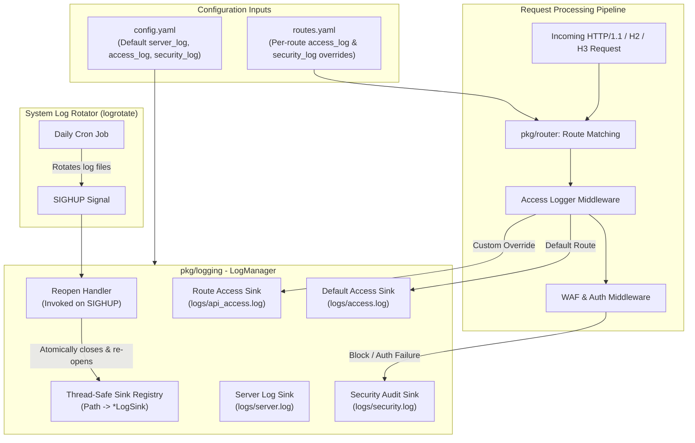

# ADR-053 - Unified Multi-Stream Configurable Logging Architecture with Route-Level Overrides and Logrotate Reopen

## Context

Edge gateways and reverse proxies generate heterogeneous log events that serve fundamentally different operational constituencies:
1. **Server Logs**: Critical system lifecycle, port bindings, runtime anomalies, and background scheduler events needed by platform reliability engineers.
2. **Access Logs**: High-volume, per-request transactional telemetry needed by traffic analytics, customer usage meters, and observability pipelines.
3. **Security Logs**: High-fidelity audit records of malicious attempts, WAF blocks, authentication failures, and access control infractions needed by security and compliance officers.

Monolithic logging solutions that dump all output into a single `stdout` or unstructured log file complicate downstream ingestion, create high noise-to-signal ratios, and prevent fine-grained compliance segmentation (e.g. isolating audit logs for sensitive endpoints).

Furthermore, in enterprise Linux environments, log files must be rotated daily to prevent unconstrained disk consumption. The two standard system log rotation strategies are:
- `copytruncate`: The active log file is copied to a timestamped backup and truncated in place.
- Rename & Reopen (`postrotate kill -HUP`): The active file is renamed, a new empty file is created, and the daemon is signaled to re-open its file descriptors.

## Decision

We decide to:

1. **Introduce a Centralized, Decoupled Log Manager (`pkg/logging`)**:
   Implement a lightweight, thread-safe `LogManager` in `pkg/logging` that manages file descriptors and sinks for server, access, and security logs.
   - Files are opened with `os.O_CREATE|os.O_WRONLY|os.O_APPEND` with permission `0644`.
   - Thread-safety is guaranteed through per-sink mutexes or synchronized writes.
   - Sinks are indexed by target destination path, deduplicating file descriptors when multiple routes share the same log file.

2. **Support Declarative Global Paths and Route-Level Overrides**:
   - `config.yaml` defines default paths under `logging`: `server_log`, `access_log`, and `security_log`.
   - `routes.yaml` allows any route to declare `access_log: "path/to/custom.log"` and `security_log: "path/to/custom.log"` (or `"off"` to silence logging for that specific route).
   - The router resolves the applicable log sink during route dispatching and passes the context to the logging middleware.

3. **Provide Dual-Mode Logrotate Compatibility**:
   - By opening in `O_APPEND` mode, Toron is immediately compatible with `copytruncate` without lost writes or file offset corruption.
   - In addition, Toron establishes an asynchronous OS signal listener in `cmd/toron/main.go` for `syscall.SIGHUP`. Upon receiving `SIGHUP`, `LogManager.Reopen()` atomically closes existing file descriptors and reopens the files at their configured paths, enabling traditional rename-and-signal rotation.
   - An official `etc/logrotate.d/toron` logrotate definition is packaged with the project.

## Mermaid Diagram

## Alternatives Considered

1. **Relying on Third-Party Log Rotation Libraries (e.g. `lumberjack`)**:
   - *Rejected*: Violates Toron's core principle of zero external runtime dependencies. Built-in log rotation often conflicts with host-level log rotation policies (`logrotate`), SELinux permissions, and container stdout collection.
2. **Streaming All Logs Exclusively to Stdout**:
   - *Rejected*: Does not allow operators to route access logs and security logs to separate disk partitions, isolated compliance files, or distinct forwarders without complex external shell multiplexers.

## Rationale

Decoupled multi-stream logging with route-level overrides gives Toron enterprise-grade flexibility. Using OS-native `O_APPEND` and `SIGHUP` aligns with UNIX best practices (identical to NGINX, HAProxy, and Apache), ensuring seamless operation in systemd, Docker, Kubernetes, and bare-metal installations.

## Constraints

- Zero third-party Go dependencies.
- Reopening files on `SIGHUP` must not block or drop incoming network traffic.
- Missing log directories must be automatically created without panicking.

## Consequences

### Positive
- Strict separation between operational errors, access logs, and security incidents.
- Support for route-level isolation and per-route silencing (`access_log: "off"`).
- Out-of-the-box daily log rotation via standard system tools (`logrotate`).
- Thread-safe, high-performance file sink management with deduplicated file handles.

### Negative / Trade-offs
- File I/O overhead on access logging. Mitigated by `O_APPEND` sequential writes and configurable formatting.
