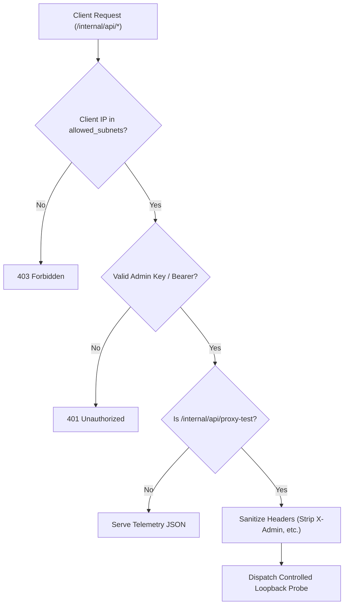

# ADR-057 - Internal Management API Access Control, Token Authentication & SSRF Hardening

## Context & Problem Statement

Toron exposes internal control plane endpoints (`/internal/api/status`, `/internal/api/routes`, `/internal/api/upstreams/health`, `/internal/api/security/incidents`, `/internal/api/proxy-test`) registered on the primary router.

In the current architecture:
1. Endpoints lack authentication or client IP authorization. Any external client can query internal container IPs, upstream hosts, routes, and security incidents.
2. `POST /internal/api/proxy-test` accepts arbitrary JSON request parameters (`path`, `method`, `headers`) and executes an HTTP client request against `http://127.0.0.1:<port>`. Attackers can use this endpoint as an internal Server-Side Request Forgery (SSRF) proxy to inject privileged headers (e.g. `X-Admin: true`) into restricted routes.

## Decision

We decide to architect a **Dedicated Management Security Guard Middleware** and **Strict Proxy-Test Isolation**:

1. **Authentication Token & Header Verification**:
   - Provide `internal_api.auth_token` in `config.yaml` (or `TORON_ADMIN_KEY` environment variable).
   - Require requests to `/internal/api/*` to supply this secret via `X-Toron-Admin-Key` or `Authorization: Bearer <token>`.
   - Reject unauthenticated requests with `HTTP 401 Unauthorized`.

2. **CIDR / Subnet Access Control**:
   - Support `internal_api.allowed_subnets` (default: `["127.0.0.1/32", "::1/128"]`).
   - The middleware verifies the client socket IP (`req.RawConn.RemoteAddr()`) against the parsed CIDR blocks.
   - Non-matching IPs are rejected with `HTTP 403 Forbidden`.

3. **Loopback SSRF Hardening in `proxy-test`**:
   - Strip client-supplied sensitive forwarded headers (`X-Authenticated-User`, `X-Admin`, `X-Forwarded-*`, `Authorization`) before dispatching loopback test requests.
   - Constrain methods to safe read-only methods (`GET`, `HEAD`, `POST`) and prohibit dispatching requests to endpoints outside configured public proxy routes.

## Mermaid Diagram

## Alternatives Considered

1. **Separate Dedicated Listener Port for Internal APIs**:
   - *Trade-off*: Opening a secondary listener (e.g. port 9090) requires additional firewall rules, OS socket bindings, and TLS configuration. Adding middleware to the primary router allows flexible single-port or multi-port deployments.
2. **Mutual TLS (mTLS) for Management APIs**:
   - *Trade-off*: High operational complexity for simple web dashboard administration. Token authentication paired with CIDR allowlisting provides defense-in-depth with zero client certificate friction.

## Rationale

Restricting control plane access to authorized administrative networks and tokens prevents infrastructure discovery and prevents SSRF privilege escalation from external actors.

## Constraints

- Zero external auth library dependencies; uses standard library crypto constant-time comparison (`subtle.ConstantTimeCompare`).
- Backward compatible with existing web dashboard when configured with an admin key.

## Consequences

### Positive
- Prevents unauthenticated reconnaissance of edge proxy routes and health.
- Neutralizes internal SSRF and privilege escalation via loopback proxy testing.
- Flexible configuration via YAML or environment variables.

### Negative / Trade-offs
- Web dashboard or CLI tools accessing `/internal/api/*` must pass the administrative key.

## Open Questions

- None.
