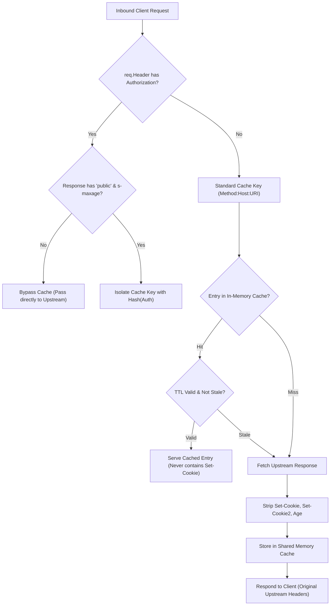

# ADR-058 - Shared HTTP Cache Session Cookie Isolation & Authorization Boundaries

## Context & Problem Statement

Toron includes an in-memory HTTP response caching middleware (`pkg/router/cache.go`) designed per RFC 7234. However, the current caching implementation suffers from two critical security defects:
1. **`Set-Cookie` Header Leakage**: When caching an upstream response, `clonedHeader` copies all response headers without exclusion. If an upstream endpoint emits `Set-Cookie: session=xyz`, this cookie is stored in the cache and replayed to subsequent, unrelated clients requesting the same URL (CWE-539).
2. **Missing Authorization Header Boundaries**: Cache lookup keys are constructed solely from `req.Method + ":" + extractHost(req) + ":" + uri`. Responses to requests containing `Authorization` headers are cached and served to unauthenticated requests, violating RFC 7234 §3.2.

## Decision

We decide to enforce strict **RFC 7234 §8 and §3.2 Compliance** in `pkg/router/cache.go`:

1. **Deterministic `Set-Cookie` Stripping**:
   - In `ResponseRecorder.WriteHeader` and when capturing upstream responses for cache storage, delete `Set-Cookie` and `Set-Cookie2` headers from the stored entry header map:
     ```go
     delete(entry.Headers, "Set-Cookie")
     delete(entry.Headers, "Set-Cookie2")
     ```
   - Responses containing `Cache-Control: private` shall not be stored in the shared cache under any condition.

2. **Authorization Boundary Enforcement**:
   - By default, if incoming request `req.Header.Get("Authorization")` is non-empty, the request MUST bypass the shared cache (both for cache read and cache write).
   - If the response explicitly includes `Cache-Control: public, s-maxage=...`, caching is only permitted if the cache key incorporates a hash of the `Authorization` header to maintain user-level cache isolation.

3. **Hop-by-Hop & Invalidation Headers**:
   - Strip `Age`, `Connection`, and proxy headers from stored entries before replay.

## Mermaid Diagram



## Alternatives Considered

1. **Tag Responses with Session IDs**:
   - *Trade-off*: Complex session tracking at the proxy layer increases memory footprint and violates Layer 7 gateway separation of concerns. Stripping `Set-Cookie` from shared cache is the industry-standard solution mandated by RFC 7234 §8.
2. **Completely Disable Caching for Dynamic Routes**:
   - *Trade-off*: Degrades caching benefits for public APIs. Stripping `Set-Cookie` allows safe caching of public content even if an upstream mistakenly emits a session cookie.

## Rationale

Shared caches must never distribute one client's session identifier or credentialed state to another client. RFC 7234 §8 explicitly forbids caching `Set-Cookie` in shared caches.

## Constraints

- Zero impact on caching hit ratios for static or anonymous public assets.
- Negligible latency impact during header map filtering.

## Consequences

### Positive
- Completely eliminates cross-client session fixation and credential leakage.
- Enforces RFC 7234 authorization boundaries for protected API endpoints.

### Negative / Trade-offs
- Upstream applications that relied on caching proxies delivering session cookies will need to separate cookie generation from cacheable content.

## Open Questions

- None.
