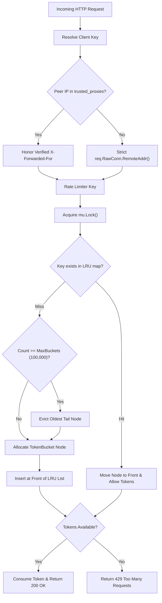

# ADR-059 - Rate Limiter Bounded LRU Cache, State Eviction & Client Identity Anchoring

## Context & Problem Statement

Toron implements a Token Bucket rate-limiting middleware (`pkg/router/rate_limiter.go`) to protect backend services against abuse and denial-of-service. However, the current implementation has two critical vulnerabilities:
1. **Unbounded Memory Consumption (OOM Panic)**: Buckets are stored in a simple Go map `buckets map[string]*TokenBucket` without maximum entry limits, LRU eviction, or TTL expiration. An attacker generating requests with random IPs or API keys can cause the map to grow indefinitely until the OS kernel terminates the process via OOM killer (CWE-400).
2. **Client Key Spoofing**: `ExtractClientKey` trusts unverified client headers (`X-API-Key`, `X-Forwarded-For`) before checking `RemoteAddr`. Attackers can rotate `X-Forwarded-For` with every request to bypass rate limits entirely.

## Decision

We decide to architect a **Bounded LRU Token Bucket Cache** with **Background TTL Cleanup** and **Socket-Anchored Identity Verification**:

1. **Capacity-Bounded LRU State Store**:
   - Limit the total number of active rate-limiter buckets to a configurable maximum (default: `100,000` entries, approx. 8 MB RAM).
   - When capacity is reached, evict the Least Recently Used (LRU) bucket via a doubly-linked list.
   - Run a periodic background goroutine (every 60 seconds) to purge buckets that have been inactive longer than `TTL = 10 * Window` or are fully replenished.

2. **Socket-Anchored Client Key Derivation**:
   - When extracting client IP, extract the host from physical socket connection `req.RawConn.RemoteAddr()`.
   - Never trust client-supplied `X-Forwarded-For` or `X-Real-IP` headers unless the immediate connection peer IP matches a configured `trusted_proxies` CIDR entry.
   - For authenticated API keys (`X-API-Key`), require exact format matching before using it as a rate limiter key.

## Mermaid Diagram

## Alternatives Considered

1. **Simple Mutex Map with Periodic Stop-the-World Purge**:
   - *Trade-off*: A full map lock during purges induces request latency spikes. An LRU doubly-linked list combined with gentle periodic sweeping provides constant-time eviction ($O(1)$) with zero latency spikes.
2. **External Distributed Store (Redis / Memcached)**:
   - *Trade-off*: Violates Toron's zero external dependency invariant. In-memory bounded LRU provides nanosecond-scale lookups on a single instance without network round-trips.

## Rationale

Bounded capacity guarantees deterministic memory bounds ($O(N)$), preventing denial-of-service from heap exhaustion while socket-anchored client identification prevents trivial rate limit bypass.

## Constraints

- Zero heap allocations during cache hits.
- Standard Go library container/list or intrusive linked list.

## Consequences

### Positive
- Memory usage is strictly capped at predictable bounds (e.g. ~8 MB for 100k clients).
- Eviction of inactive clients happens automatically without manual restarts.
- Rate limits cannot be bypassed by forging `X-Forwarded-For`.

### Negative / Trade-offs
- An attacker rotating millions of IPs will evict legitimate clients from the LRU cache (mitigated by setting high capacity limits and network perimeter IP filtering).

## Open Questions

- None.
