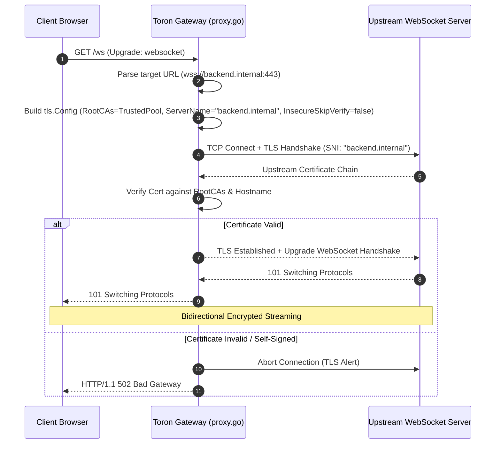

# ADR-060 - Upstream TLS Certificate Verification and SNI in WebSocket Reverse Proxy

## Context & Problem Statement

Toron supports full-duplex WebSocket reverse proxying over cleartext TCP (`ws://`) and TLS (`wss://`). In `pkg/proxy/proxy.go:serveWebSocketProxy`, outbound TLS dial connections hardcode `InsecureSkipVerify: true`:

```go
upstreamConn, dialErr = tls.Dial("tcp", host, &tls.Config{InsecureSkipVerify: true})
```

Disabling upstream certificate verification completely undermines transport layer security, exposing WebSocket sessions to Man-in-the-Middle (MitM) eavesdropping and frame injection by any hostile actor or compromised node on the upstream network (CWE-295).

## Decision

We decide to enforce **Strict Upstream TLS Certificate Verification** by default in `pkg/proxy/proxy.go`:

1. **Remove Hardcoded `InsecureSkipVerify`**:
   - Eliminate hardcoded `{InsecureSkipVerify: true}` from all WebSocket proxy dial calls.
   - Construct a proper `*tls.Config` with verification enabled by default (`InsecureSkipVerify: false`).

2. **SNI and Hostname Validation**:
   - Set `tlsConfig.ServerName = hostName` (excluding port) derived from `outURL.Hostname()`, ensuring proper TLS Server Name Indication (SNI) negotiation and SAN certificate validation.

3. **Custom CA Certificate Support**:
   - Inspect `ProxyOptions.TLS` or global proxy configuration.
   - If a custom `CAFile` or CA cert pool is specified, populate `tlsConfig.RootCAs` with the parsed certificate bundle.
   - Allow `InsecureSkipVerify` to be true ONLY if explicitly and intentionally configured in `routes.yaml` (e.g. `insecure_skip_verify: true`) for local testing environments.

4. **Failure Behavior**:
   - If the upstream certificate is self-signed, expired, or untrusted, `tls.Dial` will return a handshake error.
   - Toron will log the TLS handshake failure, record an upstream failure metric, and respond to the client with `502 Bad Gateway`.

## Mermaid Diagram



## Alternatives Considered

1. **Continue Skipping Verification on Internal Subnets (RFC 1918)**:
   - *Trade-off*: Zero-Trust architectures assume internal networks may be untrusted or shared (e.g. Kubernetes pod networks, public clouds). Enforcing valid certificates or internal private CAs is a required industry standard.
2. **Warn Only on Verification Failure**:
   - *Trade-off*: Warning without blocking still transmits decrypted user traffic over a compromised connection. Fail-closed is the only acceptable security posture.

## Rationale

Edge gateways must protect the integrity and confidentiality of traffic entering and leaving internal clusters. Defaulting to strict certificate verification eliminates eavesdropping vulnerabilities.

## Constraints

- Zero third-party dependencies; uses standard library `crypto/tls` and `crypto/x509`.
- Compatible with mutual TLS (mTLS) client certificate extensions.

## Consequences

### Positive
- Prevents Man-in-the-Middle attacks against WebSocket streams.
- Full compliance with modern Zero-Trust and enterprise security policies.
- Supports custom internal PKI root CAs via route configuration.

### Negative / Trade-offs
- Upstream backend services with self-signed certificates must either install valid certs, provide a custom CA bundle in `ProxyOptions.TLS`, or explicitly set `insecure_skip_verify: true`.

## Open Questions

- None.
