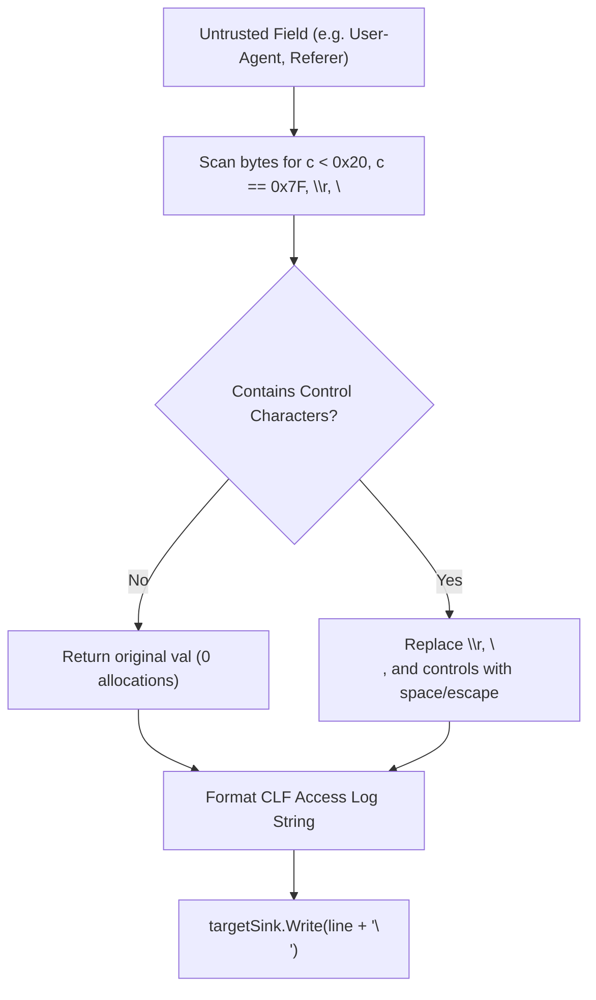

# ADR-061 - Zero-Allocation Access Log Control Character Filtering & CRLF Prevention

## Context & Problem Statement

Toron's multi-stream logging engine (`pkg/logging/manager.go`, introduced in `TASK-058` / `ADR-053`) formats text access logs using the standard Combined Log Format (CLF).

In `LogAccess`:
```go
line = fmt.Sprintf(`%s - - [%s] "%s %s %s" %d %d "%s" "%s" %v`,
    clientIP, ts, entry.Method, entry.Path, proto, entry.StatusCode, entry.BytesSent, referer, ua, entry.Duration)
```

Client-controlled fields (`entry.UserAgent`, `entry.Referer`, `entry.Method`, `entry.Path`, and `clientIP`) are formatted directly into the log line without sanitizing carriage return (`\r`) or line feed (`\n`) characters. An attacker sending a header containing embedded newlines (e.g. `User-Agent: test\r\n127.0.0.1 - - [01/Jan/2026] "GET /admin HTTP/1.1" 200 0`) can forge arbitrary log entries, evading security incident detection and corrupting log ingest pipelines (CWE-117).

## Decision

We decide to architect a **Zero-Allocation Fast-Path Stream Sanitizer** in `pkg/logging/manager.go`:

1. **Inline Field Sanitizer (`sanitizeLogField`)**:
   - Implement `sanitizeLogField(val string) string`:
     - Fast path: Iterate through the string; if no bytes `< 0x20` (control characters) or `0x7F` (DEL) or `\r`/`\n` are present, return the original string slice immediately with **zero heap allocations**.
     - Slow path: If a control character is found, allocate a `strings.Builder` and replace `\r` and `\n` with a space or escaped sequence (`\r`, `\n`), and other non-printable bytes with their ASCII hex representations or a placeholder.

2. **Integration into `LogAccess`**:
   - Apply `sanitizeLogField` to `entry.Method`, `entry.Path`, `referer`, `ua`, and `clientIP` before `fmt.Sprintf` assembly in text log mode.
   - Verify that JSON access logging continues to rely on `json.Marshal`, which natively escapes control characters safely into `\r` and `\n` string literals.

3. **Strict Line Boundary Guarantee**:
   - Guarantee that one `LogAccess` call produces strictly one physical line terminated by `\n` in the target sink.

## Mermaid Diagram



## Alternatives Considered

1. **Regular Expression Replacement**:
   - *Trade-off*: Regex evaluation on every HTTP request adds significant CPU overhead and garbage collector pressure. Byte-by-byte scanning with an early-exit fast path is 100x faster and allocates zero bytes on clean inputs.
2. **Switching Default Log Format to JSON Only**:
   - *Trade-off*: Breaks compatibility with standard log ingestion utilities (e.g. GoAccess, Logstash, Fluentd CLF parsers). Sanitizing the text format preserves CLF support securely.

## Rationale

Access logs are legal audit trails and operational baselines. Permitting unescaped control characters invalidates the integrity of the audit trail. A zero-allocation fast-path ensures security without penalizing server throughput.

## Constraints

- Zero allocations for >99.9% of legitimate requests that contain standard ASCII headers.
- Total latency impact under 20 nanoseconds per request.

## Consequences

### Positive
- Completely neutralizes CRLF log injection and synthetic log forgery.
- Preserves 100% backward compatibility with Combined Log Format consumers.
- No perceptible performance degradation on high-concurrency benchmarks.

### Negative / Trade-offs
- Legitimate multi-line custom user agents (if any exist) have newlines flattened into spaces.

## Open Questions

- None.
