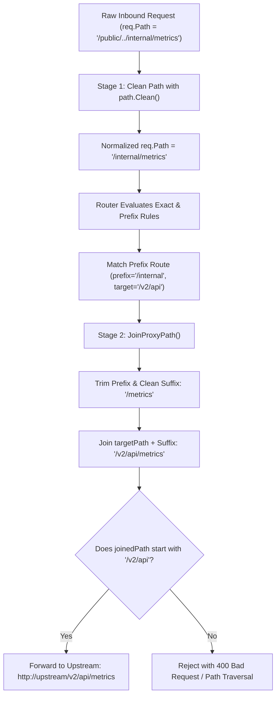

# ADR-062 - Two-Stage Pre-Routing Path Canonicalization & Upstream Traversal Guards

## Context & Problem Statement

Toron routes incoming requests via `router.Router` (`pkg/router/router.go`) and dispatches upstream requests via `ReverseProxy` (`pkg/proxy/proxy.go`). In `httpparser`, `req.Path` is parsed using `url.ParseRequestURI`, which preserves uncleaned dot segments (e.g. `/api/../admin`).

This creates two critical vulnerabilities:
1. **Pre-Routing Prefix Bypass**: An incoming request for `/api/../admin` matches an exact route lookup for `/api/../admin` rather than `/admin`, or matches a prefix route for `/api` before dot segments are resolved.
2. **Upstream Path Escape in `JoinProxyPath`**: When a prefix route is configured with `prefix: "/api"` and `target: "http://upstream/v1"`, an incoming request with `reqPath = "/api/../admin"` causes `JoinProxyPath` to produce `/v1/../admin`. On backend microservices that normalize paths, this escapes the `/v1` namespace, reaching unauthorized endpoints (CWE-22).

## Decision

We decide to implement a **Two-Stage Path Canonicalization and Containment Architecture**:

1. **Stage 1: Pre-Routing Canonicalization (`pkg/router/router.go`)**:
   - In `Router.ServeHTTP`, canonicalize `req.Path` using `path.Clean(req.Path)` before any route lookup or prefix matching.
   - Ensure the path is prefixed with a leading slash `/`.
   - Any path attempting to traverse above root (`/..` or `../../`) evaluates safely to `/`.
   - Collapses redundant slashes (e.g. `//admin` -> `/admin`) to ensure uniform routing keys.

2. **Stage 2: Upstream Boundary Containment in `JoinProxyPath` (`pkg/proxy/proxy.go`)**:
   - In `JoinProxyPath(targetPath, reqPath, prefix, stripPrefix)`:
     - Apply `path.Clean` to the relative trimmed suffix.
     - Verify that the resulting joined path starts with the cleaned `targetPath` prefix (containment assertion).
     - Preserve explicit trailing slashes requested by clients on valid directory paths:
       ```go
       if strings.HasSuffix(reqPath, "/") && !strings.HasSuffix(joinedPath, "/") {
           joinedPath += "/"
       }
       ```

## Mermaid Diagram



## Alternatives Considered

1. **Rely on Upstream Backend Normalization**:
   - *Trade-off*: Many backend frameworks or internal microservices sit behind proxies specifically expecting the gateway to enforce path safety. Delegating path security downstream violates gateway boundary responsibilities.
2. **Strict Regex Filtering on Inbound Paths**:
   - *Trade-off*: Rejecting every path containing a dot causes false positives on file downloads, API versions (`/v1.0/`), and static files. Normalizing via RFC 3986 dot segment rules (`path.Clean`) handles traversal cleanly without breaking legitimate paths.

## Rationale

Canonicalizing before routing ensures routing decisions reflect the true semantic destination of the request. Containment verification in `JoinProxyPath` guarantees that upstream namespace boundaries are never violated.

## Constraints

- RFC 3986 §5.2.4 dot-segment removal algorithm.
- Preserves client query strings and request bodies without modification.

## Consequences

### Positive
- Completely neutralizes path traversal attacks and prefix boundary bypasses.
- Consistent routing behavior across exact, prefix, and wildcard routes.
- Protects downstream microservices from namespace confusion attacks.

### Negative / Trade-offs
- Requests with intentional raw dot-segments in path components will be normalized before reaching upstreams.

## Open Questions

- None.
