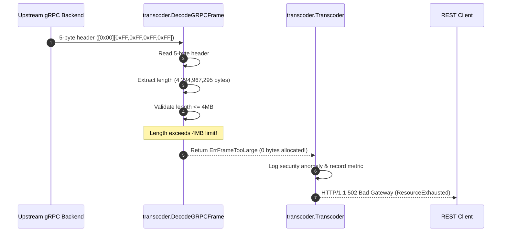

# ADR-063 - Wire Frame Size Bounding & Heap Allocation Protection in gRPC Transcoder

## Context & Problem Statement

Toron includes a high-performance REST-to-gRPC transcoding engine (`pkg/transcoder/framer.go`). In `DecodeGRPCFrame(reader io.Reader)`:
```go
length := binary.BigEndian.Uint32(header[1:5])
if length == 0 {
    return []byte{}, nil
}
payload := make([]byte, length)
```

The decoder reads the 4-byte `uint32` length field from the incoming wire header and immediately calls `make([]byte, length)` without validating the declared size against an upper limit.

If an attacker controls or compromises an upstream service, or if network data corruption occurs, an incoming frame declaring a length of `0xFFFFFFFF` (4 GB) will cause the Go runtime to attempt a multi-gigabyte memory allocation, triggering immediate Out-Of-Memory (OOM) heap exhaustion or panic crashes in worker goroutines (CWE-789).

## Decision

We decide to architect a **Pre-Allocation Frame Bounding and Safe Decoder Architecture** in `pkg/transcoder/framer.go`:

1. **Explicit Default and Configurable Frame Limits**:
   - Define `DefaultMaxGRPCFrameSize uint32 = 4 * 1024 * 1024` (4 MB), matching standard gRPC framework defaults.
   - Define `ErrFrameTooLarge = errors.New("transcoder: gRPC wire frame payload exceeds maximum allowed size")`.

2. **Pre-Allocation Length Guard**:
   - Provide `DecodeGRPCFrameWithLimit(reader io.Reader, maxFrameSize uint32) ([]byte, error)`:
     ```go
     length := binary.BigEndian.Uint32(header[1:5])
     if length > maxFrameSize {
         return nil, fmt.Errorf("%w: frame length %d > max %d", ErrFrameTooLarge, length, maxFrameSize)
     }
     ```
   - Retain `DecodeGRPCFrame(reader io.Reader)` as a convenience wrapper enforcing `DefaultMaxGRPCFrameSize`.
   - Abort immediately without allocating `payload` if `length > maxFrameSize`.

3. **Graceful Error Propagation in Transcoder**:
   - In `Transcoder.ServeHTTP`, intercept `ErrFrameTooLarge` and return `HTTP 502 Bad Gateway` (with gRPC status code `ResourceExhausted`), preventing unhandled runtime crashes.
   - Emit an anomaly metric and log the upstream target with the oversized length.

## Mermaid Diagram



## Alternatives Considered

1. **Stream Decoding with Incremental Buffer Growth**:
   - *Trade-off*: Protobuf message deserialization requires the complete message payload buffer in memory to execute unmarshaling. Validating the total frame length up-front before allocating the single contiguous buffer is more memory-efficient than dynamic buffer growth.
2. **Global Heap Memory Watchdog**:
   - *Trade-off*: Reactive heap watchdogs catch OOM conditions after memory is already exhausted. Up-front bounding at the protocol decoder layer is deterministic and proactive.

## Rationale

No untrusted wire header integer should ever be passed directly as an allocation argument to `make()`. Validating bounds prior to buffer allocation eliminates heap exhaustion panics.

## Constraints

- Zero memory allocated prior to length validation.
- Standard 5-byte gRPC framing compatibility.

## Consequences

### Positive
- Completely prevents memory exhaustion crashes from malicious or corrupted upstream frames.
- Reclaims worker goroutines safely without server panics.
- Configurable for high-throughput enterprise systems handling larger messages.

### Negative / Trade-offs
- Upstream messages legitimate in size but exceeding 4 MB will require configuring `transcoder.max_frame_size` to a higher threshold.

## Open Questions

- None.
