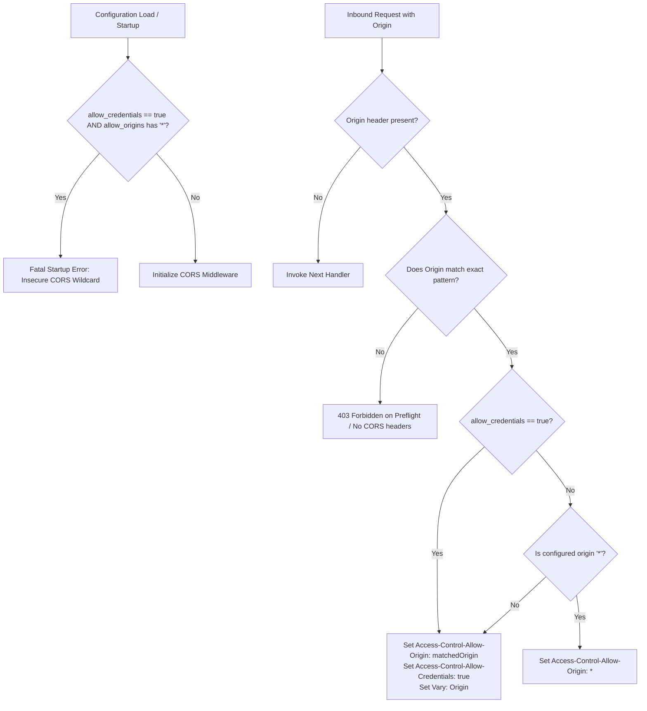

# ADR-064 - Strict CORS Origin Matching and Wildcard Credential Disallowance

## Context & Problem Statement

Toron provides Cross-Origin Resource Sharing (CORS) middleware in `pkg/router/cors.go`. Modern web browsers prohibit the combination of `Access-Control-Allow-Origin: *` with `Access-Control-Allow-Credentials: true` to protect users against cross-origin credential hijacking.

In Toron's current CORS implementation:
1. When `allow_origins` includes `*` and `allow_credentials` is `true`, `isOriginAllowed` matches all origins.
2. In `NewCORSMiddleware`, because `allow_credentials` is true, line 123 dynamically reflects the client's `Origin` header into `Access-Control-Allow-Origin` while emitting `Access-Control-Allow-Credentials: true`.

This dynamic reflection bypasses browser security protections, permitting any third-party website to make authenticated, credentialed cross-origin requests to internal APIs and read sensitive user data (CWE-942).

## Decision

We decide to implement **Strict Configuration Validation and Origin Reflection Constraints**:

1. **Configuration Validation Fail-Closed Guard (`pkg/config/config.go`, `pkg/router/cors.go`)**:
   - In `ValidateCORSConfig`, reject any route configuration that specifies `allow_credentials: true` alongside wildcard origin `*` in `allow_origins`:
     ```go
     if cfg.AllowCredentials {
         for _, o := range cfg.AllowOrigins {
             if strings.TrimSpace(o) == "*" {
                 return fmt.Errorf("cors: insecure configuration - allow_credentials cannot be true when allow_origins contains '*'")
             }
         }
     }
     ```
   - Refuse to start the server or reload configuration with this dangerous pattern.

2. **Runtime Wildcard Disallowance**:
   - In `isOriginAllowed`, if `allowCredentials` is active, ignore wildcard `*` matching rules.
   - Only match if the origin explicitly matches an allowed origin (or safe subdomain wildcard such as `https://*.example.com`).

3. **Origin Header Signaling & Vary Header**:
   - Never reflect an arbitrary untrusted `Origin` header.
   - Always append `Vary: Origin` to response headers when origin-dependent CORS headers are emitted, ensuring downstream proxies and caches do not serve cached cross-origin responses to wrong origins.

## Mermaid Diagram



## Alternatives Considered

1. **Silent Fallback to `allow_credentials: false`**:
   - *Trade-off*: Silently altering developer configuration leads to runtime behavioral bugs where client applications fail authentication without explanation. Failing fast during configuration load forces operators to make deliberate security choices.
2. **Dynamic Domain Whitelisting via Regex Callback**:
   - *Trade-off*: Overly complex and error-prone regexes often introduce ReDoS or sub-domain bypasses. Supporting explicit domains and prefix wildcard subdomains (`*.domain.com`) provides safe, predictable matching.

## Rationale

The combination of wildcard origins and credential reflection completely negates the Same-Origin Policy. Banning this configuration at load time and removing dynamic wildcard reflection at runtime ensures enterprise-grade CORS security.

## Constraints

- Compliance with W3C / WHATWG Fetch and CORS specifications.
- Minimal overhead during origin comparison.

## Consequences

### Positive
- Completely neutralizes cross-origin credential hijacking (CWE-942).
- Downstream caching proxies are instructed via `Vary: Origin` to prevent cache poisoning.
- Operators receive clear validation errors during configuration syntax checks.

### Negative / Trade-offs
- Insecure configurations in legacy `config.yaml` files will fail validation and must be updated to enumerate specific origins.

## Open Questions

- None.
