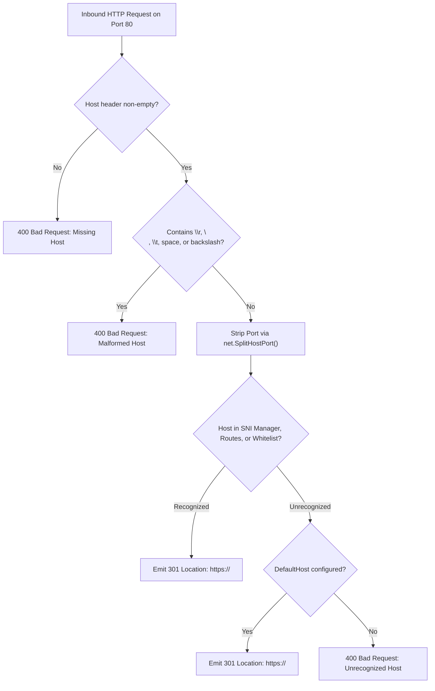

# ADR-065 - Whitelist-Driven Host Header Validation in Cleartext HTTPS Redirection

## Context & Problem Statement

Toron provides cleartext HTTP-to-HTTPS redirection (`pkg/server/server.go:serveHTTPRedirect`) to automatically upgrade inbound traffic on port 80 to encrypted HTTPS on port 443.

The redirection handler cleans the incoming `Host` header against control characters and backslashes (`\r\n\t /\\`), and strips port numbers. However, it does not validate whether the host represents a legitimate domain registered on the gateway. The client-supplied `Host` is reflected verbatim into the 301/308 redirect `Location: https://<host><uri>` header.

An attacker can send `GET /login HTTP/1.1\r\nHost: evil.com` to the edge gateway's public IP address. The gateway will respond with `Location: https://evil.com/login`. Attackers can use the trusted IP of the gateway to launch Open Redirect (CWE-601) and credential phishing campaigns.

## Decision

We decide to architect **Whitelist-Driven Host Header Recognition and Canonical Fallback**:

1. **Host Recognition Registry (`isRecognizedHost`)**:
   - Provide a host validation lookup method on `Server`:
     - Checks against domains configured in `s.sniManager` (registered TLS certificates).
     - Checks against configured route domain names in `routes.yaml`.
     - Checks against an explicit list of allowed domains in `HTTPRedirectConfig.AllowedHosts`.

2. **Redirection Handling for Unrecognized Hosts**:
   - If `isRecognizedHost(host)` returns true, redirect to `https://<host>:<targetPort><uri>`.
   - If `host` is unrecognized:
     - If `HTTPRedirectConfig.DefaultHost` is configured (e.g. `gateway.example.com`), redirect safely to `https://<DefaultHost>:<targetPort><uri>`.
     - If no `DefaultHost` is specified, abort the redirect and respond with `HTTP 400 Bad Request` (`{"error":"400 Bad Request: Unrecognized Host"}`).
   - Unrecognized client-supplied hostnames are **never** reflected into redirect `Location` headers.

3. **Preservation of Injection Checks**:
   - Retain existing sanitization rejecting CRLF sequences and control characters to prevent HTTP response splitting (CWE-113).

## Mermaid Diagram

## Alternatives Considered

1. **Relative Redirection (Location: /path)**:
   - *Trade-off*: A relative redirect does not upgrade the scheme from cleartext HTTP to HTTPS; browsers continue using the current scheme (HTTP). Redirection to HTTPS requires an absolute URI containing the scheme and host.
2. **Dynamic Reverse DNS Lookup of Gateway IP**:
   - *Trade-off*: Reverse DNS lookups introduce network latency and can fail or be spoofed. Checking known in-memory SNI and route configurations is instantaneous ($O(1)$) and secure.

## Rationale

Edge gateways should only redirect users to domains for which they are authoritative. Validating `Host` against the server's known SNI certificates and routes closes the Open Redirect vulnerability.

## Constraints

- Zero allocations on recognized hosts.
- Preserves client query string and request URI during redirect.

## Consequences

### Positive
- Completely eliminates Open Redirect vulnerabilities in HTTP-to-HTTPS upgrading.
- Provides seamless canonical fallback when clients connect via raw IP addresses.
- Retains full compliance with RFC 7231 redirection standards.

### Negative / Trade-offs
- Requests with unrecognized hostnames (e.g. misconfigured internal aliases) will receive HTTP 400 unless configured in `allowed_hosts` or registered with an SNI certificate.

## Open Questions

- None.
