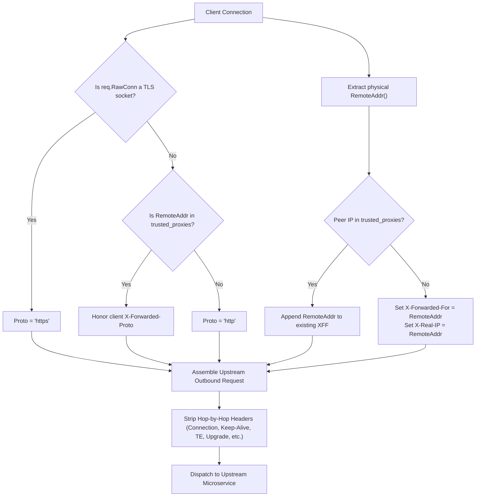

# ADR-066 - Physical Connection State Derivation & Hop-by-Hop Header Stripping

## Context & Problem Statement

When proxying HTTP requests to upstream microservices, `ReverseProxy` (`pkg/proxy/proxy.go`) injects standard proxy ingress headers (`X-Forwarded-For`, `X-Forwarded-Proto`, `X-Forwarded-Host`).

In the current implementation:
1. **Header Spoofing**: `X-Forwarded-Proto` blindly trusts client-supplied headers (`if req.Header.Get("X-Forwarded-Proto") != "" { proto = ... }`). A client connecting over unencrypted cleartext HTTP can supply `X-Forwarded-Proto: https` to trick upstream backends into bypassing SSL-only middleware. Similarly, `X-Real-IP` is copied directly to `X-Forwarded-For` without verifying whether the peer is a trusted proxy.
2. **Hop-by-Hop Leakage**: The proxy does not strip standard hop-by-hop headers per RFC 7230 §6.1 (`Connection`, `Keep-Alive`, `Proxy-Authenticate`, `Proxy-Authorization`, `TE`, `Trailers`, `Upgrade`). This leads to connection misbehavior and proxy confusion on upstream HTTP/1.1 connections.

## Decision

We decide to implement **Connection-Anchored Header Derivation and RFC 7230 §6.1 Hop-by-Hop Sanitization**:

1. **Protocol State Anchoring (`X-Forwarded-Proto`)**:
   - Inspect physical socket connection `req.RawConn` to determine if TLS encryption was active during handshake (e.g. `*tls.Conn`).
   - If TLS is active, set `X-Forwarded-Proto: https`.
   - If cleartext TCP, set `X-Forwarded-Proto: http`.
   - Disregard client-supplied `X-Forwarded-Proto` unless the immediate connecting peer IP is in `trusted_proxies`.

2. **Client IP Derivation (`X-Forwarded-For`)**:
   - Extract the physical client IP from `req.RawConn.RemoteAddr()`.
   - If peer IP is not in `trusted_proxies`, overwrite `X-Forwarded-For` and `X-Real-IP` with the physical client IP.
   - If peer IP is in `trusted_proxies` and `X-Forwarded-For` exists, append the physical IP: `existingXFF + ", " + physicalIP`.

3. **RFC 7230 §6.1 Hop-by-Hop Stripping**:
   - Delete standard hop-by-hop headers before dispatching outbound requests:
     `Connection`, `Keep-Alive`, `Proxy-Authenticate`, `Proxy-Authorization`, `TE`, `Trailers`, `Upgrade` (unless a valid WebSocket handshake is established).
   - Read the incoming `Connection` header tokens and delete any custom headers declared as hop-by-hop.

## Mermaid Diagram

## Alternatives Considered

1. **Trusting Private IP Subnets (RFC 1918) by Default**:
   - *Trade-off*: In containerized environments (Docker/Kubernetes), all clients may appear with private IPs from the bridge or overlay network. Requiring explicit `trusted_proxies` configuration ensures that arbitrary containers cannot spoof headers.
2. **Dropping Requests with Spoofed Headers**:
   - *Trade-off*: Dropping requests causes operational disruptions for benign users behind misconfigured corporate proxies. Overwriting headers with verified physical connection data safely sanitizes the request without breaking connectivity.

## Rationale

Reverse proxies are boundary enforcement points. Deriving security-critical headers from verified kernel socket state prevents downstream microservices from being deceived by malicious clients.

## Constraints

- Zero allocations during header stripping.
- Strict RFC 7230 §6.1 compliance.

## Consequences

### Positive
- Prevents protocol confusion and HTTPS bypass attacks on internal backends.
- Prevents IP address spoofing in backend audit logs and rate limiters.
- Eliminates upstream HTTP/1.1 connection desynchronization from leaked hop-by-hop headers.

### Negative / Trade-offs
- Upstream proxies in front of Toron (e.g. AWS ALB, Cloudflare) must have their IP ranges declared in `trusted_proxies` for their client IP headers to be passed through.

## Open Questions

- None.
