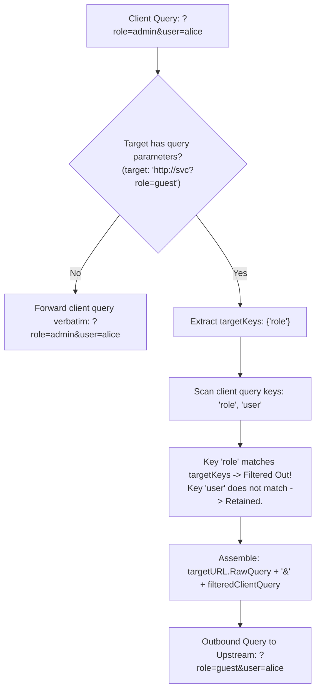

# ADR-067 - Target Query Precedence and HTTP Parameter Pollution (HPP) Mitigation

## Context & Problem Statement

Toron introduced query parameter forwarding and target query merging in `TASK-060` / `ADR-055`. When an upstream target route defines fixed query parameters in `routes.yaml` (e.g. `target: "http://upstream:8080/api?role=guest"`), the reverse proxy concatenates the target query string and client query string with an ampersand:
```go
outURL.RawQuery = targetURL.RawQuery + "&" + clientQuery
```

If a client supplies `?role=admin&user=alice`, the combined query string forwarded to the upstream service becomes:
```
role=guest&role=admin&user=alice
```

Different web application frameworks and runtimes resolve duplicate query parameters differently:
- Some runtimes (e.g. PHP, ASP.NET, Express with qs) select the **last** parameter occurrence.
- Others select the **first** parameter occurrence, or concatenate values into an array.

By appending client queries after target queries, Toron allows untrusted clients to exploit HTTP Parameter Pollution (HPP / CWE-235) to override gateway-enforced security constraints on downstream backends.

## Decision

We decide to architect **Target Query Parameter Precedence and Client Key Filtering**:

1. **Target Query Collision Set**:
   - If `targetURL.RawQuery` is empty, client queries are forwarded directly without alteration (fast path).
   - If `targetURL.RawQuery` contains parameters:
     - Parse the query parameter keys defined in `targetURL.RawQuery` into an in-memory collision set (`targetKeys`).
     - Target parameters are considered immutable gateway policy constraints.

2. **Deduplication and Collision Filtering**:
   - Parse client query parameters.
   - Any client query parameter key present in `targetKeys` is discarded, preventing clients from overriding target-defined keys.
   - Non-colliding client query parameters are preserved and appended to `targetURL.RawQuery`.

3. **Fidelity and Formatting Preservation**:
   - For all non-colliding client parameters, retain percent-encoding, parameter ordering, and flag syntax per `ADR-055`.

## Mermaid Diagram



## Alternatives Considered

1. **Reject Requests with Conflicting Query Keys (HTTP 400)**:
   - *Trade-off*: Aborting requests could break clients when upstream routes configure benign query parameters (e.g. `?format=json`). Silently prioritizing the gateway's target parameters maintains application compatibility while preserving security.
2. **Prepend Client Query Parameters Before Target Query Parameters**:
   - *Trade-off*: If Toron prepends client parameters (`role=admin&role=guest`), backends that parse by taking the *first* parameter occurrence would be vulnerable instead of backends taking the *last*. Deduplicating colliding keys eliminates ambiguity across all framework parsing strategies.

## Rationale

Gateway-enforced parameters must never be overridden or polluted by untrusted client input. Explicitly stripping conflicting client query keys eliminates parameter precedence ambiguities across all backend runtime environments.

## Constraints

- Zero allocations when the target URL defines no query parameters.
- Seamless compatibility with `ADR-055` verbatim query forwarding.

## Consequences

### Positive
- Completely neutralizes HTTP Parameter Pollution (HPP) against target-enforced route parameters.
- Eliminates framework-dependent parameter precedence differences.
- Preserves full client query parameters on non-colliding keys.

### Negative / Trade-offs
- Clients attempting to pass legitimate parameters with the same name as a gateway-configured target parameter will have that parameter discarded.

## Open Questions

- None.
