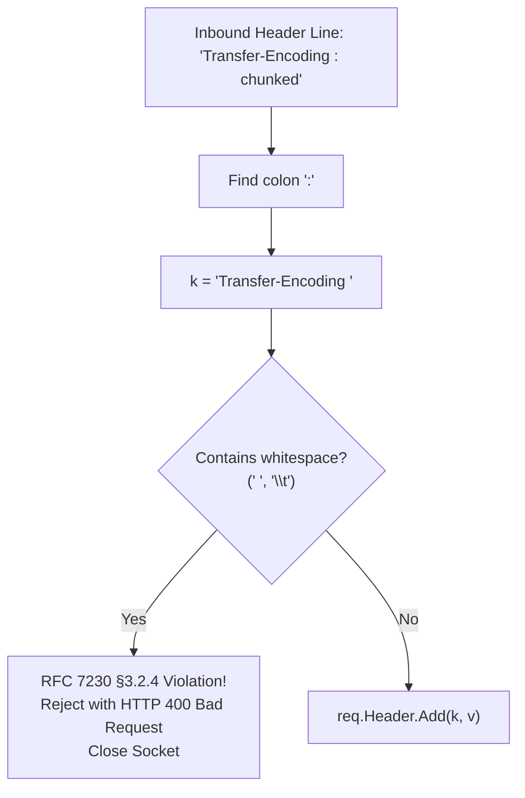

# ADR-068 - Header Field-Name Whitespace Rejection Architecture

## Context & Problem Statement

In `pkg/httpparser/parser.go`, header lines are parsed by finding the first colon delimiter:
```go
colonIdx := strings.IndexByte(lineTrimmed, ':')
k := lineTrimmed[:colonIdx]
```
If a request contains whitespace preceding the colon (e.g. `Transfer-Encoding : chunked`), `k` retains the trailing space. Go's `http.Header` lookup does not strip whitespace, allowing `req.Header.Get("Transfer-Encoding")` to evaluate to empty and bypass protocol security guards. RFC 7230 §3.2.4 mandates that any whitespace between the header name and colon must cause the request to be rejected with `400 Bad Request`.

## Decision

We decide to enforce strict RFC 7230 §3.2.4 header token validation:
1. Scan the extracted header key token `k` before adding it to `req.Header`.
2. If `strings.ContainsAny(k, " \t\r\n")` is true, immediately return `fmt.Errorf("%w: whitespace in header field-name", ErrBadRequest)`.
3. Terminate the connection so that desynchronized socket bytes cannot contaminate subsequent requests.

## Mermaid Diagram



## Alternatives Considered

- *Strip trailing whitespace automatically*: Rejected because normalizing whitespace masks protocol violations and leaves the gateway vulnerable to differential parsing behavior against backends.
- *Strict token regex matching*: Rejected due to per-header allocation overhead. `strings.ContainsAny` provides instant, zero-allocation checking.

## Rationale

Rejection is the only compliant behavior under RFC 7230 §3.2.4 and completely neutralizes whitespace header smuggling.

## Constraints

- Pure Go standard library.
- Zero memory allocations on valid headers.
