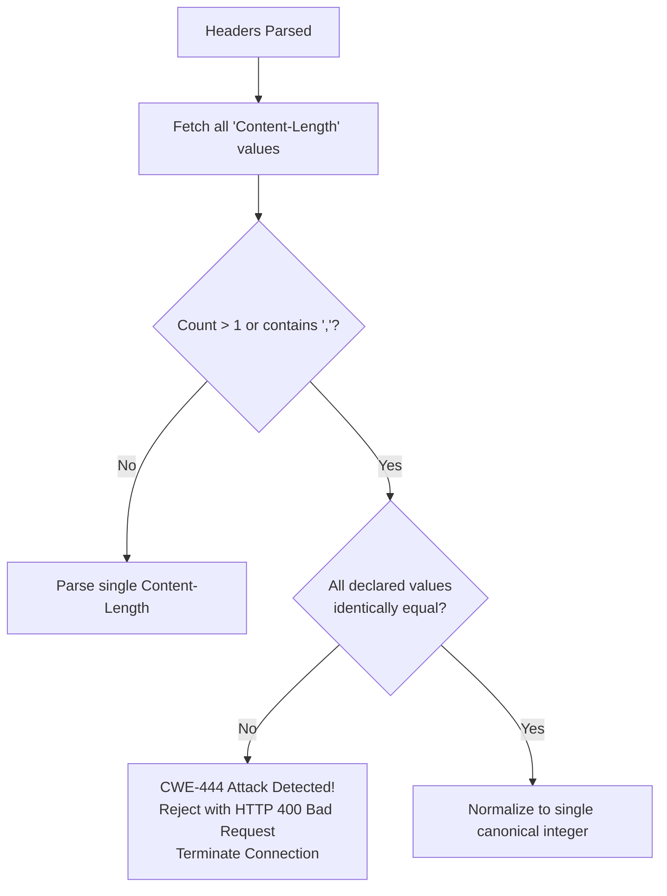

# ADR-069 - Multiple Content-Length Desynchronization Prevention Architecture

## Context & Problem Statement

In HTTP/1.1, if an attacker sends multiple `Content-Length` headers (e.g. `Content-Length: 0\r\nContent-Length: 45\r\n`) or comma-separated values, `req.Header.Get("Content-Length")` returns only the first value. The proxy consumes 0 bytes, leaving the remaining 45 bytes on the persistent keep-alive socket where they are parsed as a smuggled request line.

## Decision

We decide to enforce strict RFC 7230 §3.3.2 validation:
1. Inspect all values associated with `Content-Length` via `req.Header.Values("Content-Length")`.
2. If multiple values exist:
   - Verify if all values, when stripped of whitespace, evaluate to the identical integer.
   - If any values disagree (or if comma-separated lists contain distinct numbers), immediately abort parsing with `HTTP 400 Bad Request`.
3. Terminate the connection on failure.

## Mermaid Diagram

## Alternatives Considered

- *Always reject if count > 1*: Some proxies and CDNs duplicate identical `Content-Length` headers. Permitting identical duplicates while strictly rejecting conflicting values prevents false positives while maintaining 100% security.

## Rationale

Completely eliminates CL.CL HTTP request smuggling and connection desynchronization.

## Constraints

- Pure Go standard library.
