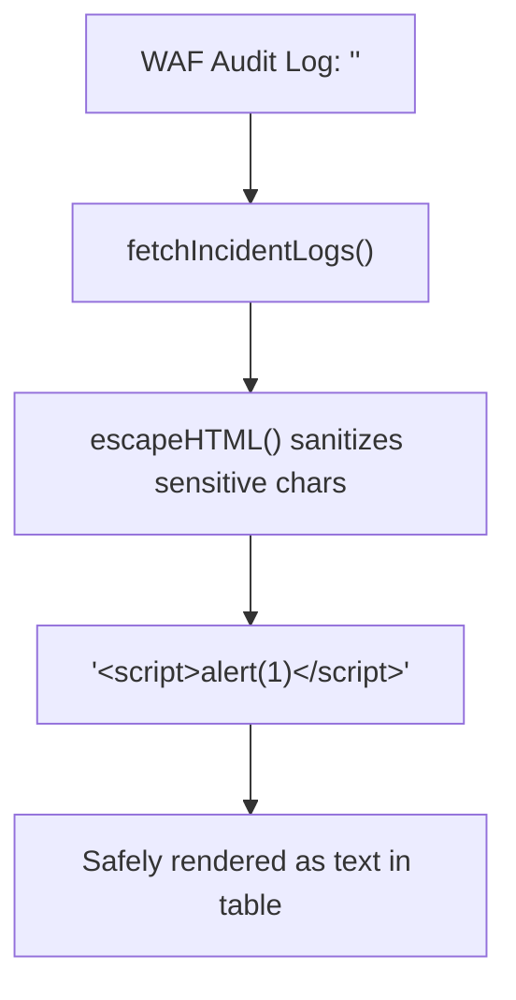

# ADR-070 - DOM-based XSS Mitigation via Contextual Encoding in Security Dashboard

## Context & Problem Statement

In `public/app.js`, `fetchIncidentLogs()` renders audit logs directly into `tbody.innerHTML` using unescaped template string interpolation. Real-world attacks that trigger WAF violations (containing HTML tags, quotes, or script vectors) execute in the security operator's browser when inspecting the incident log.

## Decision

We decide to eliminate raw HTML interpolation of user-controlled variables:
1. Introduce a lightweight `escapeHTML` helper in `public/app.js`:
   ```javascript
   function escapeHTML(str) {
     if (!str) return '';
     return String(str)
       .replace(/&/g, '&amp;')
       .replace(/</g, '&lt;')
       .replace(/>/g, '&gt;')
       .replace(/"/g, '&quot;')
       .replace(/'/g, '&#39;');
   }
   ```
2. Apply `escapeHTML` to all dynamic fields (`inc.path`, `inc.client_ip`, `inc.rule_id`, `r.container_name`, `r.prefix`, `r.host`) prior to rendering.

## Mermaid Diagram



## Alternatives Considered

- *Adopt React/Vue with built-in JSX escaping*: Rejected to keep Toron's dashboard zero-dependency, ultra-lightweight, and fully embedded in static vanilla JS.

## Rationale

Contextual encoding neutralizes HTML and JavaScript execution while preserving verbatim incident data visibility for security analysts.

## Constraints

- Vanilla JavaScript; zero client-side dependencies.
