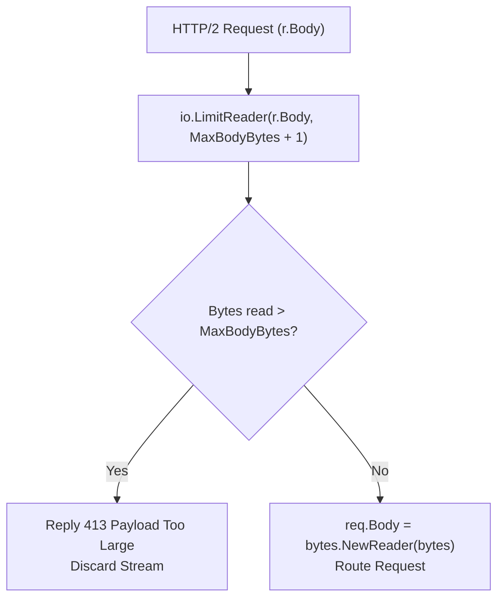

# ADR-071 - Ingress Payload Bounding Architecture in HTTP/2 Adaptation

## Context & Problem Statement

In `pkg/server/server.go:http2AdapterHandler`, incoming standard library `http.Request` bodies were consumed via `io.ReadAll(r.Body)` without bounds, contrasting with HTTP/1.1 where `MaxBodyBytes` is strictly enforced. Malicious HTTP/2 clients streaming large or infinite bodies could exhaust gateway heap memory and crash the server.

## Decision

We decide to enforce bounded payload ingestion in `http2AdapterHandler`:
1. Limit incoming stream consumption to `s.config.MaxBodyBytes + 1` using `io.LimitReader`.
2. If bytes read exceed `s.config.MaxBodyBytes`, immediately abort and reply with `http.StatusRequestEntityTooLarge` (`HTTP 413`).
3. Only instate `req.Body = bytes.NewReader(bodyBytes)` if the payload conforms to configured memory limits.

## Mermaid Diagram

## Alternatives Considered

- *Directly stream without buffering*: Certain router middlewares (WAF body inspection, REST-to-gRPC transcoding) require inspecting or rewinding request bodies. Bounding buffered payload size protects memory while enabling full Layer 7 inspection.

## Rationale

Restores parity between HTTP/1.1 and HTTP/2 memory protection guards.

## Constraints

- Pure Go standard library.
