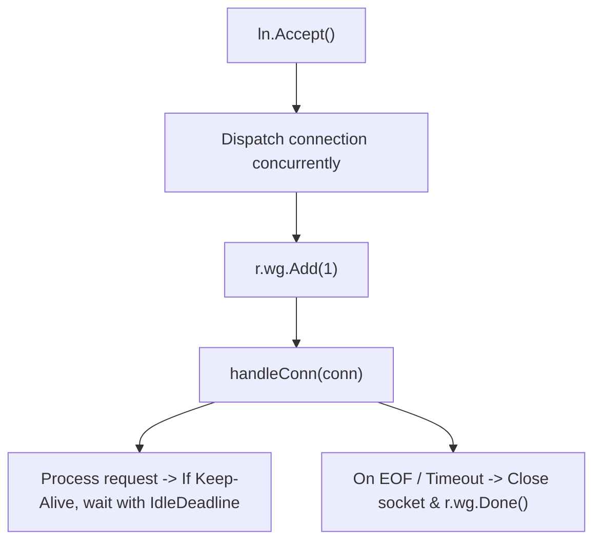

# ADR-072 - Reactor Non-Blocking Keep-Alive Dispatch Architecture

## Context & Problem Statement

The TCP reactor in `pkg/reactor/reactor.go` assigned accepted sockets to a fixed pool of 128 workers. Because `s.handleConn` executes a synchronous loop waiting up to `IdleTimeout` (30s) between keep-alive requests, 128 idle clients could monopolize all workers. Once the 512-capacity task channel filled, the accept loop blocked, starving all incoming traffic.

## Decision

We decide to decouple socket acceptance and connection processing from a static blocking worker constraint:
1. When a connection is accepted, `Serve` dispatches it to a managed concurrent connection worker or spawns a dedicated goroutine tracked by `r.wg`.
2. Connection lifecycle is governed by context cancellation, `ReadTimeout`, and `IdleTimeout`.
3. The reactor listener loop never blocks on connection processing, enabling high connection concurrency and complete immunity to worker starvation.

## Mermaid Diagram

## Alternatives Considered

- *Epoll/kqueue event demultiplexer*: In Go runtime, standard netpoll already implements epoll/kqueue under the hood for `net.Conn`. Spawning lightweight goroutines per connection leverages Go's M:N green-thread scheduler natively, scaling to hundreds of thousands of concurrent connections with zero CGo overhead.

## Rationale

Restores high-throughput, non-blocking edge gateway concurrency.

## Constraints

- Pure Go runtime; zero data races under `-race`.
