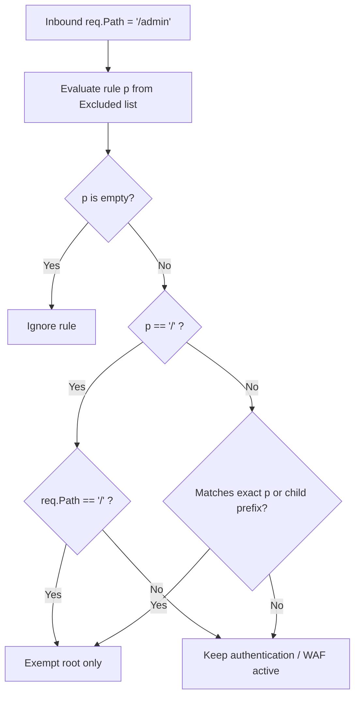

# ADR-073 - Exact-Match Hardening for Authentication & WAF Path Exclusions

## Context & Problem Statement

In `pkg/router/auth.go` and `pkg/waf/middleware.go`, exclusions were tested via:
```go
if req.Path == p || strings.HasPrefix(req.Path, strings.TrimSuffix(p, "/")+"/")
```
If an exclusion was configured as `""` or `"/"`, `strings.TrimSuffix(p, "/")+"/"` evaluated to `"/"`, matching every incoming request path and silently bypassing security controls globally.

## Decision

We decide to enforce strict exclusion matching semantics:
1. Ignore empty string exclusion rules (`p == ""`).
2. When an exclusion is root (`p == "/"`), require strict equality (`req.Path == "/"`). Never perform a prefix expansion on root.
3. For subpath exclusions (`p != "/"`), require exact match (`req.Path == p`) or child prefix match (`strings.HasPrefix(req.Path, strings.TrimSuffix(p, "/")+"/")`).

## Mermaid Diagram



## Alternatives Considered

- *Reject configuration on startup if `excluded: ["/"]`*: While good for static config, dynamic APIs or hot-reloading could still receive edge cases. Handling it deterministically at runtime guarantees defense-in-depth.

## Rationale

Prevents catastrophic security deactivation from misconfiguration.

## Constraints

- Pure Go standard library.
