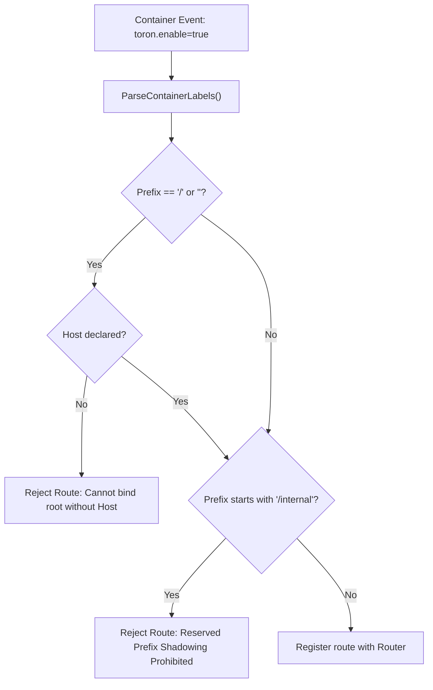

# ADR-074 - Scoped Path Policy for Container Auto-Discovery Ingress

## Context & Problem Statement

Container auto-discovery parsed labels without prefix validation. A container specifying `toron.prefix: "/"` or shadowing `/internal` could steal global ingress traffic or hijack administrative endpoints.

## Decision

We decide to enforce prefix validation on container-discovered routes:
1. Prohibit containers from declaring empty (`""`) or root (`"/"`) prefixes unless an explicit, recognized non-empty `toron.host` label is supplied.
2. Disallow container routes from binding to reserved administrative prefixes (`/internal`, `/api/status`).
3. If an unauthorized label is detected, log a security warning and discard the route registration.

## Mermaid Diagram

## Alternatives Considered

- *Only allow routes with explicit namespace label*: Slightly more restrictive for simple local setups. Enforcing host-specificity on root and blocking internal prefixes provides strong protection while maintaining developer ergonomics.

## Rationale

Guarantees multi-tenant isolation for edge gateway container discovery.

## Constraints

- Pure Go standard library.
