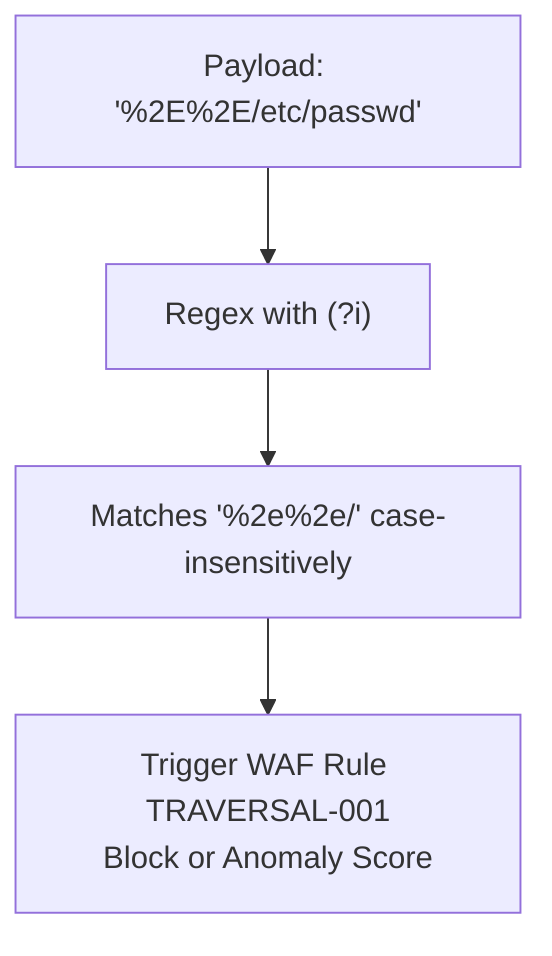

# ADR-075 - Comprehensive Case-Insensitive Traversal Pattern Matching

## Context & Problem Statement

Rule `TRAVERSAL-001` in `pkg/waf/rules.go` omitted the `(?i)` flag. When evaluating raw headers and unescaped JSON bodies, uppercase percent-encoded sequences (`%2E%2E/`, `%2E%2E%5C`) were not matched by the regex, bypassing WAF inspection.

## Decision

We decide to harden `TRAVERSAL-001`:
1. Add `(?i)` flag to ensure case-insensitive matching across hex digits (`%2E` vs `%2e`).
2. Expand coverage to include backslash variants (`\\`, `%5c`, `%5C`).
3. Pattern: `(?i)(\.\./|\.\.\\|%2e%2e/|%2e%2e%2f|%2e%2e\\|%2e%2e%5c)`

## Mermaid Diagram

## Alternatives Considered

- *Unescape bodies before regex evaluation*: Complex due to multipart form-data and arbitrary binary payloads. Making the regex case-insensitive provides comprehensive coverage with minimal overhead.

## Rationale

Eliminates casing-based evasion techniques against the WAF.

## Constraints

- Standard library `regexp`.
