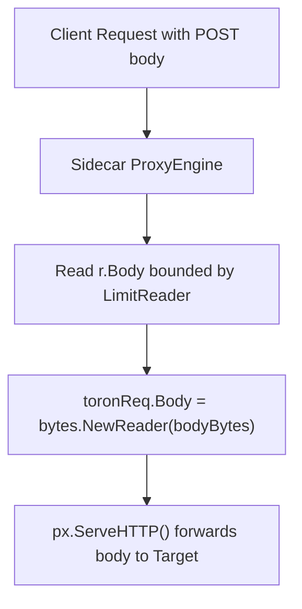

# ADR-076 - Stream Retention Architecture for Sidecar Proxy Ingress

## Context & Problem Statement

In `pkg/sidecar/proxy.go`, `toronReq` was generated using `httpparser.NewRequestFromStd(r)`, which defaults `Body` to an empty reader. Because the sidecar engine did not transfer `r.Body`, all POST, PUT, and PATCH request bodies were dropped during sidecar forwarding.

## Decision

We decide to ensure payload retention in the sidecar proxy:
1. In `pkg/sidecar/proxy.go`, if `r.Body != nil` and method is not `GET`/`HEAD`:
   - Consume `r.Body` using `io.LimitReader` bounded by configured maximum payload size.
   - Assign `toronReq.Body = bytes.NewReader(bodyBytes)`.
2. Ensure upstream requests dispatched by `px.ServeHTTP` receive the complete request payload.

## Mermaid Diagram

## Alternatives Considered

- *Pass raw `io.Reader`*: If downstream middlewares (e.g. WAF, logging) inspect the body, streaming without buffering prevents replay. Buffering with a strict size limit satisfies all middleware requirements safely.

## Rationale

Restores data integrity for sidecar-proxied services.

## Constraints

- Pure Go standard library.
