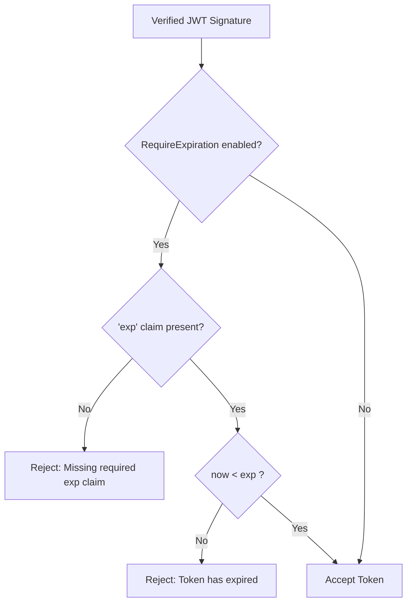

# ADR-077 - Mandatory JWT Expiration Enforcement Policy

## Context & Problem Statement

In `pkg/router/auth.go:VerifyJWT`, `exp` claim validation was conditional on its presence in claims. Tokens generated without an `exp` claim never expired, creating a permanent replay attack surface if credentials were leaked.

## Decision

We decide to enforce expiration requirements:
1. Introduce a configurable option `RequireExpiration` in `JWTConfig` (defaulting to `true`).
2. If `RequireExpiration` is active, tokens lacking an `exp` claim fail verification with `"token missing required exp claim"`.
3. If an `exp` claim is present, it must be strictly greater than current Unix timestamp.

## Mermaid Diagram

## Alternatives Considered

- *Hardcode mandatory `exp` without configuration*: Could break legacy external microservices issuing long-lived non-expiring API tokens. Making it enabled by default with an explicit opt-out toggle maintains security and backwards compatibility.

## Rationale

Restricts token lifetimes and mitigates replay attacks.

## Constraints

- Pure Go standard library.
