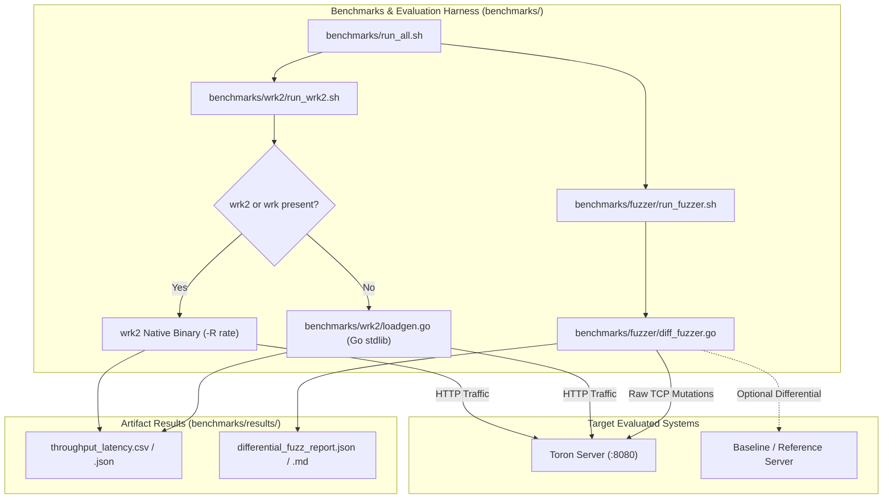

# ADR-078 - Automated Experimental Benchmarking and Differential Protocol Fuzzing Architecture

## Context & Problem Statement

Academic dissemination requires reproducible empirical benchmarks (evaluating throughput, p99 latency under load, and memory stability) and differential security testing (verifying that strict RFC invariants eliminate protocol desynchronization and request smuggling). Relying exclusively on external binary installations (`wrk2`, `syzkaller`, `PortSwigger`) complicates artifact evaluation for peer reviewers and continuous integration across diverse operating systems.

## Decision

We establish an integrated benchmark and differential fuzzing architecture in `benchmarks/`:

1. **Dual-Path Performance Benchmarking**:
   - Primary runner (`benchmarks/wrk2/run_wrk2.sh`) interfaces with `wrk2` for coordinated omission-free tail latency profiling using constant-throughput pacing (`-R`).
   - Secondary standalone load generator (`benchmarks/wrk2/loadgen.go`) implemented in pure standard-library Go. It emulates `wrk2` connection worker pools and token-bucket request emission, computing statistical latency percentiles (p50, p90, p99, p99.9) and serializing to JSON/CSV.

2. **Differential Protocol Security Fuzzer**:
   - Implemented in `benchmarks/fuzzer/diff_fuzzer.go` using raw TCP socket transmissions (`net.DialTimeout`).
   - Systematically generates mutated HTTP request payloads mapping to Toron's security invariants:
     - CL.TE / TE.CL desync variants (RFC 7230 §3.3.3)
     - Multiple Content-Length header collisions (RFC 7230 §3.3.2)
     - Leading whitespace in field names (RFC 7230 §3.2.4)
     - Non-printable ASCII control characters (CWE-117)
     - Encoded directory traversal sequences (RFC 3986)
     - HTTP Parameter Pollution collisions (CWE-235)
   - Compares target behavior against invariant assertions (e.g. `assert_status: 400|501`, `assert_connection_closed: true`).
   - Computes microsecond response times to prove zero-overhead fail-fast rejection.

## Mermaid Architecture Diagram

## Consequences

- **Positive**: Zero-setup barrier for artifact reviewers; standard `go run` executes the entire suite without compiling third-party C dependencies.
- **Positive**: Direct generation of publication-ready tables and CSV data suitable for Gnuplot, Matplotlib, or LaTeX generation.
- **Negative**: High-rate Go load generator may incur slightly higher client-side CPU usage than C-based `wrk2` at >100,000 RPS.
