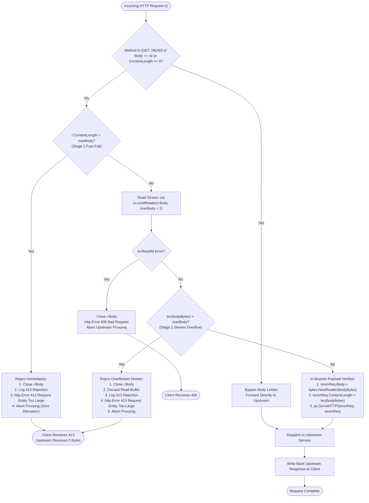

# ADR-081 - Configurable Request Body Limiting and Truncation Rejection in Service Mesh Sidecar Proxy

## Context & Problem Statement

In the Toron Service Mesh Sidecar ([`pkg/sidecar/proxy.go`](file:///Users/sneha/Developer/toron-research/toron/pkg/sidecar/proxy.go)), [`ProxyEngine.proxyToURL`](file:///Users/sneha/Developer/toron-research/toron/pkg/sidecar/proxy.go#L189) handles inbound and outbound HTTP requests across mesh proxies, translating standard Go [`http.Request`](file:///Users/sneha/Developer/toron-research/toron/pkg/sidecar/proxy.go#L189) instances into Toron internal [`httpparser.Request`](file:///Users/sneha/Developer/toron-research/toron/pkg/httpparser/request.go) structures before proxying to local application containers or remote endpoints.

Previously, request body ingestion was implemented with a hardcoded constant and an unconstrained stream reader:

```go
const maxSidecarBody = 10 * 1024 * 1024 // 10 MB limit
bodyBytes, err := io.ReadAll(io.LimitReader(r.Body, maxSidecarBody+1))
if err == nil {
    toronReq.Body = bytes.NewReader(bodyBytes)
    toronReq.ContentLength = int64(len(bodyBytes))
}
```

This implementation suffered from two critical security defects identified in [`SEC-25`](file:///Users/sneha/Developer/toron-research/toron/SECURITY_AUDIT.md#L366-L374):
1. **Silent Request Body Truncation & Interpretation Conflict ([CWE-436](https://cwe.mitre.org/data/definitions/436.html))**:
   When an incoming payload exceeded 10 MB, `io.LimitReader` silently cut the body off at `10 * 1024 * 1024 + 1` bytes without error. The sidecar proxy set `toronReq.ContentLength` to the truncated byte length and forwarded the partial payload upstream. As a result, backend applications received mutilated JSON documents, partial file uploads, or truncated RPC frames without any warning, causing silent database corruption and protocol desynchronization.
2. **Hardcoded Body Limit & Uncontrolled Resource Consumption ([CWE-400](https://cwe.mitre.org/data/definitions/400.html))**:
   The maximum payload size was hardcoded to 10 MB in the method body, preventing cluster operators from tuning request size limits in memory-constrained environments or high-throughput file transfer services.
3. **Absence of Fail-Fast HTTP 413 Rejection**:
   Neither declared `Content-Length` headers nor detected stream over-reads generated RFC-compliant `413 Request Entity Too Large` (`http.StatusRequestEntityTooLarge`) responses. Oversized payloads consumed bandwidth and CPU before being forwarded in a corrupt state.

## Decision

We establish an end-to-end architecture across configuration, validation, and proxy engine request pipelines:

### 1. Configurable Body Limit Contract in [`SidecarConfig`](file:///Users/sneha/Developer/toron-research/toron/pkg/config/config.go#L103)
- Introduce `MaxBodyBytes int64` into [`SidecarConfig`](file:///Users/sneha/Developer/toron-research/toron/pkg/config/config.go#L103) in [`pkg/config/config.go`](file:///Users/sneha/Developer/toron-research/toron/pkg/config/config.go) with tags `` `yaml:"max_body_bytes" json:"max_body_bytes"` ``.
- Enforce a standardized default limit of 10 MB (`10 * 1024 * 1024` bytes, or `10,485,760` bytes) across three layers:
  1. Default configuration builder: [`DefaultAppConfig`](file:///Users/sneha/Developer/toron-research/toron/pkg/config/config.go#L466) in [`pkg/config/config.go`](file:///Users/sneha/Developer/toron-research/toron/pkg/config/config.go).
  2. Loader normalization: [`validateConfigDefaults`](file:///Users/sneha/Developer/toron-research/toron/pkg/config/loader.go#L153) in [`pkg/config/loader.go`](file:///Users/sneha/Developer/toron-research/toron/pkg/config/loader.go) (assigning 10 MB when `cfg.Sidecar.MaxBodyBytes <= 0`).
  3. Engine constructor fallback: [`NewProxyEngine`](file:///Users/sneha/Developer/toron-research/toron/pkg/sidecar/proxy.go#L37) in [`pkg/sidecar/proxy.go`](file:///Users/sneha/Developer/toron-research/toron/pkg/sidecar/proxy.go) (ensuring programmatically constructed engines without explicit configs default to 10 MB).

### 2. Dual-Stage Overflow Detection & Rejection Pipeline
In [`ProxyEngine.proxyToURL`](file:///Users/sneha/Developer/toron-research/toron/pkg/sidecar/proxy.go#L189), replace silent truncation with a dual-stage fail-fast rejection mechanism:

- **Stage 0: Non-Mutating & Empty Request Bypass**:
  - If the request method does not convey a body (`GET`, `HEAD`) or `r.Body == nil` or declared `r.ContentLength == 0`, bypass body reading and buffering entirely. Forward the request directly to avoid allocation overhead.

- **Stage 1: Fast-Fail Declared `Content-Length` Guard**:
  - If `r.ContentLength > 0 && r.ContentLength > p.cfg.MaxBodyBytes`:
    - Immediately close the incoming request body (`_ = r.Body.Close()`).
    - Emit a diagnostic log detailing the rejected path and exceeded limit.
    - Write HTTP `413 Request Entity Too Large` (`http.StatusRequestEntityTooLarge`) via standard `http.Error(w, "Request Entity Too Large", http.StatusRequestEntityTooLarge)`.
    - Immediately abort proxying and return without allocating body memory or contacting the upstream target.

- **Stage 2: Bounded Stream Over-Read Guard (Chunked & Unknown Lengths)**:
  - For chunked transfer encoding (`Transfer-Encoding: chunked`) or undeclared content lengths (`r.ContentLength <= 0`), stream ingestion is bounded using `io.LimitReader(r.Body, p.cfg.MaxBodyBytes+1)`.
  - Read up to `p.cfg.MaxBodyBytes + 1` bytes via `io.ReadAll`.
  - If `int64(len(bodyBytes)) > p.cfg.MaxBodyBytes`:
    - The payload exceeds the allowable threshold.
    - Close `r.Body`, discard read bytes, emit diagnostic log.
    - Respond with HTTP `413 Request Entity Too Large` (`http.StatusRequestEntityTooLarge`).
    - Abort proxy dispatch immediately; ensure zero bytes are forwarded upstream.
  - If `io.ReadAll` encounters an unexpected I/O error (`err != nil`), close `r.Body`, return HTTP `400 Bad Request`, and abort dispatch.

- **Stage 3: Full-Fidelity Forwarding for In-Bounds Payloads**:
  - When `int64(len(bodyBytes)) <= p.cfg.MaxBodyBytes`, populate `toronReq.Body = bytes.NewReader(bodyBytes)` and `toronReq.ContentLength = int64(len(bodyBytes))`.
  - Dispatch the intact, uncorrupted request to the upstream proxy handler (`px.ServeHTTP`).

### 3. Safe Resource Management & Invariants
- **Resource Cleanup**: Ensure `defer r.Body.Close()` is called to prevent file descriptor leaks.
- **Zero Partial Upstream Forwarding**: On any rejection (Stage 1 or Stage 2), proxy dispatching is terminated prior to calling `px.ServeHTTP`, guaranteeing upstream services never receive partial or malformed requests.
- **Concurrency & Race Safety**: All state in [`ProxyEngine`](file:///Users/sneha/Developer/toron-research/toron/pkg/sidecar/proxy.go#L23) remains safe under concurrent execution, validated by `go test -race ./pkg/sidecar/...`.
- **Pure Go Standard Library**: All mechanisms rely strictly on `net/http`, `io`, `bytes`, `fmt`, and `sync` with zero third-party dependencies.

## Architecture & Control Flow Diagrams

### Dual-Stage Body Inspection Flowchart



### Request Ingestion & Proxying Sequence Diagram

```mermaid
sequenceDiagram
    autonumber
    actor Client
    participant Sidecar as Sidecar ProxyEngine
    participant Upstream as Upstream Service / App

    Note over Client,Upstream: Scenario 1: Declared Content-Length Overflow (Stage 1 Fast-Fail)
    Client->>Sidecar: POST /api/v1/data (Content-Length: 20MB, Limit: 10MB)
    Sidecar->>Sidecar: Fast-fail check: ContentLength (20MB) > MaxBodyBytes (10MB)
    Sidecar->>Sidecar: Close r.Body without reading payload
    Sidecar-->>Client: HTTP 413 Request Entity Too Large
    Note over Sidecar,Upstream: Upstream untouched; zero memory allocated for body

    Note over Client,Upstream: Scenario 2: Chunked Stream Over-Read Overflow (Stage 2 Stream Guard)
    Client->>Sidecar: POST /api/v1/upload (Transfer-Encoding: chunked)
    Sidecar->>Sidecar: Read stream via io.LimitReader(r.Body, 10MB + 1)
    Sidecar->>Sidecar: len(bodyBytes) exceeds 10MB limit
    Sidecar->>Sidecar: Discard buffer and close r.Body
    Sidecar-->>Client: HTTP 413 Request Entity Too Large
    Note over Sidecar,Upstream: Upstream untouched; partial stream aborted

    Note over Client,Upstream: Scenario 3: Valid In-Bounds Payload Forwarding
    Client->>Sidecar: POST /api/v1/resource (Content-Length: 512KB <= Limit)
    Sidecar->>Sidecar: Fast-fail passed; read 512KB within bounds
    Sidecar->>Upstream: Forward request with 100% byte fidelity
    Upstream-->>Sidecar: HTTP 200 OK (Response Body)
    Sidecar-->>Client: HTTP 200 OK (Response Body)
```

## Consequences

- **Positive (Security - Eliminates SEC-25)**: Prevents silent body truncation and payload corruption ([CWE-436](https://cwe.mitre.org/data/definitions/436.html)), completely closing vulnerability [`SEC-25`](file:///Users/sneha/Developer/toron-research/toron/SECURITY_AUDIT.md#L366-L374).
- **Positive (Resource Protection - CWE-400)**: Prevents uncontrolled memory allocation on oversized declared requests by rejecting them prior to buffering. For chunked streams, peak memory allocation is strictly bounded to `MaxBodyBytes + 1`.
- **Positive (Operational Flexibility)**: Operators can customize `sidecar.max_body_bytes` per deployment via YAML configuration or container environment flags.
- **Positive (Deterministic Protocol Semantics)**: Returns standard RFC-compliant HTTP `413 Request Entity Too Large` status codes to calling clients.
- **Positive (Zero 3rd-Party Dependencies)**: Built purely with standard library Go primitives (`net/http`, `io`, `bytes`, `sync`).
- **Negative / Trade-off**: Streaming requests with chunked encoding are buffered up to `MaxBodyBytes + 1` in memory prior to forwarding. This is an intentional tradeoff to verify payload integrity and enforce size boundaries before initiating upstream writes.
