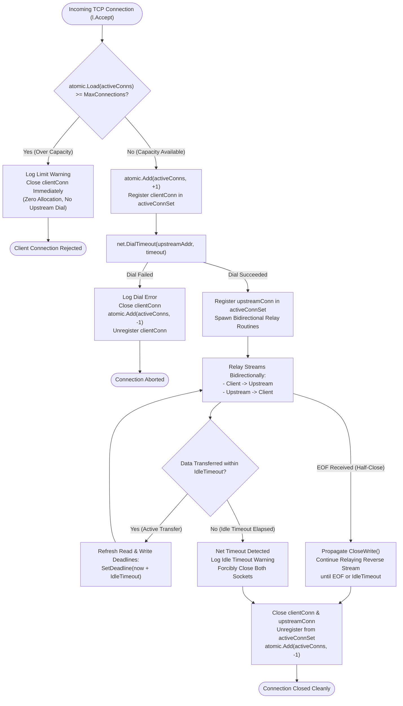
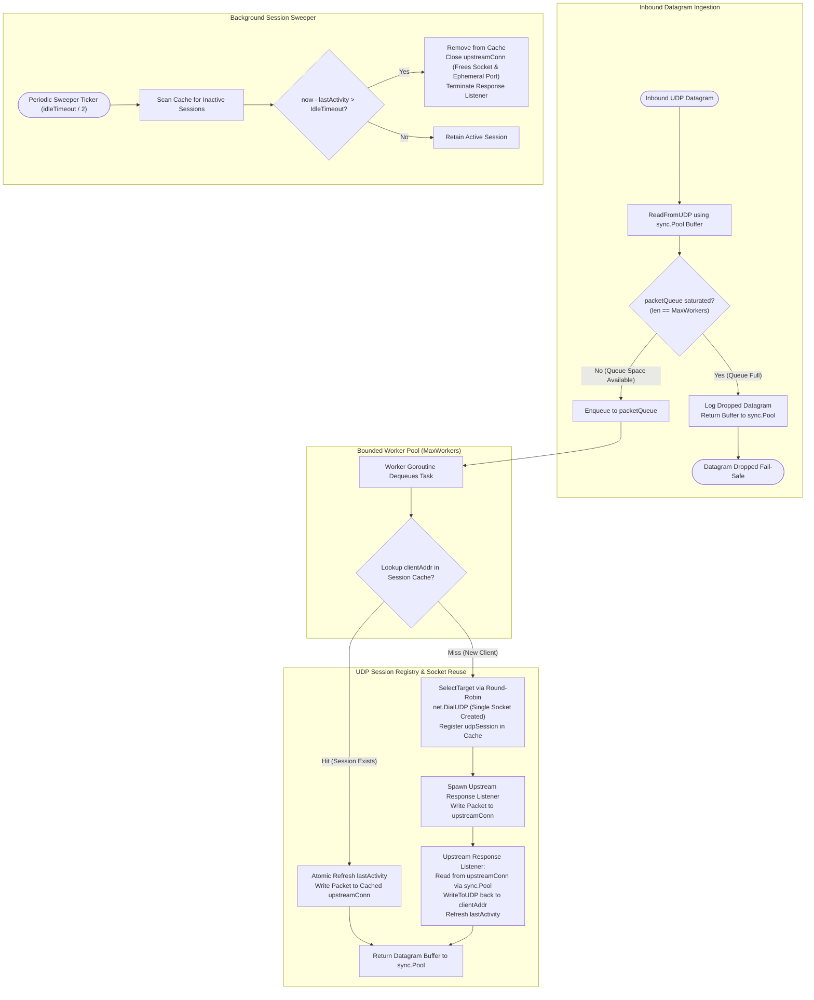

# ADR-082 - Bounded Concurrency, Socket Reuse, and Idle Deadline Enforcement in Layer 4 TCP and UDP Proxies

## Context & Problem Statement

Toron provides Layer 4 transport proxies for stream forwarding ([`TCPProxy`](file:///Users/sneha/Developer/toron-research/toron/pkg/proxy/tcp.go#L14-L23)) and datagram forwarding ([`UDPProxy`](file:///Users/sneha/Developer/toron-research/toron/pkg/proxy/udp.go#L13-L22)), configured through [`ProxyRouteConfig`](file:///Users/sneha/Developer/toron-research/toron/pkg/config/config.go#L253-L290) and wired at gateway startup in [`cmd/toron/main.go`](file:///Users/sneha/Developer/toron-research/toron/cmd/toron/main.go#L390-L429).

A security audit identified critical vulnerability [`SEC-26`](file:///Users/sneha/Developer/toron-research/toron/SECURITY_AUDIT.md#L375-L383) ([CWE-400: Uncontrolled Resource Consumption](https://cwe.mitre.org/data/definitions/400.html)), further detailed in [`SR-081 Finding 4`](file:///Users/sneha/Developer/toron-research/toron/docs/securityReview/SR-081.md#L130-L140). Both the TCP and UDP proxy implementations lacked resource bounding, socket lifecycle management, buffer reuse, and deadline controls:

### 1. UDP Proxy Vulnerabilities ([`pkg/proxy/udp.go`](file:///Users/sneha/Developer/toron-research/toron/pkg/proxy/udp.go))
- **Unbounded Goroutine Spawning**: In [`UDPProxy.Serve`](file:///Users/sneha/Developer/toron-research/toron/pkg/proxy/udp.go#L57-L78), every arriving datagram unconditionally spawns an unconstrained goroutine (`go p.handleDatagram(...)`). Under high-rate UDP packet floods, hundreds of thousands of goroutines are scheduled concurrently, exhausting host CPU cycles, saturating Go runtime scheduler queues, and triggering out-of-memory (OOM) crashes.
- **Per-Packet Upstream Socket Allocation & Ephemeral Port Exhaustion**: In [`handleDatagram`](file:///Users/sneha/Developer/toron-research/toron/pkg/proxy/udp.go#L80-L108), `net.DialUDP("udp", nil, targetUDPAddr)` is invoked for **every single datagram**. Each invocation requests a new OS socket file descriptor and binds a fresh ephemeral port. At moderate packet velocities (e.g., 5,000 datagrams/sec), the host quickly exhausts all available ephemeral ports (`bind: address already in use`) and reaches OS file descriptor limits (`socket: too many open files` - `EMFILE`).
- **Severe Heap Allocation Churn**: On each packet, [`handleDatagram`](file:///Users/sneha/Developer/toron-research/toron/pkg/proxy/udp.go#L101) heap-allocates a 64 KB response slice (`make([]byte, 65535)`). Under heavy datagram traffic, tens of gigabytes per minute are allocated and discarded, causing severe Garbage Collection (GC) pauses and latency spikes.
- **Orphaned Sockets on Teardown**: In [`UDPProxy.Close`](file:///Users/sneha/Developer/toron-research/toron/pkg/proxy/udp.go#L111-L126), active outbound sockets and background goroutines are neither tracked nor closed. Existing handlers continue executing until target dial or read timeouts expire.

### 2. TCP Proxy Vulnerabilities ([`pkg/proxy/tcp.go`](file:///Users/sneha/Developer/toron-research/toron/pkg/proxy/tcp.go))
- **Unbounded Connection Acceptance**: In [`TCPProxy.Serve`](file:///Users/sneha/Developer/toron-research/toron/pkg/proxy/tcp.go#L58-L76), `l.Accept()` accepts incoming client sockets in an unconstrained loop without concurrency bounds. An adversary can exhaust system file descriptors by opening thousands of concurrent TCP connections.
- **Missing Idle Deadlines (Slowloris Vulnerability)**: During stream forwarding in [`handleConn`](file:///Users/sneha/Developer/toron-research/toron/pkg/proxy/tcp.go#L78-L109), `io.Copy(upstreamConn, clientConn)` and `io.Copy(clientConn, upstreamConn)` block indefinitely without read or write deadlines. An attacker opening connections and maintaining zero throughput (Slowloris attack) permanently locks socket file descriptors and worker goroutines.
- **Untracked Connections on Shutdown**: In [`TCPProxy.Close`](file:///Users/sneha/Developer/toron-research/toron/pkg/proxy/tcp.go#L112-L127), only the TCP listener is closed. Established client connections and upstream sockets remain open and blocked in `io.Copy` until the remote peers disconnect.

## Architectural Decisions

To remediate [`SEC-26`](file:///Users/sneha/Developer/toron-research/toron/SECURITY_AUDIT.md#L375-L383) and satisfy [`REQ-087`](file:///Users/sneha/Developer/toron-research/toron/docs/requirements/REQ-087.md), we establish bounded concurrency models, socket reuse registries, buffer pooling, and bidirectional deadline enforcement across [`pkg/config`](file:///Users/sneha/Developer/toron-research/toron/pkg/config/config.go), [`pkg/proxy`](file:///Users/sneha/Developer/toron-research/toron/pkg/proxy/tcp.go), and [`cmd/toron`](file:///Users/sneha/Developer/toron-research/toron/cmd/toron/main.go).

```
+---------------------------------------------------------------------------------------+
|                                    Toron Layer 4 Gateway                              |
|                                                                                       |
|   +------------------------------------+     +------------------------------------+   |
|   |         TCP Stream Proxy           |     |        UDP Datagram Proxy          |   |
|   |                                    |     |                                    |   |
|   |  - MaxConnections (atomic gate)    |     |  - MaxWorkers (bounded worker pool)|   |
|   |  - Bidirectional Idle Deadlines    |     |  - sync.Pool Buffer Recycling      |   |
|   |  - Thread-Safe Connection Registry |     |  - Client Session Cache (Reuse FD) |   |
|   |  - Deterministic Socket Teardown   |     |  - Idle Session Sweeper & Cleanup  |   |
|   +------------------------------------+     +------------------------------------+   |
+---------------------------------------------------------------------------------------+
```

---

### 1. Layer 4 Configuration Schema in [`ProxyRouteConfig`](file:///Users/sneha/Developer/toron-research/toron/pkg/config/config.go#L253-L290)

We extend [`ProxyRouteConfig`](file:///Users/sneha/Developer/toron-research/toron/pkg/config/config.go#L253-L290) with three parameters governing resource consumption:

```go
type ProxyRouteConfig struct {
    // ... existing fields ...
    MaxConnections int           `yaml:"max_connections,omitempty" json:"max_connections,omitempty"`
    IdleTimeout    time.Duration `yaml:"idle_timeout,omitempty" json:"idle_timeout,omitempty"`
    MaxWorkers     int           `yaml:"max_workers,omitempty" json:"max_workers,omitempty"`
}
```

Helper methods guarantee deterministic, safe defaults across all entry points:
- `GetMaxConnections() int`: Returns `MaxConnections` if `> 0`, defaulting to `10000`.
- `GetIdleTimeout() time.Duration`: Returns `IdleTimeout` if `> 0`, defaulting to `60 * time.Second`.
- `GetMaxWorkers() int`: Returns `MaxWorkers` if `> 0`, defaulting to `1024`.

Constructor options (`TCPOption`, `UDPOption`) are introduced to allow both programmatic instantiation in unit tests and configuration propagation from [`cmd/toron/main.go`](file:///Users/sneha/Developer/toron-research/toron/cmd/toron/main.go#L390-L429) without breaking backwards compatibility:
- `WithTCPMaxConnections(n int)`
- `WithTCPIdleTimeout(d time.Duration)`
- `WithUDPMaxWorkers(n int)`
- `WithUDPIdleTimeout(d time.Duration)`

---

### 2. TCP Proxy Architecture ([`pkg/proxy/tcp.go`](file:///Users/sneha/Developer/toron-research/toron/pkg/proxy/tcp.go))

#### 2.1 Atomic Active Connection Tracking & Fast-Fail Rejection
- An atomic integer `activeConns int64` tracks currently active connections.
- In [`TCPProxy.Serve`](file:///Users/sneha/Developer/toron-research/toron/pkg/proxy/tcp.go#L58-L76), immediately after `l.Accept()`:
  - If `atomic.LoadInt64(&p.activeConns) >= int64(p.maxConnections)`:
    - Close `clientConn.Close()` immediately.
    - Emit diagnostic warning: `log.Printf("[TCPProxy] Maximum connection limit reached (%d), rejecting connection from %s", p.maxConnections, clientConn.RemoteAddr())`.
    - Do not dial upstream, allocate buffers, or spawn goroutines.
  - If below capacity:
    - Atomically increment `atomic.AddInt64(&p.activeConns, 1)`.
    - Dispatch `go p.handleConn(clientConn)`.
    - In `handleConn`, guarantee `defer atomic.AddInt64(&p.activeConns, -1)` on exit.

#### 2.2 Bidirectional Idle Deadline Enforcement (Slowloris Immunity)
- Standard `io.Copy` blocking loops are replaced by deadline-aware stream relaying using allocated 32 KB transfer buffers.
- Before each read or write operation:
  - Refresh read deadline on source socket: `src.SetReadDeadline(time.Now().Add(p.idleTimeout))`.
  - Refresh write deadline on destination socket: `dst.SetWriteDeadline(time.Now().Add(p.idleTimeout))`.
- If an established connection produces no traffic for `IdleTimeout`:
  - The read operation aborts with a network timeout error (`net.Error.Timeout() == true`).
  - Both `clientConn` and `upstreamConn` are forcibly closed, unblocking all paired goroutines.
  - Log diagnostic notice: `log.Printf("[TCPProxy] Idle timeout (%s) reached for connection %s <-> %s, terminating stream", p.idleTimeout, clientConn.RemoteAddr(), upstreamConn.RemoteAddr())`.
- TCP half-close semantics: when one stream direction reads `io.EOF`, call `CloseWrite()` on the destination TCP connection while maintaining idle deadline tracking on the reverse stream until completion or timeout.

#### 2.3 Thread-Safe Active Connection Registry & Deterministic Close
- Maintain `connsMu sync.Mutex` and `activeConnSet map[net.Conn]struct{}`.
- Upon successful upstream dial, register both `clientConn` and `upstreamConn` into `activeConnSet`.
- Unregister both sockets upon stream completion in `defer`.
- On [`TCPProxy.Close`](file:///Users/sneha/Developer/toron-research/toron/pkg/proxy/tcp.go#L112-L127):
  - Mark proxy closed and close `p.listener`.
  - Acquire `connsMu`, iterate over all tracked connections, invoke `conn.Close()`, and clear the map.
  - Pending I/O operations are interrupted immediately, terminating all running goroutines without resource leaks.

---

### 3. UDP Proxy Architecture ([`pkg/proxy/udp.go`](file:///Users/sneha/Developer/toron-research/toron/pkg/proxy/udp.go))

#### 3.1 Bounded Worker Pool & Queue Saturation Drop
- Replace per-packet goroutine spawning (`go p.handleDatagram(...)`) with a bounded worker pool pattern:
  - A task channel `packetQueue chan udpPacketTask` of fixed capacity `MaxWorkers`.
  - `MaxWorkers` persistent worker goroutines spawned during startup that process datagrams from `packetQueue`.
- In [`UDPProxy.Serve`](file:///Users/sneha/Developer/toron-research/toron/pkg/proxy/udp.go#L57-L78):
  - Read incoming datagram into a recycled buffer from `sync.Pool`.
  - Attempt non-blocking enqueue into `packetQueue` using `select`:
    - **Success**: Task enqueued to worker pool.
    - **Saturated Queue**: Drop datagram fail-safe, release buffer back to `sync.Pool`, and log: `log.Printf("[UDPProxy] Dropping datagram from %s: worker queue saturated (%d workers)", clientAddr, p.maxWorkers)`.
  - Protects host against CPU saturation and OOM under high-volume UDP floods.

#### 3.2 Buffer Recycling via `sync.Pool`
- A dedicated pool `bufPool sync.Pool{New: func() any { return make([]byte, 65535) }}` manages 64 KB datagram buffers.
- Inbound datagram reception and upstream response reading borrow slices from `bufPool` and return them immediately after transmission.
- Completely eliminates per-packet heap allocations and reduces GC pause times to near zero.

#### 3.3 Client Session Registry & Socket Reuse
- Define `udpSession` tracking:
  - `clientAddr *net.UDPAddr`
  - `upstreamConn *net.UDPConn`
  - `targetAddr string`
  - `lastActivity atomic.Int64` (Unix nano timestamp)
  - `closed chan struct{}`
- Session Table: `sessions map[string]*udpSession` indexed by `clientAddr.String()`, synchronized via `sessionMu sync.RWMutex`.
- Packet Forwarding Flow:
  - Lookup session in `p.sessions` under read lock.
  - **Cache Hit**: Update `lastActivity.Store(time.Now().UnixNano())`, write datagram to cached `upstreamConn`. Zero socket creation, zero ephemeral port allocation.
  - **Cache Miss**: Acquire write lock, verify double-checked locking, select upstream target via round-robin, invoke `net.DialUDP` once, register new `udpSession`, and launch a dedicated upstream response reader goroutine.
- Response Reader Routine:
  - Loops reading upstream replies from `upstreamConn` using pooled buffers.
  - Forwards responses back to client address via the inbound listener socket `conn.WriteToUDP(...)`.
  - Refreshes `session.lastActivity`.
- Background Idle Session Sweeper:
  - Runs periodically (every `idleTimeout / 2`).
  - Scans active sessions; if `time.Since(lastActivity) > idleTimeout`:
    - Remove from `p.sessions`.
    - Close `session.upstreamConn` and terminate response reader.
    - Emit diagnostic log: `log.Printf("[UDPProxy] Idle session expired for client %s, closed upstream socket", clientKey)`.

#### 3.4 Deterministic Shutdown
- In [`UDPProxy.Close`](file:///Users/sneha/Developer/toron-research/toron/pkg/proxy/udp.go#L111-L126):
  - Close listener socket `p.conn`.
  - Signal `stopCleaner` channel to terminate background sweeper.
  - Close `packetQueue` and drain worker goroutines.
  - Under `sessionMu.Lock()`, close all active `session.upstreamConn` sockets and clear the session registry.

---

### 4. Performance Monitoring & Benchmarking Strategy

To ensure these security hardenings do not introduce regressions in throughput or latency, we establish automated benchmark suites and quantitative degradation criteria:

#### 4.1 Benchmark Suites ([`pkg/proxy/tcp_test.go`](file:///Users/sneha/Developer/toron-research/toron/pkg/proxy/tcp_test.go), [`pkg/proxy/udp_test.go`](file:///Users/sneha/Developer/toron-research/toron/pkg/proxy/udp_test.go))
- `BenchmarkTCPProxy_Forwarding`: Measures TCP stream throughput, bytes allocated per operation (`B/op`), and heap allocations per operation (`allocs/op`) across concurrent streams.
- `BenchmarkUDPProxy_Forwarding`: Measures UDP datagram throughput (packets/sec), latency distribution (p50, p99), `B/op`, and `allocs/op` under sustained packet loads.
- Baseline targets:
  - UDP per-packet heap allocations: **0 allocs/op** during steady-state forwarding (due to `sync.Pool` and session socket reuse).
  - TCP active connection overhead: negligible CPU overhead (<2% penalty) for atomic tracking and deadline refreshes.

#### 4.2 Architectural Alternatives Considered
To mitigate potential performance bottlenecks under extreme concurrency, alternative designs were analyzed:

| Subsystem | Baseline Decision | Alternative Considered | Trade-off / Decision Rationale |
| :--- | :--- | :--- | :--- |
| **UDP Session Cache** | `sync.RWMutex` + `map[string]*udpSession` | Sharded Hash Map or `sync.Map` | `sync.RWMutex` provides minimal overhead for steady-state read hits with atomic timestamp updates. If lock contention is measured under >50k concurrent client sessions, a 32-stripe sharded map will be adopted. |
| **UDP Buffer Management** | `sync.Pool` with 64 KB slices | Per-worker private buffer | `sync.Pool` dynamically scales with worker demand and reduces quiescent memory footprint while eliminating heap allocation churn. |
| **TCP Concurrency Tracking** | Atomic int64 counter | Channel-based semaphore (`chan struct{}`) | Atomic load/increment is $O(1)$ and requires zero allocations or lock acquisitions, whereas channel operations incur channel lock and scheduler overhead. |
| **TCP Deadline Refresh** | Syscall `SetDeadline` per stream I/O | Coarse-grained timer / wheel | Direct standard library `SetDeadline` has negligible overhead on modern OS kernels and provides sub-millisecond precision without timer wheel allocations. |

#### 4.3 Degradation Escalation Path
If benchmarking reveals >10% throughput degradation or lock contention under `go test -bench`:
1. Partition the UDP session registry into a 32-way sharded mutex map (`[32]struct{ mu sync.RWMutex; m map[string]*udpSession }`) indexed by FNV hash of `clientAddr.String()`.
2. Batch TCP deadline updates by refreshing deadlines only after transmitting $N$ bytes (e.g., 64 KB) or once per elapsed second, reducing OS socket syscall frequency.

---

## Visual Architecture & Control Flow Diagrams

### 1. TCP Connection Lifecycle & Concurrency Control Flow



---

### 2. UDP Worker Pool, Buffer Recycling & Session Reuse Architecture



---

### 3. UDP Session Lifecycle Sequence Diagram

```mermaid
sequenceDiagram
    autonumber
    actor Client
    participant Proxy as UDPProxy (Worker Pool)
    participant Cache as Session Registry
    participant Upstream as Upstream UDP Backend

    Note over Client,Upstream: Datagram 1: New Client Session (Cache Miss & Socket Creation)
    Client->>Proxy: Datagram 1 (Client Port: 45100)
    Proxy->>Cache: Lookup "10.0.0.1:45100"
    Cache-->>Proxy: Miss (Session Not Found)
    Proxy->>Upstream: net.DialUDP (Allocates Ephemeral Port 52001)
    Proxy->>Cache: Store Session {"10.0.0.1:45100": upstreamConn (Port 52001)}
    Proxy->>Proxy: Spawn dedicated Upstream Response Listener
    Proxy->>Upstream: Forward Datagram 1
    Upstream-->>Proxy: Upstream Reply 1 (received on Port 52001)
    Proxy-->>Client: WriteToUDP Reply 1 (via inbound socket)

    Note over Client,Upstream: Datagram 2: Existing Client Session (Cache Hit & Socket Reuse)
    Client->>Proxy: Datagram 2 (Client Port: 45100)
    Proxy->>Cache: Lookup "10.0.0.1:45100"
    Cache-->>Proxy: Hit (Reusing Port 52001 upstreamConn)
    Proxy->>Cache: Update lastActivity timestamp
    Proxy->>Upstream: Forward Datagram 2 via existing Port 52001
    Note over Proxy,Upstream: Zero net.DialUDP calls; zero ephemeral port allocation
    Upstream-->>Proxy: Upstream Reply 2
    Proxy-->>Client: WriteToUDP Reply 2

    Note over Client,Upstream: Session Expiration on Idle Timeout
    Note over Client,Proxy: No datagrams transmitted for > IdleTimeout
    Proxy->>Proxy: Background Sweeper checks session
    Proxy->>Proxy: time.Since(lastActivity) > IdleTimeout
    Proxy->>Cache: Evict session "10.0.0.1:45100"
    Proxy->>Upstream: Close upstreamConn (Port 52001 released to OS)
```

---

## Consequences

### Positive
- **Remediates Vulnerability SEC-26 & CWE-400**: Eliminates unbounded goroutines, per-packet socket creation, and unconstrained connection loops.
- **Slowloris Attack Immunity**: Active idle deadline enforcement terminates non-transmitting TCP connections, preventing file descriptor leaks.
- **Eliminates Ephemeral Port Starvation**: Client session caching reuses outbound UDP sockets across all datagrams from the same client, preventing `bind: address already in use` and `EMFILE` errors.
- **Zero Allocation Churn with `sync.Pool`**: Datagram payload buffers (64 KB) are pooled and recycled, eliminating garbage collection latency spikes.
- **Bounded Concurrency & Over-Capacity Resilience**: Incoming TCP connections exceeding `MaxConnections` are fast-rejected. UDP datagrams exceeding `MaxWorkers` queue capacity are dropped fail-safe without memory growth or panics.
- **Deterministic Teardown on `Close()`**: All open client and upstream sockets are tracked and closed immediately upon proxy shutdown.
- **Regression Protection via Benchmarking**: Continuous benchmarking (`BenchmarkTCPProxy_Forwarding`, `BenchmarkUDPProxy_Forwarding`) guarantees detection of performance regressions.
- **Pure Go Standard Library**: Employs strictly standard packages (`net`, `sync`, `sync/atomic`, `time`, `io`, `log`, `errors`). Zero third-party dependencies.

### Trade-offs & Mitigations
- **UDP Datagram Dropping under Extreme Saturation**: Under severe traffic bursts exceeding worker throughput, excess datagrams are dropped.
  - *Mitigation*: UDP is an unreliable datagram protocol by definition. Dropping datagrams under congestion preserves proxy stability and prevents host-level OOM crashes. `MaxWorkers` is operator-configurable up to system capability.
- **Memory Footprint for UDP Sessions**: Cached client sessions consume memory for tracking state and open upstream sockets.
  - *Mitigation*: The background sweeper aggressively closes and frees sessions inactive for longer than `IdleTimeout` (default 60s), ensuring memory consumption remains proportional to active clients.
- **Syscall Overhead from Deadline Refreshing**: Calling `SetDeadline` on every stream transfer introduces minor syscall overhead.
  - *Mitigation*: Syscall cost on Linux/macOS `epoll`/`kqueue` is negligible relative to network I/O latency, and the architectural escalation path provides batched deadline updates if benchmarking indicates contention.
