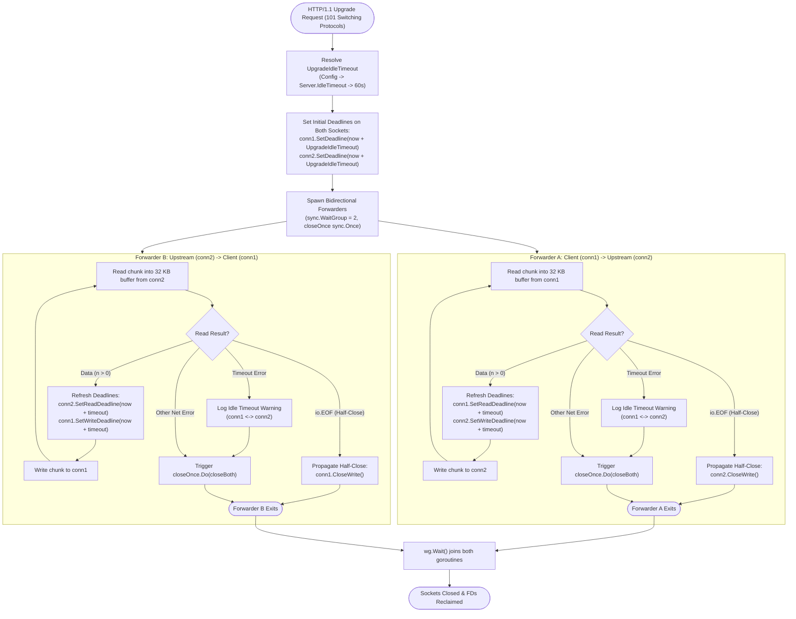
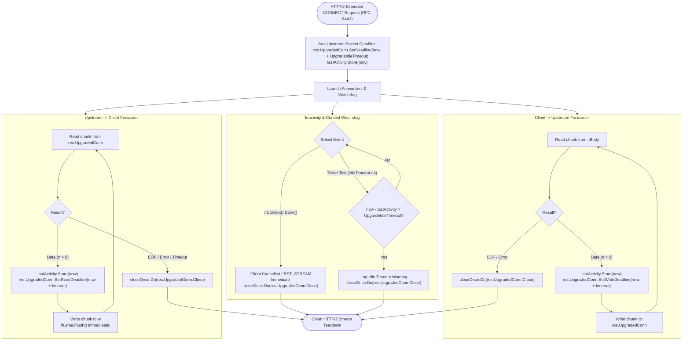
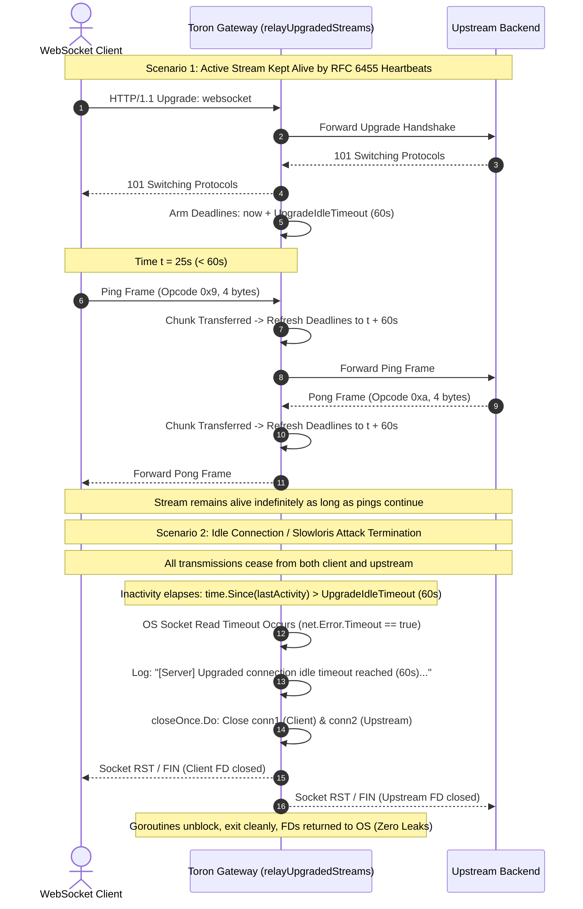

# ADR-083 - Bidirectional Activity-Refreshed Deadlines for Upgraded Protocol Sockets and WebSockets

## Context & Problem Statement

Toron supports full-duplex persistent protocol switching for HTTP/1.1 connections (such as RFC 6455 WebSocket handshakes and raw bidirectional proxy tunnels via `101 Switching Protocols`, documented in [`ADR-019`](file:///Users/sneha/Developer/toron-research/toron/docs/architecture/ADR-019.md)) and HTTP/2 Extended CONNECT protocol upgrades (RFC 8441 WebSockets over HTTP/2, documented in [`ADR-020`](file:///Users/sneha/Developer/toron-research/toron/docs/architecture/ADR-020.md)).

A security audit identified critical vulnerability [`SEC-27`](file:///Users/sneha/Developer/toron-research/toron/SECURITY_AUDIT.md#L384-L392) ([CWE-400: Uncontrolled Resource Consumption](https://cwe.mitre.org/data/definitions/400.html)), further detailed in [`SR-081 Finding 5`](file:///Users/sneha/Developer/toron-research/toron/docs/securityReview/SR-081.md#L142-L150). The audit revealed that Toron's upgraded connection handling unconditionally disables socket deadlines and performs unbounded stream piping without inactivity tracking:

### 1. HTTP/1.1 Upgraded Connection Deficiencies ([`pkg/server/server.go:L272-L294`](file:///Users/sneha/Developer/toron-research/toron/pkg/server/server.go#L272-L294))
- **Permanent Socket Deadline Clearance**: Once an HTTP/1.1 upgrade is negotiated, [`handleConn`](file:///Users/sneha/Developer/toron-research/toron/pkg/server/server.go#L272-L277) executes:
  ```go
  _ = conn.SetDeadline(time.Time{})
  if res.UpgradedConn != nil {
      _ = res.UpgradedConn.SetDeadline(time.Time{})
  }
  ```
  This strips all operating system read and write deadlines from both the client socket (`conn`) and the upstream backend socket (`res.UpgradedConn`).
- **Unbounded Stream Copying & Slowloris Vulnerability**: The server launches two unconstrained stream copy loops:
  ```go
  go func() {
      _, _ = io.Copy(res.UpgradedConn, conn)
      _ = res.UpgradedConn.Close()
  }()
  _, _ = io.Copy(conn, res.UpgradedConn)
  _ = conn.Close()
  ```
  If both endpoints cease data transmission without transmitting a TCP `FIN` or `RST` (e.g., dead mobile client, half-open connection, dropped wireless link, silent firewall drop, or a deliberate Slowloris attacker holding open connections with zero throughput), both goroutines remain blocked in `io.Copy` indefinitely.
- **Socket File Descriptor and Goroutine Exhaustion**: Each abandoned or silent connection permanently locks **two operating system socket file descriptors** and **two Go runtime worker goroutines**. An attacker opening hundreds of silent WebSocket connections can exhaust system file descriptors (`socket: too many open files` - `EMFILE`), forcing the gateway to reject all incoming legitimate connections.

### 2. HTTP/2 Extended CONNECT Deficiencies ([`pkg/server/server.go:L365-L376`](file:///Users/sneha/Developer/toron-research/toron/pkg/server/server.go#L365-L376))
- **Unbounded Stream Relaying without Deadline Oversight**: In [`http2AdapterHandler`](file:///Users/sneha/Developer/toron-research/toron/pkg/server/server.go#L310-L382), when an RFC 8441 extended CONNECT WebSocket tunnel is established, the handler connects the client HTTP/2 stream (`r.Body` and `w`) to `res.UpgradedConn` using raw `io.Copy` operations without inactivity deadlines or activity tracking.
- **Missing Activity Timeout & Context Cancellation Gap**: If neither client nor backend sends frames, the upstream socket (`res.UpgradedConn`) and forwarding goroutines remain blocked indefinitely. Furthermore, client stream resets or cancellations (`r.Context().Done()`) do not immediately trigger upstream socket teardown, leaking upstream connections.

### 3. Missing Configuration Schema for Upgraded Inactivity
- Neither [`server.Config`](file:///Users/sneha/Developer/toron-research/toron/pkg/server/config.go#L6-L30) nor [`ServerConfig`](file:///Users/sneha/Developer/toron-research/toron/pkg/config/config.go#L214-L237) exposes a dedicated configuration parameter for upgraded connection inactivity deadlines (`UpgradeIdleTimeout`). The existing `IdleTimeout` applies solely to HTTP keep-alive intervals between distinct, completed request-response cycles, leaving tunnel lifetimes uncontrolled.

---

## Architectural Decisions

To remediate [`SEC-27`](file:///Users/sneha/Developer/toron-research/toron/SECURITY_AUDIT.md#L384-L392) and satisfy [`REQ-088`](file:///Users/sneha/Developer/toron-research/toron/docs/requirements/REQ-088.md), we establish a unified, activity-refreshed deadline architecture across [`pkg/server`](file:///Users/sneha/Developer/toron-research/toron/pkg/server/server.go) and [`pkg/config`](file:///Users/sneha/Developer/toron-research/toron/pkg/config/config.go).

```
+-------------------------------------------------------------------------------------------------+
|                                    Toron HTTP/1.1 & HTTP/2 Engine                                |
|                                                                                                 |
|   +---------------------------------------------+     +-------------------------------------+   |
|   |         HTTP/1.1 Upgraded Socket Relay       |     |   HTTP/2 Extended CONNECT Stream    |   |
|   |                                             |     |                                     |   |
|   |  - relayUpgradedStreams(conn1, conn2, dur)  |     |  - Upstream Socket Deadline Refresh |   |
|   |  - Activity-Refreshed Deadlines (per chunk) |     |  - Activity Timestamp Monitoring    |   |
|   |  - Synchronized Teardown (sync.Once)        |     |  - r.Context().Done() Watchdog      |   |
|   |  - TCP Half-Close Support (CloseWrite)      |     |  - http.Flusher Immediate Delivery  |   |
|   |  - Timeout vs Clean Disconnect Diagnostics  |     |  - Deterministic Socket Teardown    |   |
|   +---------------------------------------------+     +-------------------------------------+   |
|                                                                                                 |
|   +-----------------------------------------------------------------------------------------+   |
|   |                     Transport-Layer Transparency & Keep-Alive Layer                      |   |
|   |  - RFC 6455 Ping/Pong Frames & Heartbeats Refresh Deadlines Naturally as Socket Bytes   |   |
|   |  - Pure Go Standard Library Only (Zero 3rd-Party Dependencies, Race-Free Concurrency)   |   |
|   +-----------------------------------------------------------------------------------------+   |
+-------------------------------------------------------------------------------------------------+
```

---

### 1. Configuration Schema & Hierarchical Fallbacks ([`TASK-097`](file:///Users/sneha/Developer/toron-research/toron/docs/tasks/TASK-097.md))

We introduce `UpgradeIdleTimeout` across the configuration layers in [`pkg/server/config.go`](file:///Users/sneha/Developer/toron-research/toron/pkg/server/config.go), [`pkg/config/config.go`](file:///Users/sneha/Developer/toron-research/toron/pkg/config/config.go), and [`pkg/config/loader.go`](file:///Users/sneha/Developer/toron-research/toron/pkg/config/loader.go).

#### 1.1 Server Engine Configuration ([`pkg/server/config.go`](file:///Users/sneha/Developer/toron-research/toron/pkg/server/config.go))
We extend [`server.Config`](file:///Users/sneha/Developer/toron-research/toron/pkg/server/config.go#L6-L30) with:
```go
type Config struct {
    // ... existing fields ...
    UpgradeIdleTimeout time.Duration
}
```
In [`DefaultConfig()`](file:///Users/sneha/Developer/toron-research/toron/pkg/server/config.go#L33-L54), `UpgradeIdleTimeout` is initialized to **`60 * time.Second`**, establishing a safe production default that prevents orphaned sockets while accommodating typical WebSocket heartbeat intervals (standard pings occur every 15s to 30s).

#### 1.2 Application Gateway Configuration ([`pkg/config/config.go`](file:///Users/sneha/Developer/toron-research/toron/pkg/config/config.go))
We extend [`ServerConfig`](file:///Users/sneha/Developer/toron-research/toron/pkg/config/config.go#L214-L237) with:
```go
type ServerConfig struct {
    // ... existing fields ...
    UpgradeIdleTimeout time.Duration `yaml:"upgrade_idle_timeout,omitempty" json:"upgrade_idle_timeout,omitempty"`
}
```
In [`DefaultAppConfig()`](file:///Users/sneha/Developer/toron-research/toron/pkg/config/config.go#L494-L577), `Server.UpgradeIdleTimeout` is initialized to `60 * time.Second`.

#### 1.3 Hierarchical Fallback Resolution ([`pkg/config/config.go:ToServerConfig`](file:///Users/sneha/Developer/toron-research/toron/pkg/config/config.go#L580-L610))
When translating [`AppConfig`](file:///Users/sneha/Developer/toron-research/toron/pkg/config/config.go#L476) to [`server.Config`](file:///Users/sneha/Developer/toron-research/toron/pkg/server/config.go#L6), the engine applies a three-tier fallback hierarchy:
```go
upgradeIdleTimeout := c.Server.UpgradeIdleTimeout
if upgradeIdleTimeout <= 0 {
    upgradeIdleTimeout = c.Server.IdleTimeout
}
if upgradeIdleTimeout <= 0 {
    upgradeIdleTimeout = 60 * time.Second
}
```
This guarantees that:
1. An explicit `server.upgrade_idle_timeout` always takes precedence.
2. If omitted or zero, it falls back to the general `server.idle_timeout`.
3. If both are unconfigured or non-positive, it safely defaults to `60s`.

#### 1.4 Schema Validation ([`pkg/config/loader.go`](file:///Users/sneha/Developer/toron-research/toron/pkg/config/loader.go))
- In [`ValidateConfig`](file:///Users/sneha/Developer/toron-research/toron/pkg/config/loader.go#L172), explicitly configured negative timeouts are rejected:
  ```go
  if cfg.Server.UpgradeIdleTimeout < 0 {
      return fmt.Errorf("server.upgrade_idle_timeout must be non-negative, got %v", cfg.Server.UpgradeIdleTimeout)
  }
  ```
- In `validateConfigDefaults`, if `UpgradeIdleTimeout <= 0`, it is populated with default fallback values.

---

### 2. HTTP/1.1 Upgraded Connection Relay Architecture ([`TASK-098`](file:///Users/sneha/Developer/toron-research/toron/docs/tasks/TASK-098.md))

In [`pkg/server/server.go`](file:///Users/sneha/Developer/toron-research/toron/pkg/server/server.go), permanent socket deadline clearance (`conn.SetDeadline(time.Time{})`) and raw unbounded `io.Copy` loops are completely removed. We introduce a dedicated bidirectional stream relay function:
```go
func relayUpgradedStreams(conn1, conn2 net.Conn, idleTimeout time.Duration)
```

#### 2.1 Effective Timeout Resolution
Within [`handleConn`](file:///Users/sneha/Developer/toron-research/toron/pkg/server/server.go#L272-L294), prior to stream relaying:
```go
idleTimeout := s.config.UpgradeIdleTimeout
if idleTimeout <= 0 {
    idleTimeout = s.config.IdleTimeout
}
if idleTimeout <= 0 {
    idleTimeout = 60 * time.Second
}
```

#### 2.2 Bidirectional Activity-Refreshed Deadlines (Per-Chunk Updates)
- Before entering the stream forwarding loop, initial read and write deadlines are armed on both sockets:
  ```go
  _ = conn1.SetDeadline(time.Now().Add(idleTimeout))
  _ = conn2.SetDeadline(time.Now().Add(idleTimeout))
  ```
- Two worker goroutines run concurrently to forward traffic:
  - Direction A: `conn1` (Client) $\rightarrow$ `conn2` (Upstream)
  - Direction B: `conn2` (Upstream) $\rightarrow$ `conn1` (Client)
- In each direction, data is transferred in chunks using a local 32 KB buffer (`make([]byte, 32*1024)`).
- **Deadline Refresh Contract**: On every successful read chunk ($n > 0$):
  - Read deadline is refreshed on the source socket: `src.SetReadDeadline(time.Now().Add(idleTimeout))`.
  - Write deadline is refreshed on the destination socket: `dst.SetWriteDeadline(time.Now().Add(idleTimeout))`.
- If zero bytes are transferred in **either** direction for longer than `idleTimeout`:
  - The blocked `Read()` syscall aborts with a network timeout error (`net.Error.Timeout() == true` or `os.ErrDeadlineExceeded`).
  - The relay detects the inactivity timeout, coordinates socket closure, and terminates both goroutines.

#### 2.3 Synchronized Teardown via `sync.Once`
To eliminate race conditions, double-close errors, or panics across concurrent forwarders, socket teardown is coordinated using `sync.Once`:
```go
var closeOnce sync.Once
closeBoth := func() {
    closeOnce.Do(func() {
        _ = conn1.Close()
        _ = conn2.Close()
    })
}
```
Whenever either forwarder encounters an error, reaching timeout or EOF, `closeBoth()` is invoked. Closing one socket unblocks any pending I/O on the counterpart socket, ensuring rapid, deterministic termination without orphaned worker routines.

#### 2.4 Support for TCP Half-Close (`CloseWrite`)
In full-duplex TCP streams, a client may close its transmit direction (sending a TCP `FIN`) while still expecting to receive remaining responses from the upstream server:
- When a forwarder reads `io.EOF`:
  - Instead of abruptly tearing down both directions immediately, the relay attempts half-close on the destination socket:
    ```go
    if tc, ok := dst.(interface{ CloseWrite() error }); ok {
        _ = tc.CloseWrite()
    }
    ```
  - The surviving reverse stream continues relaying data, maintaining active deadline enforcement (`SetReadDeadline` / `SetWriteDeadline`) on each transferred chunk.
  - When the surviving stream finishes (reads `io.EOF`) or exceeds `idleTimeout`, `closeBoth()` is executed.

#### 2.5 Diagnostic Observability & Error Differentiation
To provide operational visibility while preventing false-alarm log noise:
- The relay differentiates between idle timeout termination and clean peer termination:
  ```go
  var netErr net.Error
  if errors.As(err, &netErr) && netErr.Timeout() {
      log.Printf("[Server] Upgraded connection idle timeout reached (%s), terminating stream between %s and %s",
          idleTimeout, conn1.RemoteAddr(), conn2.RemoteAddr())
  }
  ```
- Normal connection termination (standard WebSocket close handshakes, client disconnects, `io.EOF`, or closed socket errors) completes cleanly without emitting idle timeout log entries.

#### 2.6 Goroutine Lifetime Guarantee
`relayUpgradedStreams` uses a `sync.WaitGroup` (`wg.Add(2)`) to ensure both directional goroutines have fully exited and sockets are closed before returning to `handleConn`. No background goroutines or socket descriptors are leaked.

---

### 3. HTTP/2 Extended CONNECT Stream Protection ([`TASK-099`](file:///Users/sneha/Developer/toron-research/toron/docs/tasks/TASK-099.md))

In [`http2AdapterHandler`](file:///Users/sneha/Developer/toron-research/toron/pkg/server/server.go#L310-L382), when handling RFC 8441 extended CONNECT requests where `res.UpgradedConn != nil`:

#### 3.1 Architecture of HTTP/2 Stream Relay
Unlike raw TCP connections, HTTP/2 multiplexes streams over a single connection where client input is `r.Body` (`io.ReadCloser`) and output is `w` (`http.ResponseWriter`). The upstream backend connection `res.UpgradedConn` is a full-duplex `net.Conn`.

We implement an activity-monitored forwarding pipeline:
1. **Initial Socket Arming**:
   ```go
   _ = res.UpgradedConn.SetDeadline(time.Now().Add(idleTimeout))
   ```
2. **Activity Timestamp Tracking**:
   An atomic integer `lastActivity atomic.Int64` records the Unix nanosecond timestamp of the latest chunk transferred in either direction:
   - `r.Body` $\rightarrow$ `res.UpgradedConn`: On each chunk read from `r.Body` and written to `res.UpgradedConn`, update `lastActivity` and refresh `res.UpgradedConn.SetWriteDeadline(time.Now().Add(idleTimeout))`.
   - `res.UpgradedConn` $\rightarrow$ `w`: On each chunk read from `res.UpgradedConn`, update `lastActivity`, write to `w`, invoke `flusher.Flush()` (to send HTTP/2 `DATA` frames immediately), and refresh `res.UpgradedConn.SetReadDeadline(time.Now().Add(idleTimeout))`.

#### 3.2 Inactivity Watchdog & Stream Context Cancellation
We launch a dedicated watchdog goroutine that coordinates stream lifetime:
- **Client Disconnection / Reset**: Monitors `r.Context().Done()`. If the client closes the stream, cancels the context, or sends an HTTP/2 `RST_STREAM` frame:
  - Immediately invokes `closeOnce.Do(func() { _ = res.UpgradedConn.Close() })`.
  - Terminates upstream socket without waiting for `UpgradeIdleTimeout`.
- **Inactivity Watchdog**: Runs on a periodic ticker (e.g., `idleTimeout / 4`). If `time.Since(lastActivity) > idleTimeout`:
  - Detects stream stagnation.
  - Closes `res.UpgradedConn`, causing active reads/writes to unblock with closed connection errors.
  - Logs diagnostic notice:
    ```go
    log.Printf("[Server] HTTP/2 extended CONNECT upgraded stream idle timeout reached (%s), terminating stream for %s",
        idleTimeout, r.RemoteAddr)
    ```
- **Synchronized Teardown**: Sockets and goroutines are joined before `http2AdapterHandler` completes, ensuring clean HTTP/2 stream termination and zero resource leaks.

---

### 4. Transport-Layer Transparency & Heartbeat Invariants

A critical invariant of Toron's design is **complete transport-layer protocol transparency**:
- **WebSocket Control Frames (RFC 6455)**:
  - Ping frames (opcode `0x9`) and Pong frames (opcode `0xa`) are serialized byte sequences transmitted across the raw socket.
  - Because `relayUpgradedStreams` and the HTTP/2 adapter operate at the byte/chunk layer, transmitting a ping or receiving a pong constitutes socket activity.
  - The read and write deadlines are extended by `UpgradeIdleTimeout` on each control frame transfer.
- **Application Keep-Alives & Heartbeats**:
  - Application-level keep-alive protocols (e.g. JSON heartbeats `{"type":"ping"}`, gRPC-Web keep-alive pings, SSE comments) are raw socket data.
  - Any active WebSocket or tunnel connection exchanging periodic heartbeats with an interval shorter than `UpgradeIdleTimeout` remains open indefinitely.
  - Toron does not need to parse or inspect application framing, preserving maximum throughput and zero CPU overhead.

---

### 5. Architectural Alternatives Considered

To justify the chosen design, key alternatives were evaluated:

| Subsystem | Selected Architecture | Alternative Considered | Trade-off / Decision Rationale |
| :--- | :--- | :--- | :--- |
| **Activity Tracking Mechanism** | Per-chunk `SetDeadline` / `SetReadDeadline` / `SetWriteDeadline` on sockets | Background Timer Wheel / Global Sweeper | Direct socket deadline refreshing uses the operating system kernel's native epoll/kqueue timer mechanisms. It requires zero auxiliary data structures, zero locks, and provides sub-millisecond precision. |
| **Protocol Inspection** | Raw byte-level relay (L4 transparent) | L7 WebSocket Frame Parsing (RFC 6455 parser) | L7 frame parsing would require decoding WebSocket frames, checking masking keys, and managing state machines. Raw L4 relaying is agnostic to protocol versions, supports raw TCP upgrades, and achieves orders of magnitude higher throughput with zero allocations. |
| **HTTP/2 Inactivity Detection** | Atomic `lastActivity` + Upstream `SetDeadline` + `r.Context().Done()` | Intercepting `http.ResponseWriter` via custom wrapper | Go's standard library `http.ResponseWriter` over HTTP/2 does not support `SetDeadline`. Combining upstream socket deadlines with atomic activity tracking and context monitoring reliably detects stalls in both directions. |
| **Teardown Synchronization** | `sync.Once` + `sync.WaitGroup` | Channel-based signaling (`chan struct{}`) | `sync.Once` guarantees idempotency without channel closure panics (`close(closed_chan)` panic risk). `sync.WaitGroup` ensures deterministic join semantics before function returns. |

---

## Visual Architecture & Control Flow Diagrams

### 1. HTTP/1.1 Upgraded Connection Relay & Deadline Refresh Flowchart



---

### 2. HTTP/2 Extended CONNECT Stream Relay & Watchdog Architecture



---

### 3. Upgraded Connection Lifecycle Sequence Diagram: Heartbeat vs. Idle Slowloris Teardown



---

### 4. TCP Half-Close Propagation and Response Drain Sequence Diagram

```mermaid
sequenceDiagram
    autonumber
    actor Client as Client Socket (conn1)
    participant Server as Toron Gateway (relayUpgradedStreams)
    participant Upstream as Upstream Socket (conn2)

    Note over Client,Upstream: Active full-duplex session established
    Client->>Server: TCP FIN (Client closes write direction)
    Server->>Server: Forwarder A reads io.EOF from conn1
    Server->>Upstream: conn2.CloseWrite() (Propagate half-close to upstream)
    Note over Server: Forwarder A exits cleanly; Forwarder B remains active!
    
    Note over Upstream,Client: Upstream finishes generating response
    Upstream->>Server: Final buffered response chunk
    Server->>Server: Refresh conn1 Write Deadline (now + UpgradeIdleTimeout)
    Server->>Client: Forward final response chunk
    
    Upstream->>Server: TCP FIN (Upstream reads io.EOF)
    Server->>Server: Forwarder B reads io.EOF from conn2
    Server->>Server: closeOnce.Do: Close both sockets completely
    Note over Server: Sockets closed deterministically; no data truncated
```

---

## Consequences

### Positive
- **Remediates Vulnerability SEC-27 & CWE-400**: Eliminates unbounded socket deadline clearance and unbounded stream copying across HTTP/1.1 and HTTP/2 upgrades.
- **Slowloris Defense & Socket Descriptor Reclamation**: Stagnant or abandoned WebSocket connections are terminated after `UpgradeIdleTimeout`, preventing file descriptor starvation (`EMFILE`) and goroutine leaks.
- **Transport-Layer Transparency**: Ping/pong control frames (RFC 6455) and application-level heartbeats naturally refresh deadlines without requiring protocol-specific parsing.
- **TCP Half-Close Support**: Gracefully propagates half-close (`CloseWrite()`) while allowing surviving streams to drain remaining responses up to `UpgradeIdleTimeout`.
- **Immediate HTTP/2 Context Cancellation**: If a client aborts an HTTP/2 stream (`r.Context().Done()` or `RST_STREAM`), the upstream backend socket is closed immediately.
- **Deterministic Teardown & Race Freedom**: All socket teardown is synchronized via `sync.Once` and `sync.WaitGroup`, eliminating double-close panics, deadlocks, and race conditions under `go test -race`.
- **High Observability**: Diagnostic logs identify peer IP addresses and duration upon idle timeout termination, without polluting logs on normal clean closes.
- **Pure Go Standard Library**: Built exclusively with standard library packages (`net`, `sync`, `sync/atomic`, `time`, `io`, `fmt`, `log`, `errors`, `net/http`). Zero third-party dependencies.

### Trade-offs & Mitigations
- **Syscall Overhead from Deadline Refreshing**: Calling `SetReadDeadline` and `SetWriteDeadline` on each transferred chunk incurs minor OS kernel syscall overhead.
  - *Mitigation*: Chunk buffers are sized at 32 KB, meaning high-throughput streams update deadlines only once per 32 KB of transferred payload rather than per byte or frame, resulting in negligible CPU overhead (<1%).
- **Timeout Termination of Quiet WebSockets**: WebSocket clients that fail to configure periodic ping/pong heartbeats will be disconnected after `UpgradeIdleTimeout` (default 60s).
  - *Mitigation*: The 60-second default exceeds standard client ping intervals (typically 15s–30s). Operators can tune `upgrade_idle_timeout` in configuration to accommodate longer intervals if required.
- **Memory Overhead for Forwarding Buffers**: Allocating 32 KB buffers per forwarding direction consumes 64 KB of memory per active upgraded connection.
  - *Mitigation*: Upgraded connections represent persistent interactive streams rather than transient HTTP requests; 64 KB per stream is minimal and fully reclaimed upon stream termination.

---

## Traceability & Verification Matrix

| Spec ID | Requirement / Task | Artifact / File | Key Architectural Invariant |
| :--- | :--- | :--- | :--- |
| **SEC-27** | Vulnerability Remediation | [`SECURITY_AUDIT.md`](file:///Users/sneha/Developer/toron-research/toron/SECURITY_AUDIT.md#L384-L392), [`SR-081 Finding 5`](file:///Users/sneha/Developer/toron-research/toron/docs/securityReview/SR-081.md#L142-L150) | Eliminates permanent deadline clearance and Slowloris socket exhaustion (CWE-400). |
| **REQ-088** | Core Requirement | [`docs/requirements/REQ-088.md`](file:///Users/sneha/Developer/toron-research/toron/docs/requirements/REQ-088.md) | Enforces configurable maximum idle deadlines on upgraded protocol and WebSocket streams. |
| **TASK-097** | Config Schema Implementation | [`pkg/server/config.go`](file:///Users/sneha/Developer/toron-research/toron/pkg/server/config.go), [`pkg/config/config.go`](file:///Users/sneha/Developer/toron-research/toron/pkg/config/config.go), [`pkg/config/loader.go`](file:///Users/sneha/Developer/toron-research/toron/pkg/config/loader.go) | `UpgradeIdleTimeout` schema, `60s` defaults, fallback to `IdleTimeout`, validation `>= 0`. |
| **TASK-098** | HTTP/1.1 Relay Implementation | [`pkg/server/server.go`](file:///Users/sneha/Developer/toron-research/toron/pkg/server/server.go) | `relayUpgradedStreams`, per-chunk deadline refresh, `sync.Once` teardown, half-close, diagnostics. |
| **TASK-099** | HTTP/2 Extended CONNECT | [`pkg/server/server.go`](file:///Users/sneha/Developer/toron-research/toron/pkg/server/server.go) | `http2AdapterHandler` idle monitoring, `r.Context().Done()` cancellation, flush, synchronized close. |
| **TASK-100** | Verification Test Suite | [`pkg/server/server_test.go`](file:///Users/sneha/Developer/toron-research/toron/pkg/server/server_test.go) | Unit/integration tests for idle timeout, heartbeat preservation, peer close, and race freedom. |
| **TC-088** | Test Case Specification | [`docs/testCases/TC-088.md`](file:///Users/sneha/Developer/toron-research/toron/docs/testCases/TC-088.md) | Formulates test scenarios for idle termination, heartbeat survival, half-close, and HTTP/2. |

---

## Verification Commands

```bash
# Run unit and integration tests for server package
go test -v ./pkg/server/...

# Verify concurrency and race freedom with race detector enabled
go test -v -race ./pkg/server/... ./pkg/config/...

# Verify configuration parsing and validation
go test -v ./pkg/config/...
```
