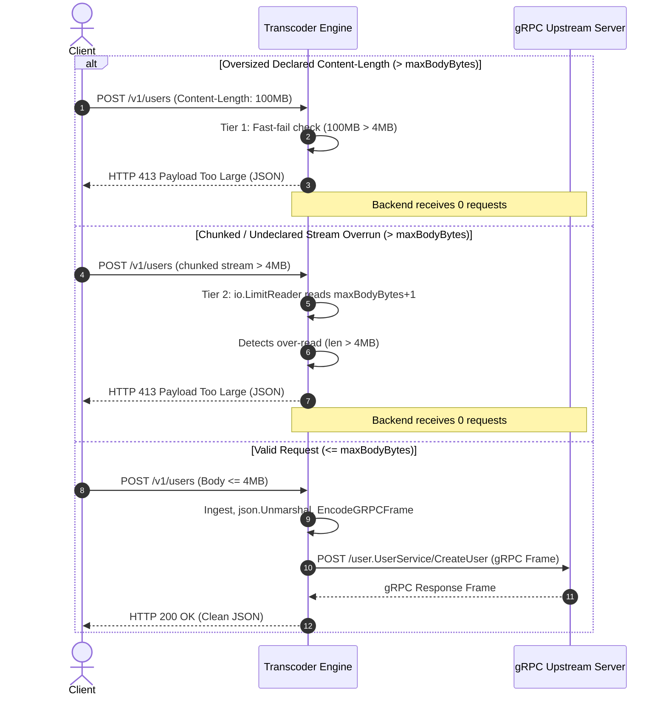

# ADR-084 - Bounded Request Body Ingestion and 413 Rejection Architecture in REST-to-gRPC Transcoder

## Context & Problem Statement

Toron's REST-to-gRPC transcoding engine ([`Engine`](file:///Users/sneha/Developer/toron-research/toron/pkg/transcoder/transcoder.go#L24)) maps incoming HTTP JSON requests into binary Protobuf gRPC wire frames ([`ADR-044`](file:///Users/sneha/Developer/toron-research/toron/docs/architecture/ADR-044.md)). In [`Engine.HandleTranscode`](file:///Users/sneha/Developer/toron-research/toron/pkg/transcoder/transcoder.go#L89), incoming request bodies are consumed using unbounded `io.ReadAll(req.Body)`.

As identified in security audit finding [`SEC-28`](file:///Users/sneha/Developer/toron-research/toron/SECURITY_AUDIT.md#L393-L401) ([CWE-400](https://cwe.mitre.org/data/definitions/400.html) / [CWE-770](https://cwe.mitre.org/data/definitions/770.html)), this design exposes the server to Out-Of-Memory (OOM) Denial-of-Service attacks:
1. **Unbounded Memory Allocation**: A client sending gigabyte-scale payloads or unbounded chunked streams causes `io.ReadAll` to exponentially grow heap byte slices until the operating system OOM killer terminates the process (`SIGKILL 9`).
2. **Amplified Heap Churn via `json.Unmarshal`**: Ingested payloads are unmarshaled into dynamic `map[string]interface{}` trees, compounding heap footprint by 3x–5x beyond the raw byte size.
3. **Absence of Pre-Read Fast-Fail**: Even when requests supply an explicit, oversized `Content-Length` header, the transcoder begins reading the body unconditionally.
4. **Missing Configuration Ceilings**: [`TranscoderConfig`](file:///Users/sneha/Developer/toron-research/toron/pkg/config/config.go#L130) contains no `MaxBodyBytes` field, unlike other hardened subsystems (e.g. [`SidecarConfig.MaxBodyBytes`](file:///Users/sneha/Developer/toron-research/toron/pkg/config/config.go) in [`ADR-081`](file:///Users/sneha/Developer/toron-research/toron/docs/architecture/ADR-081.md)).

## Architectural Decisions

### 1. Dedicated Configuration Schema with Hierarchical Defaults

We introduce `MaxBodyBytes int64` into [`TranscoderConfig`](file:///Users/sneha/Developer/toron-research/toron/pkg/config/config.go#L130) and wire it into the [`Engine`](file:///Users/sneha/Developer/toron-research/toron/pkg/transcoder/transcoder.go#L24) runtime instance:
- Default Limit: `4 * 1024 * 1024` (4 MB / 4,194,304 bytes). This aligns with [`DefaultMaxGRPCFrameSize`](file:///Users/sneha/Developer/toron-research/toron/pkg/transcoder/framer.go#L11) (established in `SEC-08` for gRPC response frame decoding) and [`ServerConfig.MaxBodyBytes`](file:///Users/sneha/Developer/toron-research/toron/pkg/config/config.go).
- Fallback Resolution: If `TranscoderConfig.MaxBodyBytes <= 0`, `GetMaxBodyBytes()` returns `4 MB`.
- Validation: Negative values are rejected at startup in [`pkg/config/loader.go`](file:///Users/sneha/Developer/toron-research/toron/pkg/config/loader.go).

### 2. Two-Tier Ingestion Defense Pipeline

To protect the server against both declared and undeclared oversized payloads, [`HandleTranscode`](file:///Users/sneha/Developer/toron-research/toron/pkg/transcoder/transcoder.go#L89) executes a two-tier defense:

```mermaid
flowchart TD
    Req["Incoming REST Request"] --> HasBody{"req.Body != nil?"}
    HasBody -->|No| ProcessParams["Extract Query & Path Params"]
    HasBody -->|Yes| Tier1{"Tier 1: Declared ContentLength<br/>req.ContentLength > maxBodyBytes?"}
    
    Tier1 -->|Yes (Oversized)| Reject413CL["Reject HTTP 413<br/>Payload Too Large (Fast-Fail)<br/>Close Body & Upstream=0"]
    Tier1 -->|No / Undeclared| Tier2Read["Tier 2: Bounded Read<br/>io.ReadAll(io.LimitReader(req.Body, maxBodyBytes+1))"]
    
    Tier2Read --> Tier2Check{"len(bodyBytes) > maxBodyBytes?"}
    Tier2Check -->|Yes (Oversized)| Reject413Stream["Reject HTTP 413<br/>Payload Too Large (Over-Read)<br/>Skip json.Unmarshal & Upstream=0"]
    Tier2Check -->|No (In-Limit)| Unmarshal["json.Unmarshal(bodyBytes, &bodyMap)"]
    
    Unmarshal --> ProcessParams
    ProcessParams --> Frame["Encode 5-Byte gRPC Wire Frame"]
    Frame --> Upstream["Forward to gRPC Backend"]
```

#### Tier 1: Declared `Content-Length` Fast-Fail Guard
- Before initiating any read on `req.Body`, inspect `req.ContentLength`.
- If `req.ContentLength > maxBodyBytes && req.ContentLength > 0`:
  - Respond immediately with `HTTP 413 Payload Too Large`.
  - Set `Content-Type: application/json`.
  - Body: `{"error":"Payload Too Large: request Content-Length %d exceeds limit of %d bytes"}`.
  - Close `req.Body` and return. **Zero bytes of payload body are buffered**, and **zero calls reach upstream**.

#### Tier 2: Bounded Stream Over-Read via `io.LimitReader`
- For chunked transfers or requests where `Content-Length` is omitted, zero, or under-reported:
  - Read with `io.LimitReader(req.Body, maxBodyBytes+1)`.
  - If `int64(len(bodyBytes)) > maxBodyBytes`:
    - Respond immediately with `HTTP 413 Payload Too Large`.
    - Set `Content-Type: application/json`.
    - Body: `{"error":"Payload Too Large: request body exceeds limit of %d bytes"}`.
    - Close `req.Body` and return.
    - **Never execute `json.Unmarshal`** on oversized bytes, preventing heap tree allocation.

### 3. Upstream Isolation Guarantee

Under any HTTP 413 rejection (Tier 1 or Tier 2), execution returns immediately without initiating HTTP/2 connections or issuing gRPC RPC calls. The upstream backend remains completely isolated from attack traffic.

### 4. Sequence Diagram



## Consequences

- **Positive**: Complete elimination of OOM DoS vulnerabilities via the REST-to-gRPC transcoding gateway.
- **Positive**: Zero payload leakage and zero connection overhead on internal gRPC services when requests exceed limits.
- **Positive**: Zero external dependencies—pure Go standard library (`io`, `net/http`, `encoding/json`).
- **Positive**: Symmetric protection aligning ingress HTTP ingestion with egress gRPC frame decoding limits (`DefaultMaxGRPCFrameSize`).
