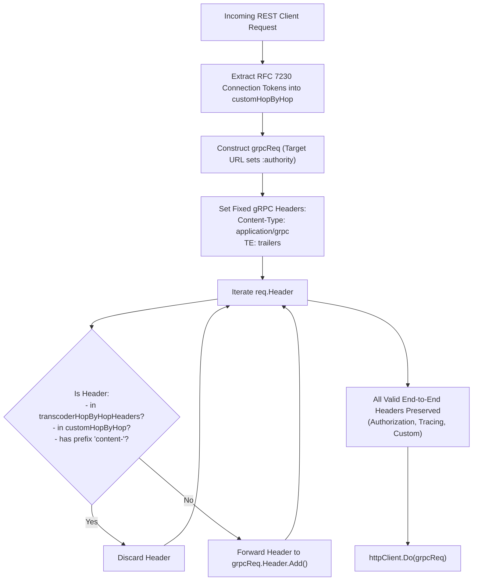

# ADR-085 - Hop-by-Hop Header Sanitization and Protocol Compliance Architecture in REST-to-gRPC Transcoder

## Context & Problem Statement

Toron's REST-to-gRPC Transcoding Engine ([`Engine`](file:///Users/sneha/Developer/toron-research/toron/pkg/transcoder/transcoder.go#L24)) translates incoming REST HTTP/1.1 requests into upstream HTTP/2 gRPC requests ([`ADR-044`](file:///Users/sneha/Developer/toron-research/toron/docs/architecture/ADR-044.md)). Prior to this decision, [`Engine.HandleTranscode`](file:///Users/sneha/Developer/toron-research/toron/pkg/transcoder/transcoder.go#L89) copied client headers with a minimal filter excluding only `content-*` prefixes.

As documented in [`SEC-29`](file:///Users/sneha/Developer/toron-research/toron/SECURITY_AUDIT.md#L402-L410) ([CWE-444](https://cwe.mitre.org/data/definitions/444.html), [CWE-436](https://cwe.mitre.org/data/definitions/436.html)) and [`SR-081 Finding 7`](file:///Users/sneha/Developer/toron-research/toron/docs/securityReview/SR-081.md#L161-L170), this resulted in critical protocol compliance issues:
1. **HTTP/2 Specification Violations ([RFC 7540 §8.1.2.2](https://datatracker.ietf.org/doc/html/rfc7540#section-8.1.2.2) / [RFC 9113 §8.2.2](https://www.rfc-editor.org/rfc/rfc9113#section-8.2.2))**:
   Connection-specific headers (`Connection`, `Keep-Alive`, `Upgrade`, `Proxy-Connection`, etc.) are explicitly forbidden in HTTP/2. Upstream gRPC servers receiving these headers must treat the request as malformed and transmit `HTTP/2 RST_STREAM (PROTOCOL_ERROR 0x1)`.
2. **TE Header Invalidation**:
   In HTTP/2 gRPC, the `TE` header is permitted only with the exact value `"trailers"`. Client `TE` values (such as `TE: gzip`) were being appended, causing gRPC stream reset.
3. **Omission of RFC 7230 §6.1 Dynamic Connection Tokens**:
   Headers nominated by the client inside the `Connection` header value were not stripped.
4. **Host Header Pollution**:
   Forwarding the client's `Host` header can conflict with upstream gRPC virtual host dispatching.
5. **False Failures (HTTP 502 Bad Gateway)**:
   Whenever an upstream gRPC server reset a stream due to prohibited headers, Toron returned `502 Bad Gateway` to legitimate clients.

## Architectural Decisions

### 1. Static Hop-by-Hop Header Discard Map

We define a dedicated package-level lookup map of prohibited connection-specific and transport headers in [`pkg/transcoder/transcoder.go`](file:///Users/sneha/Developer/toron-research/toron/pkg/transcoder/transcoder.go):
```go
var transcoderHopByHopHeaders = map[string]bool{
	"connection":          true,
	"keep-alive":          true,
	"proxy-authenticate":  true,
	"proxy-authorization": true,
	"te":                  true,
	"trailer":             true,
	"trailers":            true,
	"transfer-encoding":   true,
	"upgrade":             true,
	"proxy-connection":    true,
	"host":                true,
}
```

### 2. Dynamic Connection Token Extraction (RFC 7230 §6.1 / RFC 9110 §7.6.1)

If the incoming request contains a `Connection` header, [`HandleTranscode`](file:///Users/sneha/Developer/toron-research/toron/pkg/transcoder/transcoder.go#L89) parses all comma-delimited tokens into a local discard set (`customHopByHop`). Any header named by the client as connection-specific is stripped.

### 3. Sanitized Header Forwarding Pipeline



### 4. Canonical gRPC Header Invariant

- `grpcReq.Header.Set("Content-Type", "application/grpc")` is enforced.
- `grpcReq.Header.Set("TE", "trailers")` is enforced, guaranteeing that no client `TE` values can ever contaminate the gRPC trailer declaration.
- `Host` is discarded, allowing the standard Go `http.Client` transport to populate `:authority` from the parsed `grpcTargetURL`.

### 5. Sequence Diagram

```mermaid
sequenceDiagram
    autonumber
    actor Client
    participant Transcoder as Transcoder Engine
    participant Backend as gRPC Upstream Server

    Client->>Transcoder: POST /v1/users (Connection: keep-alive, X-Custom-Hop; TE: gzip; Authorization: Bearer ...)
    Transcoder->>Transcoder: Parse Connection tokens -> [keep-alive, x-custom-hop]
    Transcoder->>Transcoder: Strip hop-by-hop (Connection, Keep-Alive, TE, X-Custom-Hop)
    Transcoder->>Transcoder: Set Content-Type: application/grpc & TE: trailers
    Transcoder->>Backend: HTTP/2 POST /user.UserService/CreateUser<br/>(TE: trailers; Authorization: Bearer ...)<br/>[Zero Hop-by-Hop Headers]
    Note over Transcoder,Backend: gRPC Server Accepts Request Cleanly (0 Protocol Errors)
    Backend-->>Transcoder: HTTP/2 200 OK + Trailers (grpc-status: 0)
    Transcoder-->>Client: HTTP 200 OK (Clean JSON)
```

## Consequences

- **Positive**: Strict compliance with RFC 7540 §8.1.2.2, RFC 9113 §8.2.2, and RFC 7230 §6.1.
- **Positive**: Eliminates upstream `PROTOCOL_ERROR` stream resets and spurious `502 Bad Gateway` errors.
- **Positive**: Legitimate application headers (`Authorization`, tracing IDs, telemetry) are safely forwarded.
- **Positive**: Zero external dependencies (pure Go standard library).
