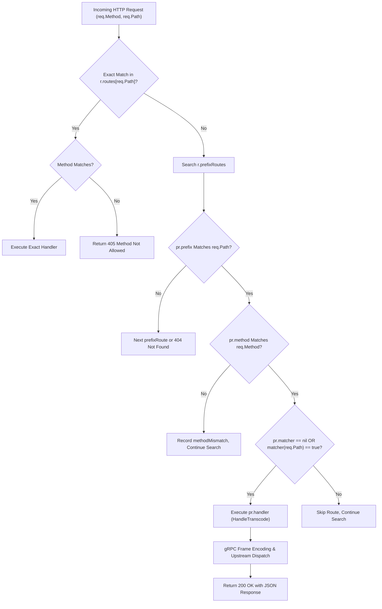

# ADR-086 - Direct Parameterized Subpath Routing and Elimination of Empty Prefix Proxy in REST-to-gRPC Transcoder

## Context & Problem Statement

Toron's REST-to-gRPC Transcoding Engine ([`Engine`](file:///Users/sneha/Developer/toron-research/toron/pkg/transcoder/transcoder.go#L25)) allows clients to invoke gRPC microservices via HTTP REST calls ([`ADR-044`](file:///Users/sneha/Developer/toron-research/toron/docs/architecture/ADR-044.md)). In REST architectures, endpoints routinely contain parameterized subpaths, such as `GET /v1/users/:id` or `GET /v1/users/:id/orders/:orderId`.

As documented in [`SEC-30`](file:///Users/sneha/Developer/toron-research/toron/SECURITY_AUDIT.md#L411-L419) ([CWE-284](https://cwe.mitre.org/data/definitions/284.html), [CWE-400](https://cwe.mitre.org/data/definitions/400.html)) and [`SR-081 Finding 8`](file:///Users/sneha/Developer/toron-research/toron/docs/securityReview/SR-081.md#L185-L202), `Engine.registerRoutes()` attempted to register prefix routes on [`Router`](file:///Users/sneha/Developer/toron-research/toron/pkg/router/router.go#L53) using:
```go
cleanPrefix := rRule.HTTPPath
if idx := strings.Index(cleanPrefix, "/:"); idx != -1 {
    cleanPrefix = cleanPrefix[:idx]
}
_ = e.router.RoutePrefix("upstream", "", cleanPrefix, nil, "", proxy.ProxyOptions{})
e.router.Handle(rRule.HTTPMethod, cleanPrefix, handler)
```

This created a severe routing defect:
1. `RoutePrefix("upstream", ...)` instantiated an upstream reverse proxy with empty `ProxyOptions` (zero targets) on `cleanPrefix` (e.g. `/v1/users`).
2. `e.router.Handle` registered `handler` solely for the exact path string `cleanPrefix`.
3. When any client sent a parameterized request (e.g. `GET /v1/users/usr-777` via `router.ServeHTTP`):
   - Exact path match failed.
   - Router fell back to `r.prefixRoutes`, matching the empty upstream proxy on `/v1/users`.
   - The empty proxy returned `HTTP 502 Bad Gateway: No upstream target available`.
   - The transcoder handler was never invoked, causing a total Denial of Service for all parameterized REST-to-gRPC endpoints.

---

## Architectural Decisions

### 1. Router Extension for Method-Aware Prefix Routing & Path Matchers
We extend [`Router`](file:///Users/sneha/Developer/toron-research/toron/pkg/router/router.go#L53) to support custom in-process prefix handlers:
- **`prefixRoute` Enhancement**:
  ```go
  type prefixRoute struct {
      routeType    string
      method       string
      host         string
      prefix       string
      matcher      func(path string) bool
      headers      map[string]string
      redirectHTTP *bool
      accessLog    string
      securityLog  string
      handler      HandlerFunc
  }
  ```
- **New Router APIs**:
  - `HandlePrefix(method, prefix string, handler HandlerFunc)`
  - `HandlePrefixWithMatcher(method, host, prefix string, headers map[string]string, matcher func(path string) bool, handler HandlerFunc)`
- **Prefix Route Matching Semantics in `Router.ServeHTTP`**:
  - If `pr.method != ""` and `!strings.EqualFold(pr.method, req.Method)`, the router skips the route and records `methodMismatch = true`.
  - If `pr.matcher != nil` and `!pr.matcher(req.Path)`, the router skips the route.
  - If a prefix matched but no candidate accepted the request method, the router responds with `405 Method Not Allowed`.

### 2. Elimination of Empty Upstream Reverse Proxy
We completely eliminate `_ = e.router.RoutePrefix("upstream", "", cleanPrefix, nil, "", proxy.ProxyOptions{})` from [`Engine.registerRoutes`](file:///Users/sneha/Developer/toron-research/toron/pkg/transcoder/transcoder.go#L68). Zero dummy upstream proxies will ever be registered by the transcoder.

### 3. Path Pattern Matcher (`MatchPathPattern`)
We implement `MatchPathPattern(pattern, path string) bool` in `pkg/transcoder/transcoder.go`:
- Canonicalizes both `pattern` and `path` by trimming leading/trailing slashes.
- Verifies exact segment counts (`len(patternParts) == len(pathParts)`).
- Literal segments must match verbatim (`part == pathParts[i]`).
- Wildcard parameter segments (starting with `:`) match any non-empty segment value.

### 4. Direct Parameterized vs. Exact Route Registration
In [`Engine.registerRoutes`](file:///Users/sneha/Developer/toron-research/toron/pkg/transcoder/transcoder.go#L68):
- If `strings.Contains(rRule.HTTPPath, "/:")`:
  - Calculate `cleanPrefix` up to the first parameter segment.
  - Bind to `e.router.HandlePrefixWithMatcher` with `matcher: func(p string) bool { return MatchPathPattern(rRule.HTTPPath, p) }`.
- Else (exact route):
  - Bind directly to `e.router.Handle(rRule.HTTPMethod, rRule.HTTPPath, handler)`.

---

## Routing Resolution Architecture Diagram



---

## Consequences & Verification

- **Security**: Resolves `SEC-30` ([CWE-284](https://cwe.mitre.org/data/definitions/284.html), [CWE-400](https://cwe.mitre.org/data/definitions/400.html)). Parameterized REST-to-gRPC endpoints are fully reachable and immune to false 502 errors.
- **Reliability**: Eliminates route collision and shadowing between parameterized routes sharing prefixes (e.g. `/v1/users/:id` and `/v1/users/:id/orders/:orderId`).
- **Compatibility**: 100% backward compatible with existing static directory serving and upstream reverse proxying.
- **Zero External Dependencies**: Pure Go standard library.
