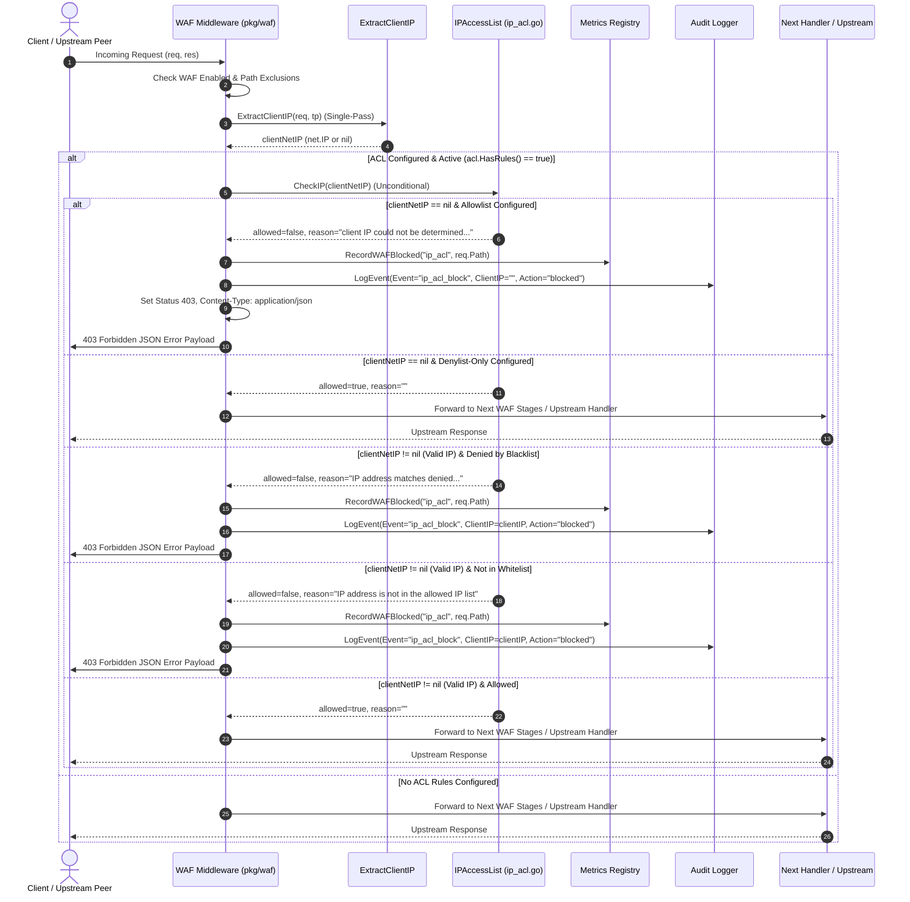
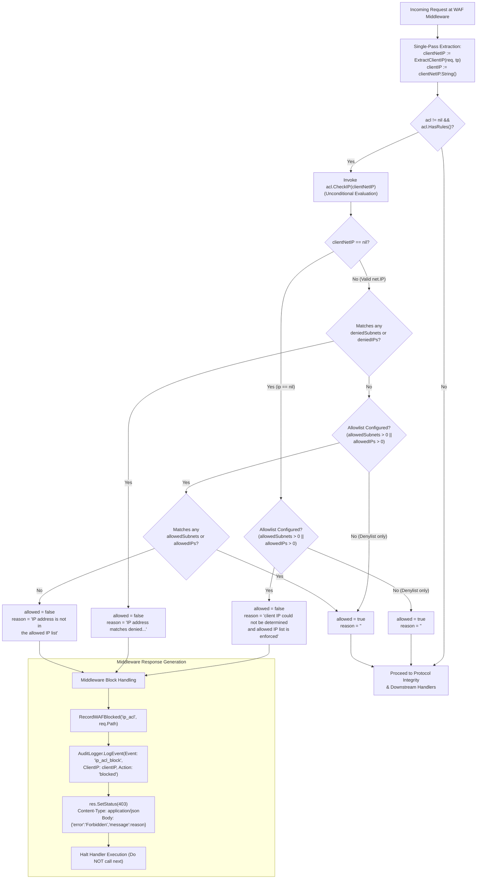

# ADR-088 - Fail-Closed WAF IP Access Control & Single-Pass Extraction

## Context & Problem Statement

Toron Edge Gateway provides a high-performance Layer 7 Web Application Firewall ([`pkg/waf`](file:///Users/sneha/Developer/toron-research/toron/pkg/waf)) and CIDR IP Access Control List engine ([`pkg/waf/ip_acl.go`](file:///Users/sneha/Developer/toron-research/toron/pkg/waf/ip_acl.go)) designed to enforce strict perimeter access policies, including IP whitelisting (`allowed_ips` / `allowedSubnets`) and IP blacklisting (`denied_ips` / `deniedSubnets`).

During security audit [`SR-091 Finding 2`](file:///Users/sneha/Developer/toron-research/toron/docs/securityReview/SR-091.md#L102-L127) and vulnerability assessment [`SEC-32`](file:///Users/sneha/Developer/toron-research/toron/SECURITY_AUDIT.md#L439-L447) ([CWE-284 Improper Access Control](https://cwe.mitre.org/data/definitions/284.html), [CWE-1188 Insecure Default Initialization of Resource](https://cwe.mitre.org/data/definitions/1188.html), [CWE-693 Protection Mechanism Failure](https://cwe.mitre.org/data/definitions/693.html)), a critical security flaw and performance inefficiency were identified in the interaction between the WAF middleware and the IP access control evaluation logic:

1. **Vulnerable Bypass Guard in Middleware**: In [`pkg/waf/middleware.go:L58-L67`](file:///Users/sneha/Developer/toron-research/toron/pkg/waf/middleware.go#L58-L67), IP access control evaluation was historically preceded by conditional guards of the form:
   ```go
   if acl := engine.IPAccessList(); acl != nil && acl.HasRules() {
       if ip := ExtractClientIP(req, tp); ip != nil {
           allowed, reason := acl.CheckIP(ip)
           if !allowed { ... }
       }
   }
   ```
   If a client's network address could not be resolved (`ExtractClientIP` returned `nil`), the middleware skipped the ACL evaluation entirely because `ip != nil` evaluated to `false`.
2. **Fail-Open Default in ACL Check**: In [`pkg/waf/ip_acl.go:L76-L86`](file:///Users/sneha/Developer/toron-research/toron/pkg/waf/ip_acl.go#L76-L86), when `ip == nil`, the ACL engine historically evaluated:
   ```go
   if acl == nil || !acl.HasRules() || ip == nil {
       return true, ""
   }
   ```
   When `ip == nil`, the method returned `true, ""` (fail-open), unconditionally granting access regardless of whether an explicit IP allowlist was enforced.
3. **Redundant Double Extraction on Hot Path**: In [`pkg/waf/middleware.go:L58-L67`](file:///Users/sneha/Developer/toron-research/toron/pkg/waf/middleware.go#L58-L67), `ExtractClientIP(req, tp)` was executed twice sequentially per request—first to populate the telemetry string `clientIP`, and immediately again to evaluate `acl.CheckIP(ip)`. In high-throughput environments, this redundant execution wasted CPU cycles on duplicate socket address splitting and CIDR parsing.
4. **Missing End-to-End Regression Protection**: There was no dedicated automated test suite in the middleware layer verifying that requests with unidentifiable or corrupt IP headers arriving at an allowlist-protected endpoint are rejected fail-closed with HTTP status `403 Forbidden`, while preserving fail-open pass-through for denylist-only configurations.

### Exploitability & Threat Model

| Threat Vector | Vulnerability Condition | Consequence |
| :--- | :--- | :--- |
| **Allowlist Bypass via Header Stripping** | An external attacker targets an endpoint protected by an IP allowlist (e.g., admin API or payment callback). The attacker routes traffic through an intermediate proxy or gateway that drops client IP headers, or supplies a synthetic request lacking connection metadata. | `ExtractClientIP` yields `nil`. The check is skipped or returns `allowed: true`. The attacker gains full unauthorized access to sensitive upstream services. |
| **Allowlist Bypass via Malformed IP** | An attacker injects corrupted headers such as `X-Forwarded-For: "bad-ip"` or `RemoteAddr: "hostname-without-ip"`. | `net.ParseIP` fails, returning `nil`. Check fails open, completely circumventing perimeter whitelist controls. |
| **Hot Path Latency & Memory Inefficiency** | High-volume benign traffic arriving through the WAF. | Duplicate extraction of client IP on every request degrades request processing throughput. |

---

## Architectural Decisions

### 1. Fail-Closed Rejection for Unidentifiable Client IP Under Active Allowlist

We enforce strict **fail-closed** semantics when an IP allowlist is active. When an incoming client IP cannot be definitively identified and an allowlist is configured, Toron MUST deny access immediately.

#### Implementation in `pkg/waf/ip_acl.go:CheckIP`
```go
func (acl *IPAccessList) CheckIP(ip net.IP) (allowed bool, reason string) {
    if acl == nil || !acl.HasRules() {
        return true, ""
    }

    if ip == nil {
        if len(acl.allowedSubnets) > 0 || len(acl.allowedIPs) > 0 {
            return false, "client IP could not be determined and allowed IP list is enforced"
        }
        return true, ""
    }
    // ... subsequent deny and allow rule evaluation
}
```

#### Middleware Rejection Invariant (`pkg/waf/middleware.go`)
When `acl.CheckIP(clientNetIP)` returns `allowed == false`:
1. **Immediate Execution Halt**: Middleware halts request processing immediately and does NOT invoke `next(req, res)`.
2. **HTTP 403 Forbidden**: Response status is set strictly to `403`.
3. **Standard JSON Error Payload**: Response header `Content-Type` is set to `application/json`, and the body is formatted as:
   ```json
   {"error":"Forbidden","message":"client IP could not be determined and allowed IP list is enforced"}
   ```
4. **Security Telemetry**: Metric `metrics.DefaultRegistry.RecordWAFBlocked("ip_acl", req.Path)` is incremented.
5. **Structured Audit Event**: If an audit logger is registered, a `SecurityEvent` is emitted with `Event: "ip_acl_block"`, `Action: "blocked"`, `Category: "ip_acl"`, `Location: "remote_addr"`, and `ClientIP: ""` (empty string, safe from null-dereference panics).

---

### 2. Fail-Open Pass-Through for Unidentifiable Client IP Under Denylist-Only or Rule-Free Configurations

When no IP allowlist is configured (i.e. only `denied_ips` / `deniedSubnets` are present, or no IP ACL rules exist):
- An unidentifiable client IP (`ip == nil`) MUST NOT cause the IP access control check to block the request (`acl.CheckIP(nil)` returns `allowed: true, reason: ""`).
- **Architectural Rationale**: Denylists represent exclusionary filters intended to block known malicious actors. Blocking requests with unresolvable client IPs under denylist-only configurations would cause severe false-positive outages for internal service mesh traffic, synthetic probes, or proxies that do not forward IP metadata.
- If permitted past the IP ACL stage, the request continues through subsequent WAF inspection stages (Protocol Integrity, Custom Rules, OWASP Injection Rules) and upstream routing.

---

### 3. Single-Pass Client IP Extraction & Reusable Representation

In [`pkg/waf/middleware.go`](file:///Users/sneha/Developer/toron-research/toron/pkg/waf/middleware.go), we eliminate duplicate invocations of `ExtractClientIP(req, tp)` on the request hot path.

#### Unified Single-Pass Pipeline
```go
// Single-pass client IP resolution
clientNetIP := ExtractClientIP(req, tp)
clientIP := ""
if clientNetIP != nil {
    clientIP = clientNetIP.String()
}
```

#### Reusability Invariant
1. The extracted `clientNetIP net.IP` is cached in a local stack variable and passed directly into `acl.CheckIP(clientNetIP)` without re-extraction.
2. The pre-formatted `clientIP string` is cached and reused across:
   - IP ACL denial audit events (`ip_acl_block`).
   - Protocol integrity violation audit events (`protocol_violation`).
   - Custom rules and OWASP injection rule evaluation and audit logging.
3. This guarantees zero redundant socket parsing, zero repeated CIDR lookups against `trusted_proxies`, and zero extra heap allocations on benign request paths.

---

### 4. Unconditional Invocation of `acl.CheckIP`

In [`pkg/waf/middleware.go`](file:///Users/sneha/Developer/toron-research/toron/pkg/waf/middleware.go), we eliminate the vulnerable `if ip != nil` guard:

```go
// Fast-Path CIDR IP Access Control Check
if acl := engine.IPAccessList(); acl != nil && acl.HasRules() {
    allowed, reason := acl.CheckIP(clientNetIP)
    if !allowed {
        metrics.DefaultRegistry.RecordWAFBlocked("ip_acl", req.Path)
        if logger := engine.AuditLogger(); logger != nil {
            logger.LogEvent(SecurityEvent{
                Event:        "ip_acl_block",
                ClientIP:     clientIP,
                Method:       req.Method,
                Path:         req.Path,
                Category:     "ip_acl",
                AnomalyScore: 0,
                Action:       "blocked",
                Location:     "remote_addr",
            })
        }

        if res.Body == nil {
            res.Body = bytes.NewBuffer(nil)
        }
        res.Body.Reset()
        res.Header.Set("Content-Type", "application/json")
        res.SetStatus(403)
        _, _ = res.WriteString(`{"error":"Forbidden","message":"` + reason + `"}`)
        return
    }
}
```

#### Architectural Principle: Engine as Single Source of Truth
The WAF middleware MUST NOT make assumptions about whether a `nil` IP is acceptable. The `IPAccessList` engine encapsulates access policy logic. By invoking `acl.CheckIP(clientNetIP)` unconditionally whenever `acl.HasRules()` is true, the ACL engine remains the authoritative arbiter of policy enforcement.

---

## Architectural Flows & Sequence Diagrams

### 1. Incoming Request Evaluation Flow (Sequence Diagram)



---

### 2. Decision Logic of `CheckIP` & Middleware Handling (Flowchart)



---

## Alternatives Considered & Trade-Offs

### Alternative 1: Guarding at Middleware Level (`if ip == nil && acl.HasAllowlist()`)
- **Description**: Inspect whether `ip == nil` inside `pkg/waf/middleware.go` and directly query whether the ACL has an allowlist, short-circuiting before invoking `acl.CheckIP`.
- **Trade-offs & Drawbacks**:
  - Leaks internal ACL structure and state (`allowedSubnets`, `allowedIPs`) to the middleware caller.
  - Violates the Single Responsibility Principle (SRP): the ACL engine must remain the single authority on IP access decisions.
  - Duplicates policy evaluation logic across multiple potential consumers of `IPAccessList`.
- **Decision**: **Rejected**. Keep `CheckIP(net.IP)` as the single unified evaluation function. Passing `nil` directly into `acl.CheckIP(nil)` guarantees encapsulation and consistent policy enforcement.

### Alternative 2: Universal Fail-Closed on Nil IP (Rejecting Denylist-Only Requests Too)
- **Description**: If `ip == nil`, deny access regardless of whether an allowlist or denylist is configured.
- **Trade-offs & Drawbacks**:
  - Fundamentally alters the semantics of a denylist (negative security model). Denylists are designed to exclude specific known threats while permitting all other traffic.
  - Would break internal service-to-service requests, health checks, or synthetic load tests where client IP headers are omitted.
  - High risk of widespread false positives in production deployments.
- **Decision**: **Rejected**. Conform strictly to [`REQ-093-AC-02`](file:///Users/sneha/Developer/toron-research/toron/docs/requirements/REQ-093.md#L96-L101): fail-open for unidentifiable IPs under denylist-only configurations, preserving availability while ensuring fail-closed protection where whitelists are enforced.

### Alternative 3: Synthesizing a Fallback IP (e.g. `0.0.0.0` or `127.0.0.1`)
- **Description**: If `ExtractClientIP` returns `nil`, substitute a dummy fallback IP such as `0.0.0.0` or `127.0.0.1` before invoking `CheckIP`.
- **Trade-offs & Drawbacks**:
  - Highly hazardous: administrators frequently add `127.0.0.1` to allowlists for local administrative access. If missing IPs defaulted to `127.0.0.1`, external requests with stripped headers would inadvertently gain administrative access.
  - Substituting `0.0.0.0` produces misleading audit logs and corrupts Prometheus metric labels.
- **Decision**: **Rejected**. Explicitly represent unresolvable client identity as `nil` `net.IP` and empty string `""` in telemetry.

### Alternative 4: Request Context Value Caching for Client IP
- **Description**: Allocate a Go `context.Context` key/value pair on `httpparser.Request` storing the parsed `net.IP`.
- **Trade-offs & Drawbacks**:
  - Toron's core reactor operates on lightweight, pooled `httpparser.Request` structures without mandatory `context.Context` allocations per request on the fast path.
  - Adding context wrappers introduces unnecessary garbage collection pressure and memory allocations.
  - A local variable within the middleware handler closure provides zero-allocation caching with zero lifetime leaks.
- **Decision**: **Rejected**. Single-pass local stack caching within the middleware closure achieves maximum performance.

---

## Constraints & Security Invariants

1. **Zero Third-Party Dependencies**:
   - Strictly pure Go standard library packages (`net`, `strings`, `bytes`, `time`). Zero third-party external dependencies.
2. **Concurrency Safety & Race-Clean Execution**:
   - `IPAccessList` structures are read-only and immutable after initialization.
   - All lookups (`CheckIP`, `HasRules`, `ExtractClientIP`) are completely safe for concurrent access across goroutines (`go test -race ./...`).
3. **Exact Error Response Specification**:
   - Status code MUST be `403 Forbidden`.
   - Header MUST include `Content-Type: application/json`.
   - Body MUST match:
     ```json
     {"error":"Forbidden","message":"client IP could not be determined and allowed IP list is enforced"}
     ```
4. **Zero-Panic Guarantee**:
   - Audit logging and telemetry formatting MUST handle `clientNetIP == nil` gracefully, logging `ClientIP: ""` without pointer dereferences or runtime panics.

---

## Traceability & Verification Matrix

| Task / Requirement | Component / File | Scope | Test Identification ([`TC-093`](file:///Users/sneha/Developer/toron-research/toron/docs/testCases/TC-093.md)) |
| :--- | :--- | :--- | :--- |
| [`REQ-093-AC-01`](file:///Users/sneha/Developer/toron-research/toron/docs/requirements/REQ-093.md#L83-L95)<br>[`TASK-114`](file:///Users/sneha/Developer/toron-research/toron/docs/tasks/TASK-114.md) | [`pkg/waf/ip_acl.go`](file:///Users/sneha/Developer/toron-research/toron/pkg/waf/ip_acl.go)<br>[`pkg/waf/middleware.go`](file:///Users/sneha/Developer/toron-research/toron/pkg/waf/middleware.go) | `acl.CheckIP(nil)` returns `false` with exact reason when allowlist is active. Middleware responds with HTTP 403 JSON error payload. | `TestIPAccessList_CheckIP_NilIP_WithAllowlist`<br>`TestWAFMiddleware_NilClientIP_AllowlistEnforced` |
| [`REQ-093-AC-02`](file:///Users/sneha/Developer/toron-research/toron/docs/requirements/REQ-093.md#L96-L101)<br>[`TASK-114`](file:///Users/sneha/Developer/toron-research/toron/docs/tasks/TASK-114.md) | [`pkg/waf/ip_acl.go`](file:///Users/sneha/Developer/toron-research/toron/pkg/waf/ip_acl.go)<br>[`pkg/waf/middleware.go`](file:///Users/sneha/Developer/toron-research/toron/pkg/waf/middleware.go) | `acl.CheckIP(nil)` returns `true, ""` when only denylist is active. Middleware allows request to proceed. | `TestIPAccessList_CheckIP_NilIP_DenylistOnly`<br>`TestWAFMiddleware_NilClientIP_DenylistOnly` |
| [`REQ-093-AC-03`](file:///Users/sneha/Developer/toron-research/toron/docs/requirements/REQ-093.md#L102-L109)<br>[`TASK-114`](file:///Users/sneha/Developer/toron-research/toron/docs/tasks/TASK-114.md) | [`pkg/waf/middleware.go`](file:///Users/sneha/Developer/toron-research/toron/pkg/waf/middleware.go) | Single-pass extraction of `ExtractClientIP(req, tp)`; caching `clientNetIP` and `clientIP` string; unconditional invocation of `acl.CheckIP(clientNetIP)`. | `TestWAFMiddleware_SinglePassExtraction_TelemetryParity` |
| [`REQ-093-AC-04`](file:///Users/sneha/Developer/toron-research/toron/docs/requirements/REQ-093.md#L110-L122)<br>[`TASK-114`](file:///Users/sneha/Developer/toron-research/toron/docs/tasks/TASK-114.md) | [`pkg/waf/middleware.go`](file:///Users/sneha/Developer/toron-research/toron/pkg/waf/middleware.go) | Metric `WAFBlocked("ip_acl", req.Path)` incremented; audit event `ip_acl_block` logged with empty `ClientIP` on nil IP block. | `TestWAFMiddleware_AuditLogging_NilIP_Blocked` |
| [`REQ-093-AC-05`](file:///Users/sneha/Developer/toron-research/toron/docs/requirements/REQ-093.md#L123-L130)<br>[`TASK-115`](file:///Users/sneha/Developer/toron-research/toron/docs/tasks/TASK-115.md) | [`pkg/waf/middleware_test.go`](file:///Users/sneha/Developer/toron-research/toron/pkg/waf/middleware_test.go) | Robust rejection of missing, unparseable, and corrupt client IP headers under active allowlist. | `TestWAFMiddleware_MalformedClientIP_AllowlistEnforced` |
| [`REQ-093-AC-06`](file:///Users/sneha/Developer/toron-research/toron/docs/requirements/REQ-093.md#L131-L134)<br>[`TASK-115`](file:///Users/sneha/Developer/toron-research/toron/docs/tasks/TASK-115.md) | `pkg/waf/...` | Thread safety and race detection verification under high concurrency. | `go test -v -race ./pkg/waf/...` |

---

## User Approval Gate

> [!IMPORTANT]
> In accordance with project engineering governance, this Architecture Decision Record is submitted with `status: draft`. Implementation tasks ([`TASK-114`](file:///Users/sneha/Developer/toron-research/toron/docs/tasks/TASK-114.md), [`TASK-115`](file:///Users/sneha/Developer/toron-research/toron/docs/tasks/TASK-115.md)) and verification testing proceed following user review and approval.
